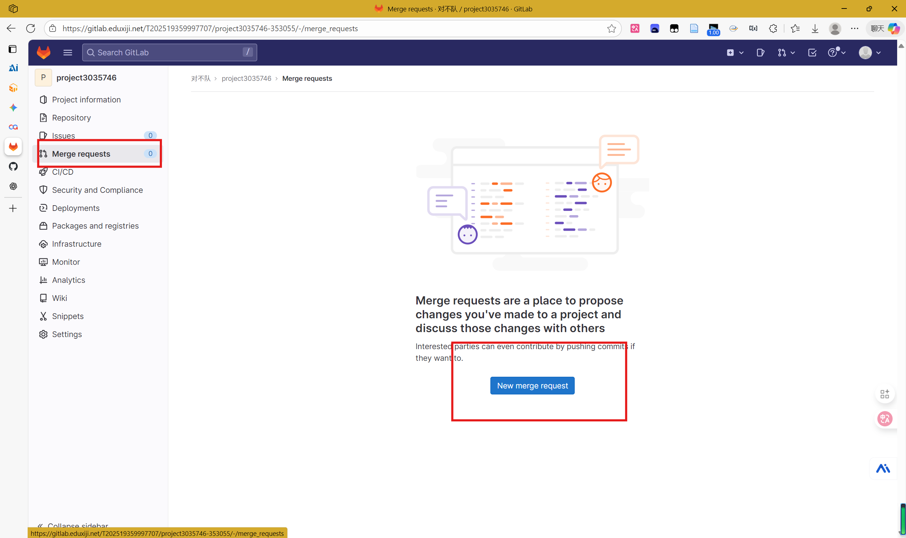

# OopsOS 项目 - GitLab 团队协作指南

## 项目信息

- **项目名称**：OopsOS（对不队）
- **GitLab 链接**：https://gitlab.eduxiji.net/T202519359997707/project3035746-353055
- **队伍成员**：
  - 贺鑫帅（进程管理）
  - 巫耿军（文件系统）
  - 陈倩倩（内存管理）

---

## 第一次使用 - 初始化（每个队友只需做一次）

### 1. 克隆项目

```powershell
git clone https://gitlab.eduxiji.net/T202519359997707/project3035746-353055.git
cd project3035746-353055
```

### 2. 配置你的信息

```powershell
git config user.name "你的名字"
git config user.email "你的邮箱"
```

> 例如：
> ```powershell
> git config user.name "ironhxs"
> git config user.email "ironhxs@gmail.com"
> ```

---

## 日常开发流程

### 第 1 步：开始工作前 - 更新最新代码

每次开始工作前，先从远程仓库拉取最新代码：

```powershell
git pull origin main
```

### 第 2 步：创建你自己的分支

**根据你的开发方向创建分支**：

```powershell
# 贺鑫帅（进程管理）
git checkout -b process-management

# 巫耿军（文件系统）
git checkout -b filesystem

# 陈倩倩（内存管理）
git checkout -b memory-management
```

### 第 3 步：修改代码

在你的分支上自由修改代码，可以修改多个文件。

### 第 4 步：提交修改

```powershell
# 1. 查看修改了哪些文件
git status

# 2. 添加所有修改到暂存区
git add .

# 或者只添加特定文件
git add kernel/proc/proc.c kernel/proc/exec.c

# 3. 查看要提交的修改
git diff --cached

# 4. 提交（一定要写清楚提交信息！）
git commit -m "feat: 实现进程优先级调度"
```

**提交信息规范**：
- `feat: 新功能` - 添加新功能
- `fix: 修复bug` - 修复 bug
- `optimize: 优化性能` - 性能优化
- `docs: 文档更新` - 更新文档
- `refactor: 代码重构` - 代码重构

> 例如：
> ```
> git commit -m "feat: 实现COW写时复制机制"
> git commit -m "fix: 修复内存泄漏问题"
> git commit -m "optimize: 提高缓冲池命中率"
> ```

### 第 5 步：推送到远程

```powershell
# 第一次推送该分支
git push -u origin process-management

# 之后推送可以简写
git push
```

> **第一次推送时**：
> - Git 会提示输入 **GitLab 用户名和密码**
> - 用户名：`T202519359997707`
> - 密码：`Dbd12345678`
> - 输入一次后，Git 会记住凭证，之后推送不需要再输入
> 
> **如果没有出现提示框**：
> - 可能已经保存过凭证了，直接推送即可
> - 或者在 Windows 凭证管理器中手动添加（系统会自动管理）

### 第 6 步：在 GitLab 网页上发起合并请求（MR）

1. 访问：https://gitlab.eduxiji.net/T202519359997707/project3035746-353055
2. 点击 **Merge Requests** → **New Merge Request**
3. 选择：
   - Source branch：你的分支（如 `process-management`）
   - Target branch：`main`
4. 填写 MR 标题和描述
5. 点击 **Create merge request**



> **MR 描述示例**：
> ```
> ## 功能说明
> 实现了进程优先级调度算法，支持动态优先级调整
>
> ## 修改文件
> - kernel/proc/proc.c
> - kernel/include/proc.h
>
> ## 测试情况
> 已通过 proctests 和 alarmtest
> ```

### 第 7 步：代码审查与合并

- 其他队友会审查你的代码
- 解决审查意见（如有）
- 审查通过后，点击 **Merge** 合并到 main 分支

---

## 同步队友的代码

### 场景 1：你在自己的分支上开发，需要队友的最新更新

```powershell
# 假设你现在在 process-management 分支上开发
# 直接拉取 main 的最新代码到你的分支
git pull origin main

# 完成！你的分支现在包含了队友的最新代码
```

### 场景 2：你已完成开发并合并到 main，现在要开始新功能

```powershell
# 1. 切回 main 分支
git checkout main

# 2. 拉取最新代码（包括你自己和队友的更新）
git pull origin main

# 3. 创建新分支继续开发
git checkout -b 新分支（上面约定好的那三个名称）
```

---

## 常用命令速查表

| 命令 | 说明 |
|------|------|
| `git status` | 查看当前状态 |
| `git branch -a` | 查看所有分支（本地和远程） |
| `git checkout 分支名` | 切换分支 |
| `git log --oneline` | 查看提交历史（简洁版） |
| `git diff` | 查看修改内容 |
| `git pull origin main` | 同步主分支最新代码 |
| `git push` | 推送当前分支 |
| `git fetch origin` | 从远程获取更新（不合并） |

---

## 工作目录划分（避免冲突）

为了减少代码冲突，建议各自负责的目录：

- **贺鑫帅**（进程管理）：
  - `kernel/proc/` - 进程相关代码
  - `kernel/include/proc.h`
  
- **巫耿军**（文件系统）：
  - `kernel/filesystem/` - 文件系统代码
  - `kernel/sysfile.c` - 文件系统调用
  
- **陈倩倩**（内存管理）：
  - `kernel/mm/` - 内存管理代码
  - `kernel/include/memlayout.h`

> **跨领域修改注意**：如果需要修改其他队友的目录，请先沟通确认，避免冲突！

---

## 常见问题解决

### Q1: 如何查看我修改了什么？

```powershell
git diff main..你的分支名
```

或在 GitLab 网页的 MR 中查看 **Changes** 标签。

### Q2: 代码有冲突怎么办？

```powershell
# 1. 先拉取最新的 main
git fetch origin main

# 2. 尝试合并
git merge origin/main

# 3. 编辑冲突文件，手动解决冲突
git status  # 查看哪些文件冲突

# 4. 编辑完毕后
git add 冲突文件
git commit -m "resolve: 解决合并冲突"
git push
```

### Q3: 如何撤销本地修改？

```powershell
# 撤销某个文件的修改
git checkout -- kernel/proc/proc.c

# 撤销所有修改（谨慎！）
git checkout -- .

# 撤销暂存区的修改
git reset HEAD 文件名
```

### Q4: 如何查看某人的提交记录？

```powershell
git log --author="贺鑫帅" --oneline
```

### Q5: 不小心推错了分支怎么办？

```powershell
# 可以在 GitLab 网页上关闭 MR，重新创建正确的 MR
# 或者联系其他队友帮忙
```

---

## 工作流总结

```
开始
  ↓
git pull origin main        （同步最新代码）
  ↓
git checkout -b new-branch  （创建分支）
  ↓
修改代码
  ↓
git add .                   （暂存修改）
  ↓
git commit -m "说明"         （本地提交）
  ↓
git push origin new-branch  （推送到远程）
  ↓
GitLab 网页发起 MR          （发起合并请求）
  ↓
队友审查 + 解决问题
  ↓
点击 Merge 合并到 main      （完成！）
  ↓
重复
```

---

## 联系方式

如有问题：
- 贺鑫帅（进程）：hexinshuai@xxx
- 巫耿军（文件）：wugongjun@xxx
- 陈倩倩（内存）：chenqianqian@xxx

或者在 GitLab MR 中讨论！

---

**祝你们开发愉快！** 🚀
