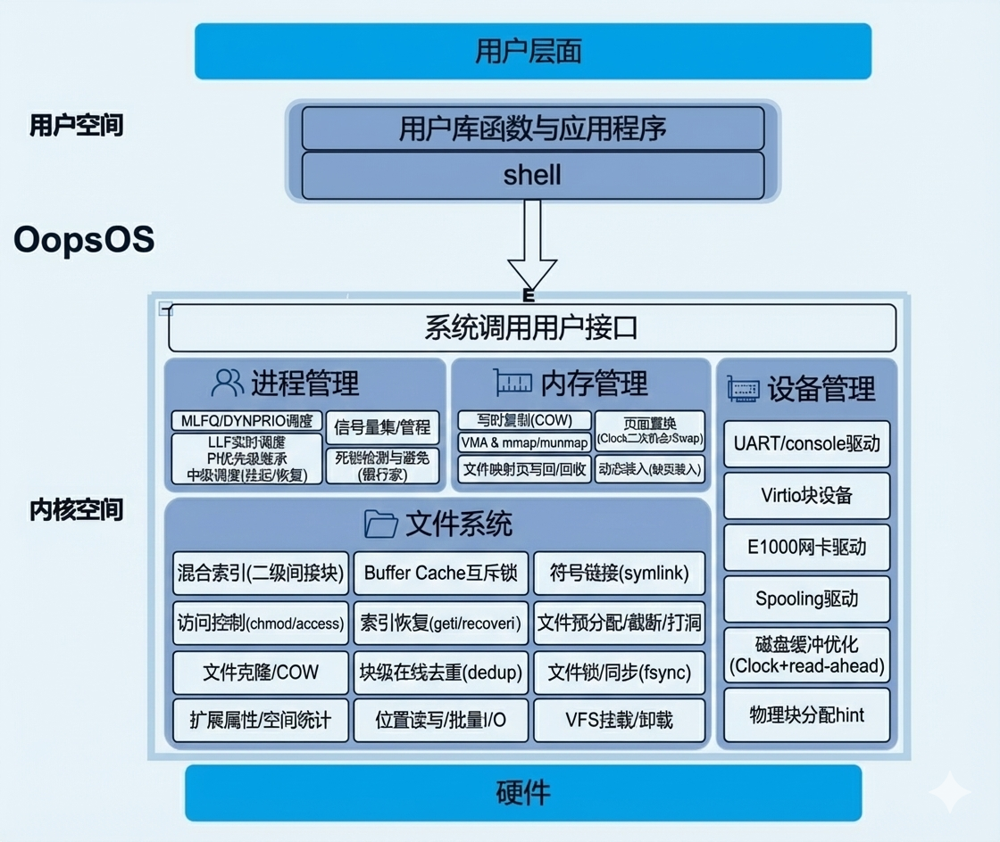
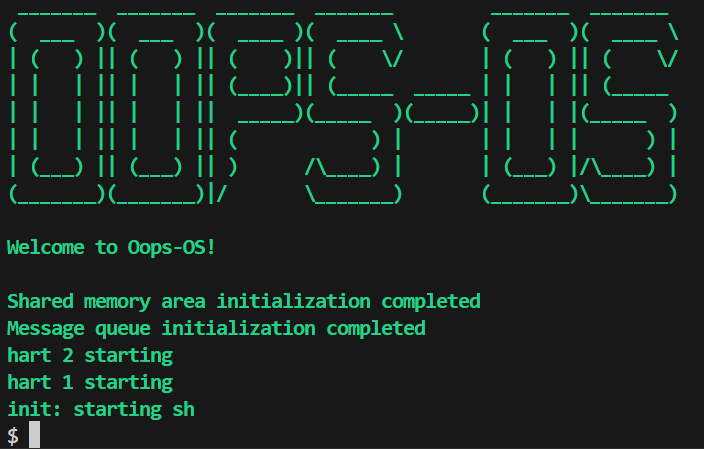

# OopsOS（参赛队伍：对不队 参赛方向：OS原理赛道——小型内核实现）

## **项目简介**

本项目是一个基于xv6-RISCV实现的小型OS内核，旨在开发过程中对xv6的各模块进行改进和优化。在原有基础上，我们分别在进程调度、文件管理、内存管理、设备管理几个方面完善了功能。截至目前共 **107 个系统调用**（xv6 自带 21 个，新增 86 个），全部为严格意义上的**内核态系统调用**——每一个都通过 RISC-V `ecall` 指令陷入内核、在 S-mode 下执行并返回，而非简单的 shell 内置命令或用户态库函数包装，为用户提供了更丰富且规范的系统服务。

> **设计理念：** 作为 **OS 原理赛道——小型内核实现** 方向的参赛作品，本项目不追求花哨的外围功能堆砌，而是以《计算机操作系统》《现代操作系统》等经典教材为蓝本，逐章逐节对照 xv6 尚未实现的核心技术点（如多级反馈队列、银行家算法、写时复制、mmap、VFS 等），结合课堂所学进行动手实现与验证。我们相信：**亲手写出来、跑起来、调通过，才是理解内核原理最扎实的方式**——而非单纯炫技或追求功能数量。

**项目成员：** 贺鑫帅（进程管理、shell改进）、巫耿军（文件系统）、陈倩倩（内存管理、设备管理）

**指导老师：** 田卫东、周红鹃

**参考项目与书籍：**

[mit-pdos/xv6-public: xv6 OS](https://github.com/mit-pdos/xv6-public)

[介紹 | xv6 中文文档](https://th0ar.gitbooks.io/xv6-chinese/content/)

[riscv手册](http://riscvbook.com/chinese/RISC-V-Reader-Chinese-v2p1.pdf)

**开发过程：** 记录在项目根目录下的[开发日志](./开发日志.md)中。

------


## 内核架构

OopsOS采用宏内核结构，分层式设计，底层是硬件，顶层是用户接口，中间层列举了主要新增或改进的内核服务与功能。

我们在用户空间也编写了相关用户程序 `/user/program` 与测试函数`/user/test` 。



------


## 项目组织

```
.
├── Makefile
├── README.md
├── docs                    # 说明文档
│   ├── document            # 各模块详细设计文档
│   └── img                 # 文档图片资源
├── kernel                  # 内核代码
│   ├── asm			# 汇编相关
│   ├── driver		# 磁盘驱动以及uart驱动
│   ├── filesystem	# 文件系统
│   ├── include		# 内核头文件
│   ├── interrupt	# 中断
│   ├── kernel.ld	# 链接脚本
│   ├── lib			# 库函数相关
│   ├── lock		# 锁
│   ├── main.c		# 主函数
│   ├── mm			# 内存管理
│   ├── network		# 网卡驱动
│   ├── proc		# 进程管理
│   ├── start.c		
│   ├── syscall.c	# 系统调用接口
│   ├── sysfile.c	# 文件相关系统调用
│   ├── sysnet.c	# 网络相关系统调用
│   └── sysproc.c	# 进程相关系统调用
├── mkfs                    # 文件系统镜像生成工具
└── user
    ├── program             # 用户命令与程序
    ├── test                # 测试用例
    ├── user.h              # 用户态函数库头文件
    └── usys.pl             # 系统调用包装生成脚本
```

------


## 项目运行

### WSL2 安装

如果你还没有安装 WSL2，按以下步骤操作：

**1. 启用 WSL 和虚拟机平台（以管理员身份运行 PowerShell）**

```bash
dism.exe /online /enable-feature /featurename:Microsoft-Windows-Subsystem-Linux /all /norestart
dism.exe /online /enable-feature /featurename:VirtualMachinePlatform /all /norestart
```

**2. 设置 WSL2 为默认版本**

```bash
wsl --set-default-version 2
```

**3. 安装 Ubuntu-20.04**

```bash
wsl --install -d Ubuntu-20.04
```

**4. 导出到 D 盘（可选，节省 C 盘空间）**

```bash
# 导出为 tar 文件
wsl --export Ubuntu-20.04 D:\WSL\Ubuntu-20.04\Ubuntu-20.04.tar

# 取消注册原有版本
wsl --unregister Ubuntu-20.04

# 导入到 D 盘
wsl --import Ubuntu-20.04 D:\WSL\Ubuntu-20.04 D:\WSL\Ubuntu-20.04\Ubuntu-20.04.tar --version 2
```


------

### 快速开始

**第一步：在 Windows 中克隆项目**

在 PowerShell 中执行（选择 C 盘或 D 盘，建议 D 盘）：

```bash
cd D:\  # 或 C:\
git clone https://gitlab.eduxiji.net/T202519359997707/project3035746-353055.git
cd project3035746-353055
```

**第二步：用 VS Code 打开项目**

在当前目录打开 VS Code：

```bash
如图找到这个项目的位置打开（显示更多选项）
```


**第三步：在 VS Code 中打开 WSL 终端**

按 `Ctrl + ~` 打开集成终端，VS Code 会自动连接到 WSL 环境。


**第四步：配置 Git 用户信息（在 WSL 终端中）**

```bash
git config user.name "你的名字"
git config user.email "你的邮箱"
```

**第五步：安装开发依赖**

在 VS Code 的 WSL 终端中运行：

```bash
sudo apt update
sudo apt install -y build-essential git qemu-system-misc gcc-riscv64-linux-gnu binutils-riscv64-linux-gnu
```

**第六步：编译并运行**

```bash
# 清理之前的编译
make clean

# 编译并启动 QEMU
make qemu

# 看到欢迎界面后，退出QEMU
# 按 Ctrl + A，然后按 X
```

**Scheduler switch (compile-time):**

```bash
# MLFQ (default)
make qemu SCHED=MLFQ

# DYNPRIO
make qemu SCHED=DYNPRIO
```

**Manual tests (not in usertests by default):**

```bash
schedtest
llftest
pitest
```


> **完成！** 可以开始开发了。更多工作流细节见 [GITLAB_WORKFLOW.md](./GITLAB_WORKFLOW.md)
------


### 运行效果



------


## 内核各模块设计综述

在xv6原有基础上，我们针对内核各模块进行了相关改进与创新，添加如下功能：

- **系统调用：** 用于支持相应功能以及提供用户接口，共 **107 个**（xv6 自带 21 个，新增 86 个）

- **进程管理**
  - 多级反馈队列调度（MLFQ）与动态优先级调度（DYNPRIO）
  - 实时调度（LLF 最小松弛度优先）
  - 优先级倒置解决（优先级继承协议 PI）
  - 中级调度（进程挂起/恢复）
  - 记录型信号量与 AND 型信号量
  - 信号量集与管程机制（Mesa 语义条件变量）
  - 死锁检测（等待图环路检测）与死锁避免（银行家算法）
  - 共享内存 IPC、消息队列 IPC、直接通信 IPC
  - 基于中断的定时提醒机制（sigalarm/sigreturn）
  - 内核多线程与用户线程库

- **内存管理**
  - 写时复制（Copy On Write）
  - 懒分配（Lazy Allocation）
  - 基于 VMA 的文件内存映射（mmap/munmap）
  - 空闲页面链表互斥锁的细粒度化
  - 页面置换/换入（Swap，Clock 二次机会）
  - 文件映射页参与置换（写回/回收）
  - 动态装入（按需加载/缺页装入）

- **设备管理**
  - 设备驱动：UART/console、Virtio 块设备、E1000 网卡
  - Spooling 驱动与用户态打印队列
  - 磁盘缓冲管理优化（Clock 缓存 + read-ahead 预读）
  - 物理块分配 hint（减少位图扫描）

- **文件系统**
  - 二级间接块的混合索引分配方式（大文件支持）
  - buffer cache 互斥锁的细粒度化
  - 符号链接（symlink）
  - 文件访问控制权限（chmod/access）
  - 基于索引信息的文件恢复策略（geti/recoveri）
  - 文件预分配（fallocate）、截断（truncate）、稀疏文件打洞（punch hole）
  - 文件克隆与写时复制（fclone/fclonerange）
  - 块级在线去重（dedup）
  - 文件锁（flock）、文件同步（fsync/fdatasync）
  - 扩展属性（xattr）、文件系统空间统计（fsinfo）
  - 位置读写（pread/pwrite）、批量 I/O（readv/writev）
  - 虚拟文件系统（VFS）与挂载/卸载（mount/umount）

- **Shell 增强**（类 Bash 交互体验）
  - 行编辑：←/→ 光标移动、Home/End 跳转、Ctrl+A/E/U/W/L 快捷键
  - 命令历史：↑/↓ 翻阅、`!!` 重复上条、`!n` 执行第 n 条
  - Tab 补全：内置命令与文件名自动补全
  - 作业控制：`&` 后台执行、`jobs` 列出任务、Ctrl+C 中断前台
  - I/O 重定向：`<` `>` `>>` 与管道 `|`、命令列表 `;`
  - 内置命令：`cd` `pwd` `exit` `clear` `help` `history` `jobs`
  - 新增用户命令：`touch` `cp` `mv` `head` `tail` `ps` `rmdir`、`rm -r` 递归删除

- **系统测试** 

  我们在本项目 `/user/test` 下添加了对各功能的相关测试

------


## 文档

模块的设计文档如下：

[系统调用](./docs/document/系统调用.md)

[进程管理](./docs/document/进程管理.md)

[内存管理](./docs/document/内存管理.md)

[文件系统](./docs/document/文件系统.md)

[设备管理](./docs/document/设备管理.md)

------

## 补充说明

**调度切换（编译期）：**
```bash
make qemu SCHED=MLFQ
make qemu SCHED=DYNPRIO
```

**手动测试（不默认加入 usertests）：**
```bash
schedtest
llftest
midschedtest
midschedcmp
pitest
```

**说明：**
- 需要截图的测试结果建议在 QEMU 里单独运行，保证输出完整。
- `usertests` 内以静默模式运行（支持 `-q` 参数）。
