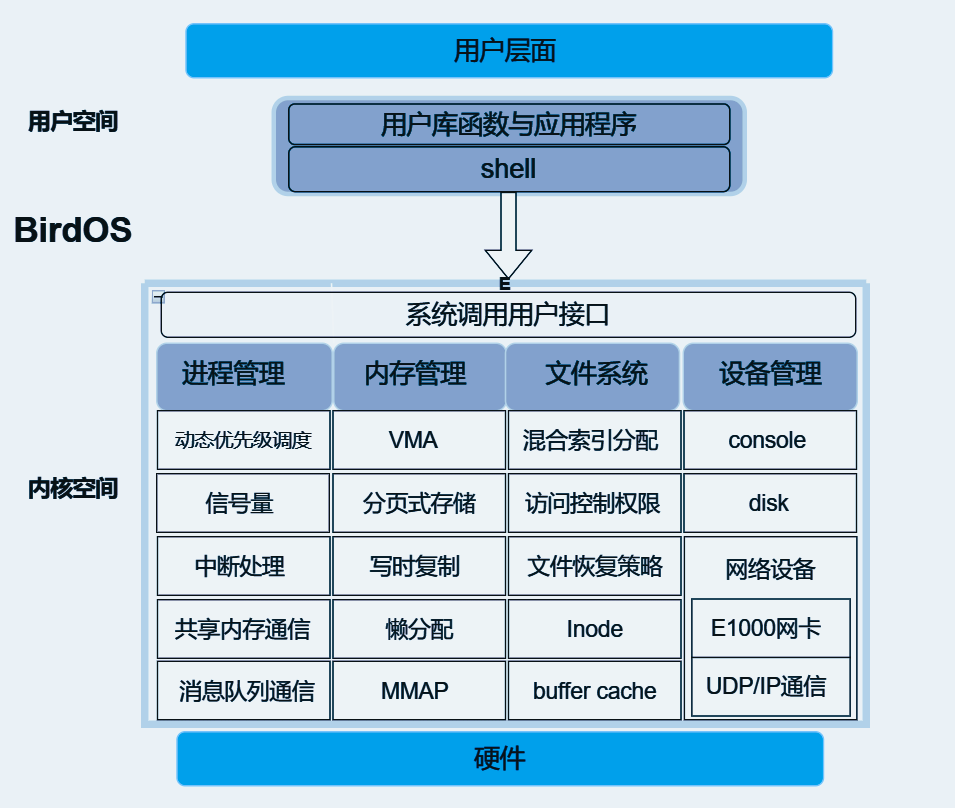
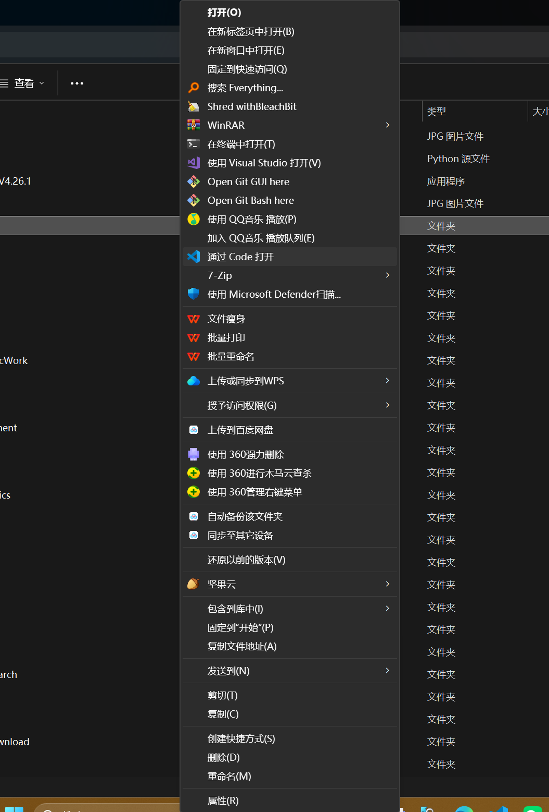
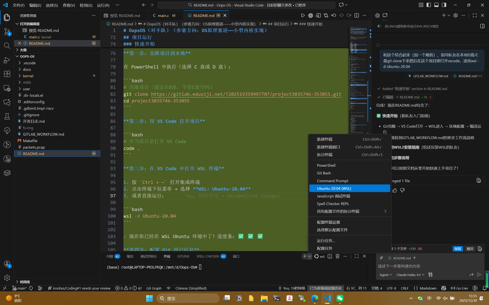
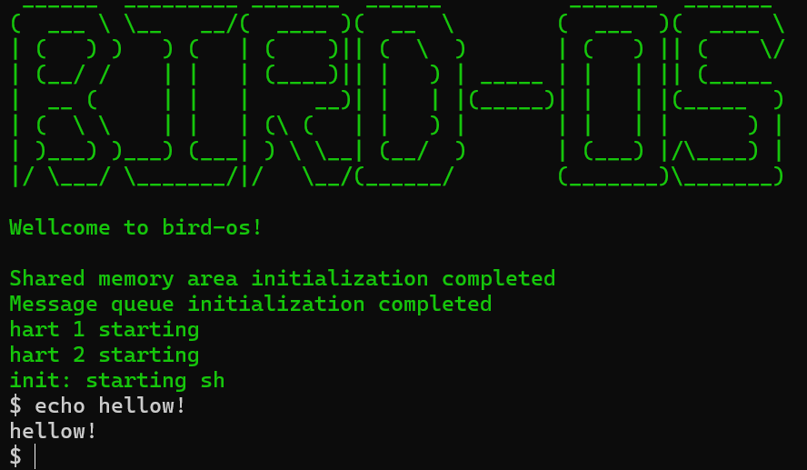

# OopsOS（对不队）（参赛方向：OS原理赛道——小型内核实现）

## **项目简介**

本项目是一个基于xv6-RISCV实现的小型OS内核，旨在开发过程中对xv6的各模块进行改进和优化。在原有基础上，我们分别在进程调度、文件管理、内存管理几个方面完善了功能。截至目前共53个系统调用（xv6自带21个），为用户提供了更丰富的系统服务。

**参考项目与书籍：**

[mit-pdos/xv6-public: xv6 OS](https://github.com/mit-pdos/xv6-public)

[介紹 | xv6 中文文档](https://th0ar.gitbooks.io/xv6-chinese/content/)

[riscv手册](http://riscvbook.com/chinese/RISC-V-Reader-Chinese-v2p1.pdf)

**开发过程：** 记录在项目根目录下的[开发日志](./开发日志.md)中。

**项目成员：** 贺鑫帅（进程管理）、巫耿军（文件系统）、陈倩倩（内存管理）

------


## 内核架构

OopsOS采用宏内核结构，分层式设计，底层是硬件，顶层是用户接口，中间层列举了主要新增或改进的内核服务与功能。

我们在用户空间也编写了相关用户程序 `/user/program` 与测试函数`/user/test` 。



------


## 项目组织

```
.
├── Makefile
├── README.md
├── docs			# 说明文档
├── kernel			# 内核代码
│   ├── asm			# 汇编相关
│   ├── driver		# 磁盘驱动以及uart驱动
│   ├── filesystem	# 文件系统
│   ├── include		# 内核头文件
│   ├── interrupt	# 中断
│   ├── kernel.ld	# 链接脚本
│   ├── lib			# 库函数相关
│   ├── lock		# 锁
│   ├── main.c		# 主函数
│   ├── mm			# 内存管理
│   ├── network		# 网卡驱动
│   ├── proc		# 进程管理
│   ├── start.c		
│   ├── syscall.c	# 系统调用接口
│   ├── sysfile.c	# 文件相关系统调用
│   ├── sysnet.c	# 网络相关系统调用
│   └── sysproc.c	# 进程相关系统调用
├── mkfs			# 文件系统初始化
└── user
    ├── program		# 用户命令与程序
    ├── test		# 测试用例
    ├── user.h		# 用户函数库
    └── usys.pl		# 脚本文件
```

------


## 项目运行

### WSL2 安装（必须先做）

如果你还没有安装 WSL2，按以下步骤操作：

**1. 启用 WSL 和虚拟机平台（以管理员身份运行 PowerShell）**

```bash
dism.exe /online /enable-feature /featurename:Microsoft-Windows-Subsystem-Linux /all /norestart
dism.exe /online /enable-feature /featurename:VirtualMachinePlatform /all /norestart
```

**2. 设置 WSL2 为默认版本**

```bash
wsl --set-default-version 2
```

**3. 安装 Ubuntu-20.04**

```bash
wsl --install -d Ubuntu-20.04
```

**4. 导出到 D 盘（可选，节省 C 盘空间）**

```bash
# 导出为 tar 文件
wsl --export Ubuntu-20.04 D:\WSL\Ubuntu-20.04\Ubuntu-20.04.tar

# 取消注册原有版本
wsl --unregister Ubuntu-20.04

# 导入到 D 盘
wsl --import Ubuntu-20.04 D:\WSL\Ubuntu-20.04 D:\WSL\Ubuntu-20.04\Ubuntu-20.04.tar --version 2
```


------

### 快速开始（队友入门指南）

**第一步：在 Windows 中克隆项目**

在 PowerShell 中执行（选择 C 盘或 D 盘，建议 D 盘）：

```bash
cd D:\  # 或 C:\
git clone https://gitlab.eduxiji.net/T202519359997707/project3035746-353055.git
cd project3035746-353055
```

**第二步：用 VS Code 打开项目**

在当前目录打开 VS Code：

```bash
如图找到这个项目的位置打开（显示更多选项）
```



**第三步：在 VS Code 中打开 WSL 终端**

按 `Ctrl + ~` 打开集成终端，VS Code 会自动连接到 WSL 环境。



**第四步：配置 Git 用户信息（在 WSL 终端中）**

```bash
git config user.name "你的名字"
git config user.email "你的邮箱"
```

**第五步：安装开发依赖**

在 VS Code 的 WSL 终端中运行：

```bash
sudo apt update
sudo apt install -y build-essential git qemu-system-misc gcc-riscv64-linux-gnu binutils-riscv64-linux-gnu
```

**第六步：编译并运行**

```bash
# 清理之前的编译
make clean

# 编译并启动 QEMU
make qemu

# 看到欢迎界面后，退出QEMU
# 按 Ctrl + A，然后按 X
```

> **完成！** 现在你可以开始开发了。更多工作流细节见 [GITLAB_WORKFLOW.md](./GITLAB_WORKFLOW.md)
------


### 运行效果



------


## 内核各模块设计综述

在xv6原有基础上，我们针对内核各模块进行了相关改进与创新，添加如下功能：

- **系统调用：** 用于支持相应功能以及提供用户接口，共53个（xv6自带21个）

- **进程管理**

基于动态优先级的进程调度器

共享内存的进程通信方式

消息队列的进程通信方式

基于中断的定时提醒机制

用于进程同步与互斥的记录型信号量

内核多线程与用户线程库

- **内存管理**

写时复制(Copy On Write)

懒分配

基于VMA的文件内存映射(MMAP)

空闲页面链表互斥锁的细粒度化

- **文件系统**

三级间接块的混合索引分配方式

buffer cache互斥锁的细粒度化

文件访问控制权限

基于索引信息的文件恢复策略

- **网络设备**

e1000网卡驱动程序

UDP/IP协议通信的简单支持

- **系统测试：** 我们在本项目/user/test下添加了对各功能的相关测试

------


## 文档

模块的设计文档如下：

[系统调用](./docs/document/系统调用.md)

[进程管理](./docs/document/进程管理.md)

[内存管理](./docs/document/内存管理.md)

[文件系统](./docs/document/文件系统.md)

[网络设备](./docs/document/网络设备.md)
