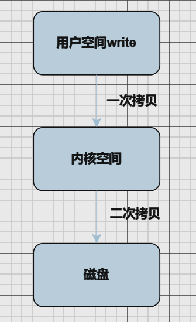
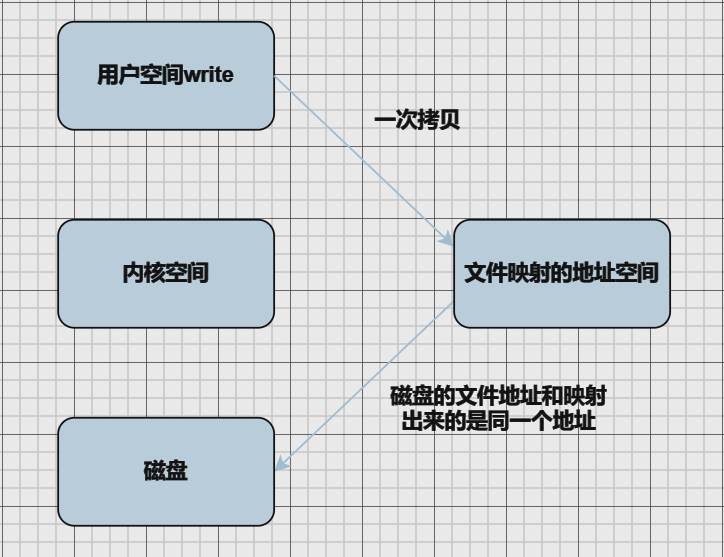
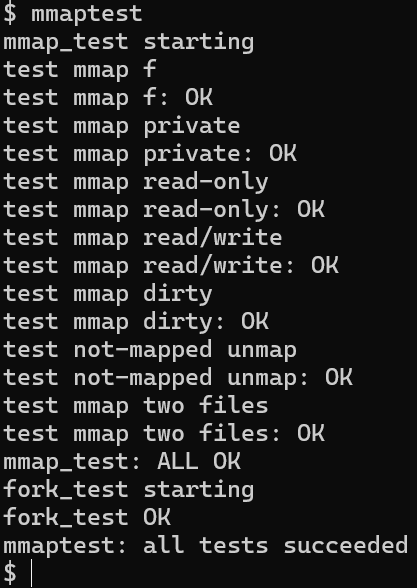
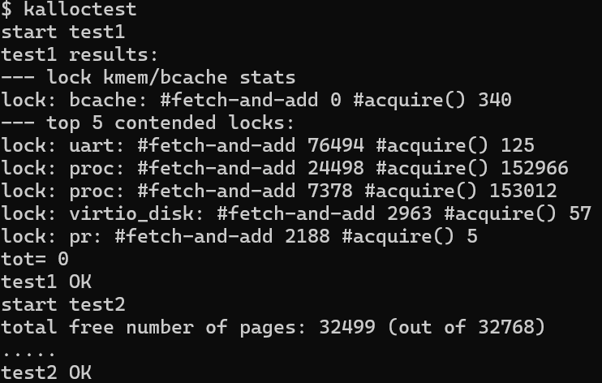


# OopsOS——内存管理

OopsOS是我们在xv6基础上改进的内核。文档分为两部分：xv6的基本功能与我们改进与新增的功能。

**目录：**

一、基本功能

二、改进与创新

- 2.1 写时复制(Copy On Write)
- 2.2 懒分配
- 2.3 基于VMA的文件内存映射(MMAP)
- 2.4 细粒度化空闲页链表互斥锁
- 2.5 页面置换/换入 (Swap)
- 2.6 动态装入（按需加载）


## 一、基本功能

### 1.1 内存布局

#### 1.1.1 内核地址空间

从0x80000000开始的地址为内核地址空间，CLINT、PLIC、uart0、virtio disk等为I/O设备（内存映射I/O），可以看到虚拟地址到物理地址的映射，大部分是相等的关系。


在kernel/memlayout.h中对内存分布进行了宏定义：

配置了内存的布局，确保内核空间与用户空间相隔，并且分配了内核栈和一些特殊的启动内存区域。

`KERNBASE` 和 `PHYSTOP` 控制内核可用的物理内存范围。

`TRAMPOLINE` 用于设置启动代码的位置。

`KSTACK(p)` 为每个进程计算内核栈的地址，确保内核栈是按顺序分配的，并且栈之间有适当的保护页。

```c
// the kernel expects there to be RAM
// for use by the kernel and user pages
// from physical address 0x80000000 to PHYSTOP.
#define KERNBASE 0x80000000L
#define PHYSTOP (KERNBASE + 128*1024*1024)

// map the trampoline page to the highest address,
// in both user and kernel space.
#define TRAMPOLINE (MAXVA - PGSIZE)

// map kernel stacks beneath the trampoline,
// each surrounded by invalid guard pages.
#define KSTACK(p) (TRAMPOLINE - ((p)+1)* 2*PGSIZE)
```

#### 1.1.2 进程地址空间


在kernel/memlayout.h中对内存分布进行了宏定义：

定义了 `TRAPFRAME`，它指定了一个内存位置，用于存储 **trap frame**。trap frame 是在发生系统调用、异常或中断时，内核用来保存进程上下文（如寄存器值）的数据结构。

```c
// User memory layout.
// Address zero first:
//   text
//   original data and bss
//   fixed-size stack
//   expandable heap
//   ...
//   TRAPFRAME (p->trapframe, used by the trampoline)
//   TRAMPOLINE (the same page as in the kernel)
#define TRAPFRAME (TRAMPOLINE - PGSIZE)
```

### 1.2 物理内存分配

对于物理内存的管理使用的是空闲链表，以页为单位进行管理，每次分配/释放都是一页。

#### 1.2.1 **空闲链表**

使用两个结构体维护一个单向链表，kmem作为全局变量，freelist为空闲链表的头节点，每个链表节点为struct run，包含指向下一个链表节点的结构体指针，并为全局变量kmem维护一把锁用于race condition（竞态条件）。

```c
struct run
{
  struct run *next;
};

struct
{
  struct spinlock lock;
  struct run *freelist;
} kmem;
```

#### 1.2.2 申请物理内存

实现了一个简单的内存分配器 `kalloc`，用于为内核分配一个 4096 字节（即 1 页）的物理内存块。

首先获取kmem的锁，r = freelist，将freelist移到freelist->next，此时r就是申请到的物理内存。（也就是获取空闲链表的头节点作为申请到的物理内存，然后空闲链表的头节点往后移一位）

```c
// 分配一个 4096 字节的物理内存页。
// 返回一个内核可以使用的指针。
// 如果无法分配内存，则返回 0。
void *kalloc(void)
{
  struct run *r;

  acquire(&kmem.lock);
  r = kmem.freelist;
  if(r)
    kmem.freelist = r->next;
  release(&kmem.lock);
  if(r)
    memset((char*)r, 5, PGSIZE);
  return (void*)r;
}
```

#### 1.2.3 释放物理内存

将传入的要释放的物理地址pa强转为链表节点，将该节点的next节点指向空闲链表头结点，然后将该节点作为空闲链表头节点（也就是链表的头插法）

```c
void kfree(void *pa)
{
  struct run *r;
  // 检查传入的内存地址是否有效
  if (((uint64)pa % PGSIZE) != 0 || (char*)pa < end || (uint64)pa >= PHYSTOP)
    panic("kfree");
  // 填充内存为垃圾值，以便检测悬空引用
  memset(pa, 1, PGSIZE);
  r = (struct run*)pa;  // 将内存地址转换为 run 结构体指针
  acquire(&kmem.lock);  // 获取内存分配器的锁，确保多核环境下的线程安全
  r->next = kmem.freelist;  // 将要释放的内存块加入空闲链表
  kmem.freelist = r;  // 更新空闲内存链表的头部
  release(&kmem.lock);  // 释放锁
}
```

### 1.3 内核页表

#### 1.3.1 三级页表的遍历


我们使用riscv-Sv39的分页策略，即三级页表的管理方式，来节约因为存储页表而耗费的大量内存页。

物理内存地址是56bit，其中44bit是物理page号（PPN，Physical Page Number），剩下12bit是offset完全继承自虚拟内存地址。

每个页表项：63-54为预留位，53-10为物理页号，9-0为标志位

首先从satp寄存器中获取最高级页目录的地址，从L2（38:30位）得到索引，根据索引在最高级页目录中找到物理页号（也就是中间级页目录的地址），根据L1（29:21位）得到索引，根据索引在中间级页目录中找到物理页号（也就是最低级页目录的地址），根据L0（20:12位）得到索引，根据索引在最低级页目录中找到物理页号，将最低级的物理页号和offset（11:0位）合并得到最终的56位物理地址。（三级页表的查询方式和每个页表项的结构如上图所示）

一个PTE定义了V、R、W、X、U等标志位，以及与物理地址之间的转换。

```c
#define PTE_V (1L << 0) // 有效位
#define PTE_R (1L << 1) // 读权限位
#define PTE_W (1L << 2)	// 写权限位
#define PTE_X (1L << 3)	// 执行权限位
#define PTE_U (1L << 4) // 用户访问权限位
// shift a physical address to the right place for a PTE.
#define PA2PTE(pa) ((((uint64)pa) >> 12) << 10)
#define PTE2PA(pte) (((pte) >> 10) << 12)
#define PTE_FLAGS(pte) ((pte) & 0x3FF)
```


#### 1.3.2 内核页表的初始化

在kernel/vm.c中声明了内核页表，每个pagetable_t（通过kalloc分配一页空间）包含512个页表项（4096 * 8 / 64 = 512）

```c
typedef uint64 pte_t;
typedef uint64 *pagetable_t; // 512 PTEs
pagetable_t kernel_pagetable; // 内核页表
```

在main.c中调用kvminit函数创建内核页表，kvminit调用了kvmmap函数，在kvmmap函数中为一些启动必备的区域添加映射到内核页表中，如UART、VIRTIO、PLIC等，

```c
void kvminit()
{
  kernel_pagetable = (pagetable_t)kalloc(); // 为内核页表分配一个页面
  memset(kernel_pagetable, 0, PGSIZE);
  // uart registers
  kvmmap(UART0, UART0, PGSIZE, PTE_R | PTE_W);
  // virtio mmio disk interface
  kvmmap(VIRTIO0, VIRTIO0, PGSIZE, PTE_R | PTE_W);
  // PCI-E ECAM (configuration space), for pci.c
  kvmmap(0x30000000L, 0x30000000L, 0x10000000, PTE_R | PTE_W);
  // pci.c maps the e1000's registers here.
  kvmmap(0x40000000L, 0x40000000L, 0x20000, PTE_R | PTE_W);
...
}
```

### 1.4 进程页表

在进程的结构体中有一个字段为pagetable_t pagetable（User page table），为进程的页表，在用户态时，使用的页表是独立的，符合了操作系统的隔离性，不同进程的虚拟地址所指向的物理地址空间是不同的，进程A无法访问到进程B的内存空间。

```c
struct proc
{
  pagetable_t pagetable;       // User page table
  ...
}
```

### 1.5 内存管理主要函数

ptb：pagetable； va : 虚拟地址； pa：物理地址； pte：页表项

#### 1.5.1与内核页表相关

创建内核页表的一些固定映射

**`void kvminit()`**

------

确保内核页表正确设置，并使虚拟内存的转换生效

**`void kvminithart()`** 

------

调用mappages，将指定范围的虚拟地址映射到一段物理地址

**`void kvmmap(uint64 va, uint64 pa, uint64 sz, int *perm) `** 

------

根据内核页表将va转换成pa

**`uint64 kvmpa(uint64 va)`** 

------


#### 1.5.2与进程页表相关

在ptb中移除va开始的npages个页的叶子级别映射（最低一级页表的映射），并根据do_free参数选择是否释放对应的物理空间（与freewalk配合使用来释放页表）

**`void uvmunmap(pagetable_t pagetable, uint64 va, uint64 npages, int do_free)：`** 

------

创建一个空的页表

**`pagetable_t uvmcreate()`** 

------

用于加载第一个进程的initcode到va = 0处

**`void uvminit(pagetable_t pagetable, uchar *src, uint sz)`** 

------

在进程页表中创建新的PTE和分配对应的物理内存，用于将进程空间从oldsz增大到newsz

**`uint64 uvmalloc(pagetable_t pagetable, uint64 oldsz, uint64 newsz)`** 

------

在进程页表中修改进程空间，从oldsz到newsz（用于回收用户页表中的页面）

**`uint64 uvmdealloc(pagetable_t pagetable, uint64 oldsz, uint64 newsz)`** 

------

把进程页表空间释放，把最低一级PTE的条目清空，并删除对应的物理页（uvmunmap）。并将最高级和中间级的PTE条目也清空，并清空物理页

**`void uvmfree(pagetable_t pagetable, uint64 sz)`**

------

将old ptb的sz个页空间拷贝到new ptb（用于fork系统调用，将父进程的页表映射复制到子进程的页表映射，虚拟地址对应的物理地址不同，但内容相同）
**`int uvmcopy(pagetable_t old, pagetable_t new, uint64 sz)`**

**`int uvmshare(pagetable_t old, pagetable_t new, uint64 sz)`**

- 为线程创建页表时使用，映射到相同的物理页并增加引用计数，不做 COW 拷贝。

------

将用户页表的最低一级PTE条目的PTE_U标志去除，用于exec函数设置守护页

**`void uvmclear(pagetable_t pagetable, uint64 va)`**

------


#### 1.5.3 工具方法

根据ptb和va，返回对应的最低一级PTE

**`pte_t *walk(pagetable_t pagetable, uint64 va, int alloc)`**

------

根据ptb和va，找到对应的pte，并使用PTE2PA，返回pa

**`uint64 walkaddr(pagetable_t pagetable, uint64 va)`**

------

递归释放指定页表的所有项，叶子节点在调用之前必须已经被清空，否则会陷入freewalk leaf

**`void freewalk(pagetable_t pagetable)`**

------

根据给定的ptb, va, pa, size, perm在三级页表中创建映射

**`int mappages(pagetable_t pagetable, uint64 va, uint64 size, uint64 pa, int perm)`**

------

将内核空间的n个字节拷贝至用户空间

**`int copyout(pagetable_t pagetable, uint64 dstva, char *src, uint64 len)`**

------

将用户空间的n个字节拷贝至内核空间

**`int copyin(pagetable_t pagetable, char *dst, uint64 srcva, uint64 len)`**

------

将用户空间的max个字符串（必须以‘\0’结尾）拷贝至内核空间
**`int copyinstr(pagetable_t pagetable, char *dst, uint64 srcva, uint64 max)`**

------


## 二、改进与创新

### 2.1 写时复制(Copy On Write)

#### 2.1.1 原理介绍

之前的`fork()`系统调用将父进程的所有用户空间内存复制到子进程中。如果父进程较大，则复制可能需要很长时间。更糟糕的是，这项工作经常造成大量浪费；例如，子进程中的`fork()`后跟`exec()`将导致子进程丢弃复制的内存，而其中的大部分可能都从未使用过。另一方面，如果父子进程都使用一个页面，并且其中一个或两个对该页面有写操作，则确实需要复制。


copy-on-write fork()的目标是推迟到子进程实际需要物理内存拷贝时再进行分配和复制物理内存页面。

COW fork()只为子进程创建一个页表，用户内存的PTE指向父进程的物理页。COW fork()将父进程和子进程中的所有用户PTE标记为不可写。当任一进程试图写入其中一个COW页时，CPU将强制产生页面错误。内核页面错误处理程序检测到这种情况将为出错进程分配一页物理内存，将原始页复制到新页中，并修改出错进程中的相关PTE指向新的页面，将PTE标记为可写。当页面错误处理程序返回时，用户进程将能够写入其页面副本。

#### 2.1.2 实现策略

在kernel/riscv.h中选取PTE中的保留位定义标记一个页面是否为COW Fork页面的标志位

```c
// 记录应用了COW策略后fork的页面
#define PTE_F (1L << 8)
```

在kalloc.c中进行如下修改

- 定义引用计数的全局变量`ref`，其中包含了一个自旋锁和一个引用计数数组，由于`ref`是全局变量，会被自动初始化为全0。

  这里使用自旋锁是考虑到这种情况：进程P1和P2共用内存M，M引用计数为2，此时CPU1要执行`fork`产生P1的子进程，CPU2要终止P2，那么假设两个CPU同时读取引用计数为2，执行完成后CPU1中保存的引用计数为3，CPU2保存的计数为1，那么后赋值的语句会覆盖掉先赋值的语句，从而产生错误

```c
struct ref_stru {
  struct spinlock lock;
  int cnt[PHYSTOP / PGSIZE];  // 引用计数
} ref;
```

- 在`kinit`中初始化`ref`的自旋锁

```c
void kinit()
{
  initlock(&kmem.lock, "kmem");
  initlock(&ref.lock, "ref");
  freerange(end, (void*)PHYSTOP);
}
```

- 修改kalloc和kfree函数，在kalloc中初始化内存引用计数为1，在kfree函数中对内存引用计数减1，如果引用计数为0时才真正删除。

- cowpage函数，检查某个虚拟地址 va 在给定的页表 pagetable 中的页表项，并判断该页是否需要进行 写时复制。

```c
/**
 * @brief cowpage 判断一个页面是否为COW页面
 * @param pagetable 指定查询的页表
 * @param va 虚拟地址
 * @return 0 是 -1 不是
 */
int cowpage(pagetable_t pagetable, uint64 va) {
  if(va >= MAXVA)
    return -1;
  pte_t* pte = walk(pagetable, va, 0);
  if(pte == 0)
    return -1;
  if((*pte & PTE_V) == 0)
    return -1;
  return (*pte & PTE_F ? 0 : -1);
}
```

- cowalloc函数，当一个进程尝试修改一个共享的页面时，如果该页面是 COW 页，系统会为该进程分配一个新的页面，并复制原页面的内容。

```c
/**
 * @brief cowalloc copy-on-write分配器
 * @param pagetable 指定页表
 * @param va 指定的虚拟地址,必须页面对齐
 * @return 分配后va对应的物理地址，如果返回0则分配失败
 */
void* cowalloc(pagetable_t pagetable, uint64 va) {
  if(va % PGSIZE != 0)
    return 0;
  uint64 pa = walkaddr(pagetable, va);  // 获取对应的物理地址
  if(pa == 0)
    return 0;
  pte_t* pte = walk(pagetable, va, 0);  // 获取对应的PTE
  if(krefcnt((char*)pa) == 1) {
    // 只剩一个进程对此物理地址存在引用
    // 则直接修改对应的PTE即可
    *pte |= PTE_W;
    *pte &= ~PTE_F;
    return (void*)pa;
  } else {
    // 多个进程对物理内存存在引用
    // 需要分配新的页面，并拷贝旧页面的内容
    char* mem = kalloc();
    if(mem == 0)
      return 0;
    // 复制旧页面内容到新页
    memmove(mem, (char*)pa, PGSIZE);
    // 清除PTE_V，否则在mappagges中会判定为remap
    *pte &= ~PTE_V;
    // 为新页面添加映射
    if(mappages(pagetable, va, PGSIZE, (uint64)mem, (PTE_FLAGS(*pte) | PTE_W) & ~PTE_F) != 0) {
      kfree(mem);
      *pte |= PTE_V;
      return 0;
    }
    // 将原来的物理内存引用计数减1
    kfree((char*)PGROUNDDOWN(pa));
    return mem;
  }
}
```

- krefcnt，用于获取内存的引用计数

```c
/**
 * @brief krefcnt 获取内存的引用计数
 * @param pa 指定的内存地址
 * @return 引用计数
 */
int krefcnt(void* pa) {
  return ref.cnt[(uint64)pa / PGSIZE];
}
```

- 相反的kaddrefcnt，增加内存的引用计数

```c
int kaddrefcnt(void* pa) 
```

- 修改`freerange`，释放一个物理地址范围内的内存区域，并确保在释放时的引用计数正确。

```c
void freerange(void *pa_start, void *pa_end)
{
  char *p;
  p = (char*)PGROUNDUP((uint64)pa_start);
  for(; p + PGSIZE <= (char*)pa_end; p += PGSIZE) {
    // 在kfree中将会对cnt[]减1，这里要先设为1，否则就会减成负数
    ref.cnt[(uint64)p / PGSIZE] = 1;
    kfree(p);
  }
}
```

- 修改`uvmcopy`，不为子进程分配内存，而是使父子进程共享内存，但禁用`PTE_W`，同时标记`PTE_F`，调用`kaddrefcnt`增加引用计数

```c
 // 仅对可写页面设置COW标记
    if (flags & PTE_W)
    {
      // 禁用写并设置COW Fork标记
      flags = (flags | PTE_F) & ~PTE_W;
      *pte = PA2PTE(pa) | flags;
    }
    if (mappages(new, i, PGSIZE, pa, flags) != 0)
    {
      uvmunmap(new, 0, i / PGSIZE, 1);
      return -1;
    }
    // 增加内存的引用计数
    kaddrefcnt((char *)pa);
```

- 修改`usertrap`，处理COW页错误

**获取虚拟地址**：获取出错的虚拟地址 `fault_va`。

**检查是否是 COW 页错误**：使用 `cowpage` 函数判断是否是一个 COW 页访问错误。

**处理 COW 页错误**：

- 如果是 COW 页访问错误，系统尝试为该页面分配一个新的副本（通过 `cowalloc`）。
- 如果虚拟地址超出了进程的地址空间，或者内存分配失败，进程将被标记为 `killed`，表示需要终止该进程。

```c
  else if (cause == 13 || cause == 15)
  {
    uint64 fault_va = r_stval(); // 获取出错的虚拟地址
    if (cowpage(p->pagetable, fault_va) == 0)
    { // 如果是cow页出错
      if (fault_va >= p->sz || cowalloc(p->pagetable, PGROUNDDOWN(fault_va)) == 0)
        p->killed = 1;
    }
```

-  在`copyout`中处理相同的情况，如果是COW页面，需要更换`pa0`指向的物理地址

#### 2.1.3 测试程序

`/user/test/cowtest` 用于测试该功能，考虑三种情况：

- `simpletest()`：内核中分配超过物理内存一半的空间，然后执行 `fork()`，在不支持写时复制的内核中，`fork()` 会失败。
- `threetest()`：三个进程都写入 COW 内存，超过一半的物理内存被分配，并检查被复制的页面是否被释放。
- `filetest()`：验证 `copyout()` 是否正确处理了 COW 页面，是否模拟了 COW 错误并触发了相应的内存复制。

**测试结果：**


通过了已有的测试。

#### 2.1.4 优点

对比之前的fork，我们写时分配的实现有如下优点：

- **提高内存利用率**

内存得到了更高效的利用，尤其是在多个进程共享相同内存时，系统的内存资源更加紧凑。

- **减少不必要的复制，提升性能**

减少了对未修改内存的冗余复制，避免了不必要的内存开销。

### 2.2 懒分配

#### 2.2.1 原理介绍

当应用程序请求额外内存时，比如通过 sbrk系统调用增加地址空间，内核调整进程的地址空间范围，但会把新地址标记为无效。在应用程序实际访问这些无效地址时，CPU 会因为找不到对应的物理地址而触发页面错误，内核捕获到异常，分析错误地址属于之前 sbrk 增加的范围，说明这是懒分配引发的页面错误，于是内核会分配一个新的物理页面，并将该虚拟地址映射到新页面上，更新页表中的该地址条目为有效状态，并重新执行触发异常的指令。
应用程序往往请求比实际需要更多的内存，通过懒分配，系统仅在真正使用内存时才进行分配，避免了大量内存浪费。

#### 2.2.2 实现策略

- 修改`sys_sbrk()`函数，将实际分配内存的函数删除，而仅仅改变进程的`sz`属性。如果为负数，就调用`uvmdealloc()`函数，但需要限制缩减后的内存空间不能小于0

```c
uint64 sys_sbrk(void)
{
  ...
  if (n > 0)
  {
    p->sz += n;// 懒分配
  }
  else if (sz + n > 0)
  {
    sz = uvmdealloc(p->pagetable, sz, sz + n);
    p->sz = sz;
  }
  ...
  return addr;
}
```

- 修改`usertrap()`函数，在页面错误处理的过程中，先判断发生错误的虚拟地址（`r_stval()`读取）是否位于栈空间之上，进程大小（虚拟地址从0开始，进程大小表征了进程的最高虚拟地址）之下，然后分配物理内存并添加映射。

```c
...
else
    { //  缺页异常(懒分配引起的)
      char *pa; // 分配的物理地址
      if (PGROUNDUP(p->trapframe->sp) - 1 < fault_va && fault_va < p->sz && (pa = kalloc()) != 0)
      {
        memset(pa, 0, PGSIZE);
        if (mappages(p->pagetable, PGROUNDDOWN(fault_va), PGSIZE, (uint64)pa, PTE_R | PTE_W | PTE_X | PTE_U) != 0)
        {
          kfree(pa);
          p->killed = 1;
        }
      }
      else
      {
        printf("usertrap(): out of memory!\n"); // 已经没有可分配的空闲页面
        p->killed = 1;
      }
...
```

- 修改`uvmunmap()`，由于懒分配并未实际分配内存，所以当解除映射关系的时候对于这部分内存要略过，而不是使系统崩溃。

```c
void uvmunmap(pagetable_t pagetable, uint64 va, uint64 npages, int do_free)
{
  // 循环遍历从虚拟地址 va 开始的 npages 页，步长为 PGSIZE（即一页的大小）
  for(a = va; a < va + npages * PGSIZE; a += PGSIZE)
  {
    // 使用 walk 函数获取当前虚拟地址 a 对应的页表项（如果没有找到页表项，则返回 0）
    if((pte = walk(pagetable, a, 0)) == 0)
      panic("uvmunmap: walk");  // 如果未找到页表项，则触发 panic，表示异常
    // 检查页表项的有效位（PTE_V），如果该位为 0，说明该页是无效的，跳过当前页
    if((*pte & PTE_V) == 0)
      continue;
    ...
  }
}
```

- 处理`fork`的内存拷贝：`fork`调用了`uvmcopy`进行内存拷贝，由于懒分配并未实际分配内存，所以当页面表项找不到或者页面无效时需要跳过而不是报错，同理也要修改`uvmunmap`对应部分。

```c
// 遍历虚拟地址空间，从地址 0 到 sz，逐步检查每个页面
for(i = 0; i < sz; i += PGSIZE){
    // 如果找不到对应的页面表项，则跳过该页面
    if((pte = walk(old, i, 0)) == 0)
        continue;
    // 检查页面表项中的有效位 PTE_V，如果该页面无效（即没有映射到物理内存），则跳过
    if((*pte & PTE_V) == 0)
        continue;
    // 进一步的操作可能在这里（未显示），如内存复制、权限修改等
}
```

- 处理通过sbrk申请内存后还未实际分配就传给系统调用使用的情况，系统调用的处理会陷入内核，scause寄存器存储的值是8，如果此时传入的地址还未实际分配，就不能走到上文usertrap中判断scause是13或15后进行内存分配的代码，syscall执行就会失败

  - 系统调用流程：
    - 陷入内核**==>**`usertrap`中`r_scause()==8`的分支**==>**`syscall()`**==>**回到用户空间

  - 页面错误流程：
    - 陷入内核**==>**`usertrap`中`r_scause()==13||r_scause()==15`的分支**==>**分配内存**==>**回到用户空间

因此就需要找到在何时系统调用会使用这些地址，将地址传入系统调用后，会通过`argaddr()`函数从寄存器中读取，因此在这里添加物理内存分配的代码。

```c
// 处理向系统调用传入lazy allocation地址的情况
  if(walkaddr(p->pagetable, *ip) == 0) {
    if(PGROUNDUP(p->trapframe->sp) - 1 < *ip && *ip < p->sz) {
      char* pa = kalloc();
      if(pa == 0)
        return -1;
      memset(pa, 0, PGSIZE);

      if(mappages(p->pagetable, PGROUNDDOWN(*ip), PGSIZE, (uint64)pa, PTE_R | PTE_W | PTE_X | PTE_U) != 0) {
        kfree(pa);
        return -1;
      }
    }
```

#### 2.2.3 测试程序

`/user/test/lazytest` 用于测试该功能，考虑如下几种情况：

- `void sparse_memory(char *s)`：模拟实际使用中内存分配的稀疏情况，验证系统在按需分配内存、读取和写入稀疏内存区域时的正确性。
- `void sparse_memory_unmap(char *s)`：分配一块大内存区域，然后通过 `fork` 创建多个进程，每个子进程尝试解除映射。测试内存解除映射。
- `void oom(char *s)`：模拟内存分配失败来测试操作系统在内存资源耗尽时的行为。

**测试结果：**


通过了已有的测试。

#### 2.2.4 优点

懒分配策略有如下优点：

- **提高内存利用率**  懒分配使得内存按需分配。这种策略特别适合某些内存占用较大的应用场景。
- **改善内存管理的灵活性 ** 懒分配和 Copy-on-Write 结合使用时，内存页可以在多个进程之间共享。

### 2.3 基于VMA的文件内存映射(MMAP)

#### 2.3.1 原理介绍

MMAP是一种内存映射文件的方法，即将一个文件或者其它对象映射到进程的地址空间，实现文件磁盘地址和进程虚拟地址空间中一段虚拟地址的一一对映关系。
实现这样的映射关系后，进程就可以采用指针的方式读写操作这一段内存，而系统会自动回写脏页面到对应的文件磁盘上，即完成了对文件的操作而不必再调用read,write等系统调用函数。相反，内核空间对这段区域的修改也直接反映用户空间，从而可以实现不同进程间的文件共享。

我们调用write函数时，由于用户空间和系统空间是隔离的，另外就是我们程序中的地址都是虚拟地址，没有办法直接将内容写到文件中的，而是先写到内核缓冲区，然后再由内核写到文件中，进行了两次拷贝。



使用mmap进行映射后，我们会得到一个和磁盘上某一个文件的地址相同的地址，当我们往这个地址写文件的时候，内容将直接写到文件中，这里和上面相比减少了一次拷贝。



#### 2.3.2 实现策略

- 定义VMA结构体，并添加到进程结构体中
- 在allocproc中将vma数组初始化为全0

```c
#define NVMA 16	// 每个进程可以拥有的虚拟内存区域最大数量
// 虚拟内存区域结构体
struct vm_area {
  int used;           // 是否已被使用
  uint64 addr;        // 起始地址
  int len;            // 长度
  int prot;           // 权限
  int flags;          // 标志位
  int vfd;            // 对应的文件描述符
  struct file* vfile; // 对应文件
  int offset;         // 文件偏移，本实验中一直为0
};
struct proc {
  ...
  struct vm_area vma[NVMA];    // 虚拟内存区域
}
```

- `sys_mmap` 将文件映射到进程的虚拟内存，其过程包括：

  **文件权限检查**：

  - 如果文件不可写（ `vfile->writable == 0` ）且请求的映射权限包含写操作（ `PROT_WRITE` ），且映射标志为共享映射（ `MAP_SHARED` ），则返回错误。

  **内存空间检查**：

  - 确保进程的虚拟地址空间（ `p->sz` ）加上映射的长度不会超过最大虚拟地址空间（ `MAXVA` ）。如果超出，返回错误。

  **寻找空闲的虚拟内存区域（VMA）**：

  - 遍历进程的虚拟内存区域数组（`p->vma` ），查找第一个未使用的区域。若找到空闲区域，标记为使用，并设置该区域的相关属性（地址、长度、权限、文件等）。

  **文件引用计数**：

  - 使用 `filedup` 增加文件的引用计数，确保文件在映射期间不会被释放。

  **更新进程内存**：

  - 更新进程的虚拟内存大小（ `p->sz` ），并返回映射区域的起始地址。

```c
uint64 sys_mmap(void) {
  uint64 addr;
  int length;
  int prot;
  int flags;
  int vfd;
  struct file* vfile;
  int offset;
  uint64 err = 0xffffffffffffffff;
  // 获取系统调用参数
  if(argaddr(0, &addr) < 0 || argint(1, &length) < 0 || argint(2, &prot) < 0 ||
    argint(3, &flags) < 0 || argfd(4, &vfd, &vfile) < 0 || argint(5, &offset) < 0)
    return err;
  // 实验提示中假定addr和offset为0，简化程序可能发生的情况
  if(addr != 0 || offset != 0 || length < 0)
    return err;
  // 文件不可写则不允许拥有PROT_WRITE权限时映射为MAP_SHARED
  if(vfile->writable == 0 && (prot & PROT_WRITE) != 0 && flags == MAP_SHARED)
    return err;
  struct proc* p = myproc();
  // 没有足够的虚拟地址空间
  if(p->sz + length > MAXVA)
    return err;
  // 遍历查找未使用的VMA结构体
  for(int i = 0; i < NVMA; ++i) {
    if(p->vma[i].used == 0) {
      p->vma[i].used = 1;
      p->vma[i].addr = p->sz;
      p->vma[i].len = length;
      p->vma[i].flags = flags;
      p->vma[i].prot = prot;
      p->vma[i].vfile = vfile;
      p->vma[i].vfd = vfd;
      p->vma[i].offset = offset;
      // 增加文件的引用计数
      filedup(vfile);
      p->sz += length;
      return p->vma[i].addr;
    }
  }
  return err;
}
```

- 访问对应的页面会产生页面错误，需要在`usertrap`中进行处理，主要完成三项工作：分配物理页面，读取文件内容，添加映射关系

```c
    else if (PGROUNDUP(p->trapframe->sp) - 1 < fault_va && fault_va < p->sz && mmap_handler(r_stval(), cause) == 0)
    {}//  缺页异常(内存映射文件引起的)
```

其中 `int mmap_handler(int *va*, int *cause*)` 用于处理mmap惰性分配导致的页面错误：流程包括查找VMA、验证文件权限、分配物理内存、读取文件数据并映射到进程的虚拟内存，如果任何步骤失败，返回 -1。

- `sys_munmap` 函数用于解除进程的内存映射，释放指定地址范围内的虚拟内存，并在需要时将映射内容写回文件系统。其过程包括：

  **查找VMA**：
  遍历进程的虚拟内存区域（VMA）数组，查找与指定地址和长度匹配的VMA区域。如果找到符合条件的VMA区域，检查它是从起始位置还是结束位置进行解除映射：

  - 如果解除映射的是起始位置，则将VMA的地址增加 `length`，长度减少 `length`。
  - 如果解除映射的是结束位置，则直接减少VMA的长度。

  **文件写回**：
  如果映射标志是 `MAP_SHARED` 且映射具有写权限（ `PROT_WRITE` ），则将该区域的数据写回文件系统，使用 `filewrite` 。

  **解除映射**：
  使用 `uvmunmap` 函数解除指定地址范围的映射，将虚拟内存与物理内存的映射关系删除。

  **清理VMA**：
  如果解除映射后VMA区域的长度为零，表示该区域的映射已完全解除，此时关闭文件并将该VMA标记为未使用。

- 修改 `exit` ，将进程的已映射区域取消映射

```c
...
// 将进程的已映射区域取消映射
  for(int i = 0; i < NVMA; ++i) {
    if(p->vma[i].used) {
      if(p->vma[i].flags == MAP_SHARED && (p->vma[i].prot & PROT_WRITE) != 0) {
        filewrite(p->vma[i].vfile, p->vma[i].addr, p->vma[i].len);
      }
      fileclose(p->vma[i].vfile);
      uvmunmap(p->pagetable, p->vma[i].addr, p->vma[i].len / PGSIZE, 1);
      p->vma[i].used = 0;
    }
  }
...
```

- 修改fork，复制父进程的VMA并增加文件引用计数

```c
...
// 复制父进程的VMA
  for(i = 0; i < NVMA; ++i) {
    if(p->vma[i].used) {
      memmove(&np->vma[i], &p->vma[i], sizeof(p->vma[i]));
      filedup(p->vma[i].vfile);
    }
  }
...
```

#### 2.3.3 测试程序

`/user/test/mmaptest` 用于测试该功能，考虑如下几种情况：

- `void mmap_test(void)` 测试了不同情况下的 `mmap` 和 `munmap` 功能，确保内存映射的正确性和行为：

  **映射文件内容**：

  - 创建一个文件并映射到内存。然后检查映射的内存内容是否与文件中原始的字节匹配，确保文件正确映射到进程的虚拟内存。

  **私有映射（ `MAP_PRIVATE` ）** ：

  - 测试使用 `MAP_PRIVATE` 映射文件，且映射内存是可写的。修改映射的内存内容并确保修改不会影响文件本身。

  **只读映射（ `PROT_READ` ）** ：

  - 测试文件被映射为只读时，确保程序无法进行写操作。如果尝试进行写操作，应触发错误。

  **读写映射（ `PROT_READ | PROT_WRITE` ）** ：

  - 测试将文件映射为可读写映射，确保文件成功映射且可以对映射的内存进行写操作，并验证映射是否在文件关闭后仍然有效。

  **写回文件（ `MAP_SHARED` ）** ：

  - 测试 `MAP_SHARED` 映射文件时，修改映射的内存内容会影响文件本身，并验证修改是否已写回文件。

  **解除映射（ `munmap` ）** ：

  - 测试解除映射的功能，确保可以正确解除一部分映射内存，并验证文件内容的变化。

  **未映射的解除映射**：

  - 测试对未映射的内存区域进行 `munmap` ，确保该操作正确处理。

  **多个文件映射**：

  - 测试同时映射两个不同的文件，验证映射后的内存内容是否正确，并确保两个文件的映射内容是独立的。

- `void fork_test(void)`  测试了在 `fork()` 调用后，父进程和子进程之间共享的内存映射。它检查了 `mmap` 在进程复制时是否正确共享，并确保在父进程和子进程中都能访问映射的文件内容：

  **共享内存**：

  - 验证 `MAP_SHARED` 映射是否能在 `fork()` 后正确地在父进程和子进程之间共享。

  **映射内容一致性**：

  - 确保父进程和子进程都能看到相同的映射内容。

  **`munmap` 的影响**：

  - 子进程在映射内存后只解除第一个页面的映射，检查父进程是否仍然能访问完整的映射。

**测试结果：**



通过了已有的测试。

#### 2.2.4 优点

- **内存映射文件与进程的虚拟内存直接绑定：** 使得文件内容可以像普通内存一样访问，避免了传统 I/O 操作（如 `read()` 和 `write()` ）的系统调用开销。
- **零拷贝：** 避免了文件内容从内核空间到用户空间的多次拷贝，从而提高了数据传输效率。

### 2.4 细粒度化空闲页链表互斥锁

#### 2.4.1 原理介绍

在kalloc 的实现中，是直接通过使用freelist这个链表，将空闲物理页本身直接用作链表项，然后连接成一个链表，这样可以不使用额外的空间，在分配的时候，将分配后的物理页从该链表中删除，回收时将该物理页放回链表中。

但是这样无论是分配物理页还是回收物理页，都将操作freelist这个链表，而修改不是一个单步操作，所以说，为了保证多线程的正确性，必须加锁，但是加锁势必会导致多线程无法并发的申请内存，降低并发效率。

原先的kmem由一个自旋锁维护，在多核的情况下锁竞争激烈。

```c
struct {
  struct spinlock lock;
  struct run *freelist;
} kmem
```

为了减少锁的竞争，提高并发效率，我们可以采用大锁化小锁的方式——细粒度化。所以修改后的kmem如下：

```c
struct
{
  struct spinlock lock;
  struct run *freelist;
} kmem[NCPU]; // 每个CPU对应一个kmem
```

为每个CPU都维护一个空闲列表，初始时将所有的空闲内存分配到某个CPU，此后各个CPU需要内存时，如果当前CPU的空闲列表上没有，则窃取其他CPU的。例如，所有的空闲内存初始分配到CPU0，当CPU1需要内存时就会窃取CPU0的，而使用完成后就挂在CPU1的空闲列表，此后CPU1再次需要内存时就可以从自己的空闲列表中取。

通过这种方式就减少了freelist锁的竞争

#### 2.4.2 实现策略

- 修改 `kinit` ，为所有锁初始化以“kmem”开头的名称，该函数只会被一个CPU调用，`freerange` 调用`kfree` 将所有空闲内存挂在该CPU的空闲列表上

```c
void kinit()
{
  char lockname[7] = "kmem_"; // 为每个CPU分配的kmem锁分配一个name
  initlock(&ref.lock, "ref");
  for (int i = 0; i < NCPU; i++)
  {
    lockname[5] = '0' + i;
    lockname[6] = '\0';
    initlock(&kmem[i].lock, lockname); // 初始化锁
  }
  // end()表示是内核区域后第一个可用的地址，(void*)PHYSTOP表示的是物理地址的结束地址
  freerange(end, (void *)PHYSTOP);//  将第一个可用的内存到最后一个可用的内存分成一页一页的，并将这些页添加到空闲页链表中
}
```

- 修改 `kfree` ，使用 `cpuid()` 和它返回的结果时必须关中断

```c
...
  push_off();  // 关中断
  int id = cpuid();
  acquire(&kmem[id].lock);
  r->next = kmem[id].freelist;
  kmem[id].freelist = r;
  release(&kmem[id].lock);
  pop_off();  //开中断
...
```

- 修改 `kalloc` ，使得在当前CPU的空闲列表没有可分配内存时窃取其他内存的

```c
void *kalloc(void)
{
  struct run *r;
  // 关中断，防止在分配内存过程中被中断打断
  push_off(); 
  int id = cpuid();  // 获取当前 CPU 的 ID
  // 锁住当前 CPU 的内存锁，防止其他 CPU 修改当前 CPU 的内存空闲链表
  acquire(&kmem[id].lock); 
  // 从当前 CPU 的空闲内存链表中获取一个空闲页
  r = kmem[id].freelist;  
  if (r)
    kmem[id].freelist = r->next;  // 如果链表不为空，移除空闲页并更新空闲链表
  else {
    int antid;  // 另一个 CPU 的 ID
    // 遍历所有 CPU 的空闲内存链表，尝试从其他 CPU 中借用空闲页
    for (antid = 0; antid < NCPU; ++antid) {
      if (antid == id)
        continue;  // 跳过当前 CPU 自己的链表
      acquire(&kmem[antid].lock);  // 锁住另一个 CPU 的内存锁
      r = kmem[antid].freelist;    // 获取另一个 CPU 的空闲页
      if (r) {
        kmem[antid].freelist = r->next;  // 移除空闲页
        release(&kmem[antid].lock);      // 解锁另一个 CPU 的内存锁
        break;  // 找到空闲页后退出循环
      }
      release(&kmem[antid].lock);  // 如果当前 CPU 没有空闲页，解锁并继续检查下一个 CPU
    }
  }
  release(&kmem[id].lock); // 解锁当前 CPU 的内存锁
  pop_off();  
  if (r)
    memset((char*)r, 5, PGSIZE);
  return (void*)r;
}
```

- **补充修复：`freebytes` 锁顺序**
  - `freebytes()` 在统计空闲页时，必须先 `acquire(&kmem[i].lock)` 再遍历 `freelist`，避免并发释放导致的野指针崩溃。

#### 2.4.3 测试程序

`/user/test/kalloctest` 用于测试该功能，考虑如下情况：

- **多进程并发**
  - fork() 创建多个子进程（最多 NCHILD 个），每个子进程在自己的地址空间内重复进行 sbrk 分配和释放操作。
  - 测试并发情况下，多个子进程是否能正确地分配和释放内存，并且不出现内存泄漏。
- **系统在内存分配和释放过程中是否能够正确地跟踪和管理物理页面，确保没有内存泄漏与页面丢失。**

最后在测试结果中打印锁的争用情况。

**测试结果：**



kmem的锁竞争已得到改善，通过了测试

#### 2.4.4 优点

减少了内存分配与回收过程中的锁竞争，提高多核并行效率。

### 2.5 页面置换/换入（Swap）

#### 2.5.1 原理介绍

当物理内存不足时，系统将部分用户页写入磁盘的 swap 区域，释放出物理页；之后访问到这些页面会触发缺页异常，再从 swap 区域读回并恢复映射。被换出的页通过 PTE 标记为 swapped（`PTE_S`），并在 PTE 中记录 swap 槽号，同时清除 `PTE_V`，保证后续访问一定走缺页路径。

#### 2.5.2 实现策略

- **Swap 区域与槽管理**：在 `swapinit` 中根据超级块计算 swap 起始块 `swapstart = sb.bmapstart + nbitmap`，连续预留 `SWAPBLOCKS` 个块；每个槽对应 1 页（`SWAP_BLOCKS_PER_PAGE = PGSIZE / BSIZE`），采用位图 `swapmap` 管理分配与回收。
- **PTE 标记与槽号编码**：使用 `PTE_S` 表示已换出页，槽号通过 `SWAP2PTE/PTE2SWAP` 编码存入 PTE；换出时清除 `PTE_V`，换入时恢复 `PTE_V` 并清除 `PTE_S`。
- **置换策略**：`swapout` 采用时钟（Second-Chance）算法。每个进程维护独立的扫描指针 `swap_hand`，循环遍历用户页：若 `PTE_A` 置位则清除并跳过；若未置位则作为候选页淘汰。扫描最多两轮，保证被再次访问的页能获得“第二次机会”，避免直接忽略 A 位带来的误淘汰。仅选择用户页（`PTE_U`）且引用计数为 1 的页面；`MAP_SHARED` 页通过写回回收路径处理。
- **并发与锁优化**：swap 槽位图由 `swapmap_lock` 保护，分配使用 `swap_hint` 作为起点缩短扫描时间；换出路径不持有位图锁，降低多进程并发 swapout 的锁竞争。
- **文件映射页换出**：`MAP_SHARED` 页参与置换时，先按页偏移将内容写回文件，再清除 PTE 并释放物理页；后续访问将通过 `mmap_handler` 重新从文件加载，不占用 swap 槽。
- **换入路径**：`usertrap` 捕获缺页后调用 `swapin`，分配新页、从 swap 槽读取数据、释放槽并恢复 PTE；通过 `sfence_vma` 刷新 TLB。
- **fork/回收**：`swapcopy` 在 `uvmcopy` 中为子进程复制 swapped 页的槽内容；`uvmunmap` 在回收映射时释放对应 swap 槽。

#### 2.5.3 测试程序

`/user/test/swaptest` 进行高强度压力测试：

- 申请并访问超过物理内存上限的页，强制触发换出/换入。
- 随机读写校验数据一致性，保证换入后内容正确。
- 与 `lazy`、`COW`、`mmap` 等功能联跑，验证兼容性。
- `/user/test/swapperftest`：多轮全量读写统计耗时，用于评估 swap 在内存压力下的吞吐表现（不纳入 `usertests`，避免全量回归过慢）。
- `/user/test/mmapswaptest`：构造 `MAP_SHARED` 映射并施加内存压力，验证文件映射页在置换/换入后数据一致性。
- `/user/test/swapconctest`：多进程并发触发 swapout，统计总耗时并验证并发换入/换出正确性。

#### 2.5.4 优点

- 在物理内存受限时提升可运行工作集，显著降低 OOM 风险。
- 与懒分配、COW 兼容，能在保持正确性的同时提高吞吐率。
- 结构清晰，槽管理与页表编码开销小，易于扩展置换策略。
- 并发换出路径锁粒度更小，减少多进程同时触发 swap 时的阻塞。

### 2.6 动态装入（按需加载）

#### 2.6.1 原理介绍

在 `exec` 阶段不再一次性将 ELF 段加载到物理内存，而是为每个可加载段建立 VMA 描述。运行时访问到对应虚拟页触发缺页异常，再按需从文件读取并建立映射；对于 `bss` 或文件末尾不足一页的部分，缺页时分配页面并保持零填充。

#### 2.6.2 实现策略

- `exec` 解析 ELF 的 `ELF_PROG_LOAD` 段，不再调用 `loadseg` 直接拷贝数据，而是构造 VMA：
  - `addr = ph.vaddr`，`len = PGROUNDUP(ph.memsz)`，`filesz = ph.filesz`，`offset = ph.off`。
  - `prot` 由 `ph.flags` 决定，`flags = MAP_PRIVATE`，`vfile` 指向可执行文件。
- 仅为用户栈分配物理页（`uvmalloc` 两页），段页完全依赖缺页加载。
- 缺页处理复用 `mmap_handler`：
  - 命中 VMA 后分配物理页；
  - 若 `page_off < filesz` 则读取文件内容，否则保持零页用于 `bss`；
  - 按权限位（R/W/X）与访问类型（cause）校验并建立映射。
- 系统调用参数在 `argaddr` 路径中补偿处理，保证对按需段的访问不会因缺页而失败。

#### 2.6.3 测试程序

- `/user/test/demandloadtest`：覆盖代码段、数据段、`bss` 的按需访问路径。
- `/user/program/bigbss`：构造大 `bss` 并逐页触发缺页，验证零填充与可写性。
- 已纳入 `usertests` 进行整体回归。

#### 2.6.4 优点

- 降低 `exec` 启动内存占用，缩短加载时间。
- `bss` 按需分配，避免一次性占用大量物理页。
- 与 swap、懒分配协同，提升内存利用率与系统稳定性。

#### 2.5.5 测试

- `user/test/swaptest.c` 被纳入 `usertests`，通过大量内存分配与读写触发换出/换入。
- 重点验证：
  - 触发 swapout 时系统仍能稳定运行，不出现内核崩溃。
  - swapin 后数据一致性正确，读回内容与写入一致。
  - 与懒分配 / COW 共存时不出现页表错误或资源泄漏。
