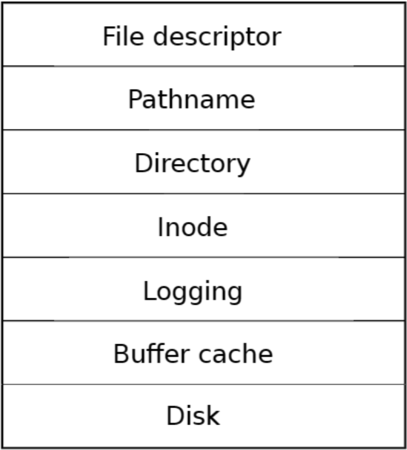
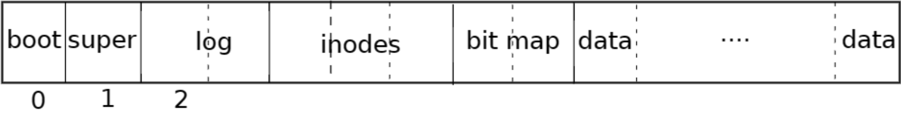
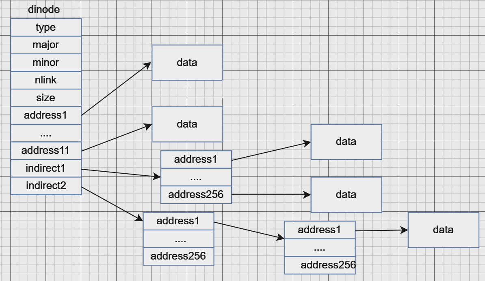
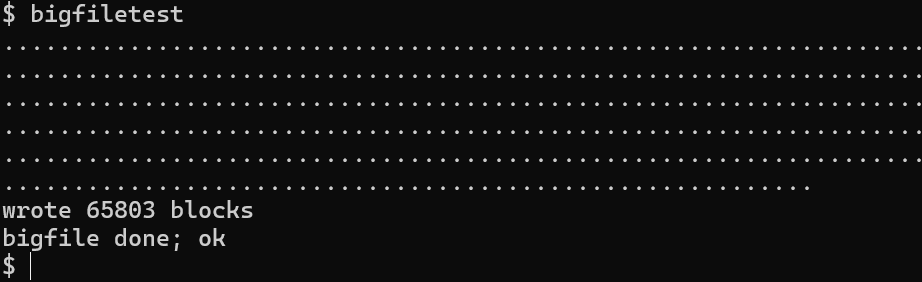
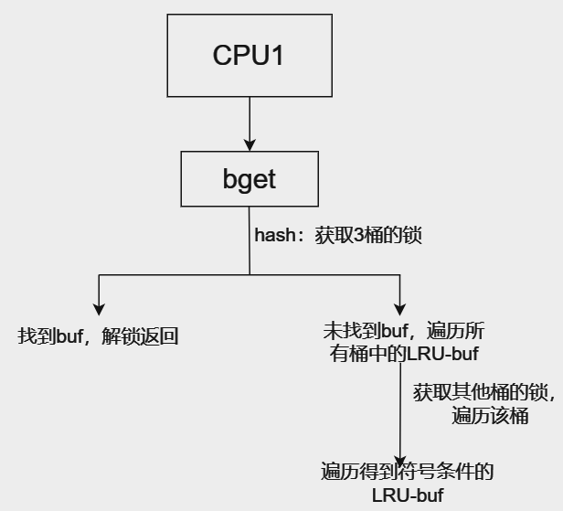
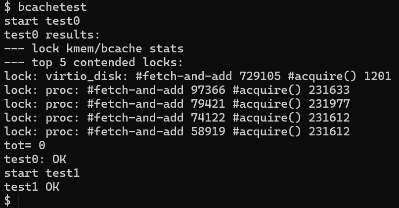
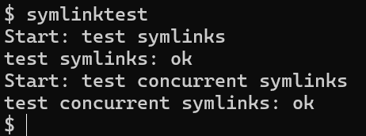
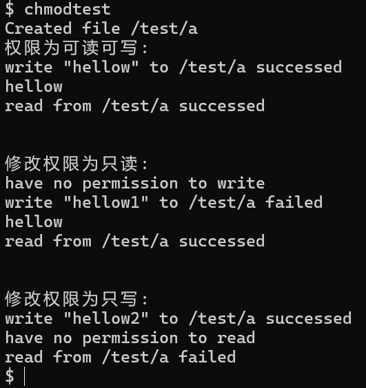
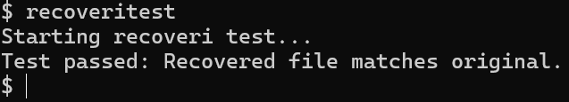

# OopsOS——文件系统

OopsOS基于XV6实现，文件系统采用近似ext4的方式设计，文档分为两部分：xv6的基本功能与我们改进与新增的功能。

**目录：**

一、基本功能

二、改进与创新

- 2.1 二级间接块的混合索引分配方式
- 2.2 细粒度化buffer cache互斥锁
- 2.3 符号链接
- 2.4 文件访问控制权限
- 2.5 基于索引信息的文件恢复策略
- 2.6 文件预分配（fallocate）
- 2.7 文件克隆与写时复制（fclone）
- 2.8 文件偏移量随机访问（lseek）
- 2.9 文件截断（truncate/ftruncate）
- 2.10 文件重命名（rename）
- 2.11 块级在线去重（dedup）

## 一、基本功能

### 1.1 层次结构

xv6文件系统分为七层：

1. **Disk层**：读取和写入virtio硬盘上的块。
2. **Buffer cache层**：缓存磁盘块并同步访问，确保每次只有一个进程可以修改数据。
3. **Logging层**：将多个块的更新包装为事务，崩溃时保证数据一致性。
4. **Inode层**：每个文件通过索引结点（i-number）表示，保存文件数据的块。
5. **Directory层**：目录实现为索引结点，包含目录项（文件名和inode编号）。
6. **Pathname层**：解析分层路径名，通过递归查找。
7. **File descriptor层**：抽象Unix资源（如文件、管道等），简化应用程序使用。



### 1.2 磁盘划分

在xv6文件系统中，为了存储索引节点和数据块的位置，文件系统将磁盘划分为多个部分。具体布局如下：

1. **块0**：保留用于引导扇区，文件系统不使用此块。
2. **块1**：称为超级块，包含整个文件系统的元数据，如文件系统的大小（以块为单位）、数据块数量、索引节点数量以及日志块数量等文件系统布局信息。
3. **日志区域**：从块2开始的区域用于存储日志，用于确保文件系统的事务性和一致性。
4. **索引节点区**：日志区域之后是索引节点区，每个磁盘块中存储多个索引节点（inode）。
5. **位图块**：位图块紧随索引节点区，用于跟踪文件系统中数据块的使用情况，标记哪些数据块已被分配，哪些是空闲的。
6. **数据块**：剩余的磁盘块是数据块，用于存储文件或目录的实际内容。每个数据块要么被位图标记为已分配，要么标记为空闲。

超级块的内容是由一个名为`mkfs`的程序生成的，该程序负责构建文件系统的初始结构，并填充超级块信息。



### 1.3 逻辑结构与物理结构

xv6文件系统的**逻辑结构**和**物理结构**相互对应。逻辑结构是文件系统的抽象层，主要包括目录、文件和路径名等概念；物理结构是文件系统在磁盘上的具体布局，主要包括数据块、索引节点（inode）、日志等。

- **逻辑结构**：包括目录、文件和路径名。文件由索引节点（inode）表示，每个文件或目录都有一个唯一的inode编号。目录是特殊类型的文件，包含一组目录项，每个目录项有文件名和对应的inode编号。路径名通过递归方式解析，指向具体的文件或目录。
- **物理结构**：包括磁盘上分配的块。磁盘分为多个区域：引导块、超级块、日志区域、索引节点区域、位图块、数据块等。逻辑结构通过物理结构实现，文件的索引节点和数据块存储在物理磁盘的特定位置，路径名解析最终对应到这些物理位置。

### 1.4 文件描述符、file结构体、索引节点inode和盘块关系

在xv6中，文件描述符、`file`结构体、索引节点（inode）和磁盘块（block）之间有明确的关系：

- **文件描述符（File Descriptor）**：每个进程通过文件描述符与打开的文件进行交互。文件描述符是进程打开文件时返回的整数，用于标识进程与文件的访问。
- **`file`结构体**：每个文件描述符都对应一个`file`结构体，`file`结构体中包含文件的相关信息，如指向`inode`的指针、文件当前的偏移量、文件状态等。`file`结构体在内核中用于管理打开的文件。
- **索引节点（inode）**：每个文件都有一个对应的索引节点（inode），它存储文件的元数据，包括文件的大小、权限、创建时间、最后访问时间、数据块的位置等。索引节点通过`inode`结构体表示。
- **磁盘块（Block）**：磁盘上的数据块用于存储文件的实际内容或索引节点。每个文件的内容被分割成多个数据块，存储在磁盘上；而文件的索引节点则存储在特定的索引节点区域。磁盘块通过位图来管理，指示哪些块是空闲的，哪些块已经分配给文件。

文件描述符指向`file`结构体，`file`结构体通过`inode`指向磁盘上的数据块，`inode`存储文件的元数据，而数据块保存文件的实际内容。

### 1.5 Block块管理

在xv6文件系统中，**块（Block）管理**负责跟踪和管理磁盘上的所有数据块和空闲块。xv6使用位图（Bitmap）来管理块的使用情况。

- **位图（Bitmap）**：位图用于表示磁盘块的分配情况。每个比特位对应一个磁盘块，值为1表示该块已分配，值为0表示该块为空闲状态。通过位图，系统能够快速判断某个磁盘块是否已被使用，以及找到空闲块以供分配。
- **数据块**：文件的数据存储在数据块中，每个数据块存储一定数量的字节（通常为512字节或4KB）。数据块通过位图进行管理，确保文件系统能有效地分配和回收块。
- **块分配**：文件系统通过块分配算法（如顺序分配或链式分配）从位图中选择空闲块，并将其分配给文件。当文件写入数据时，系统为文件分配新的数据块，并更新位图。
- **块回收**：当文件删除或文件系统需要清理空间时，系统会回收不再使用的块，并将其标记为可用（在位图中设置为0）。

### 1.6 Inode保存数据的结构

在xv6文件系统中，**inode**是文件的核心数据结构之一，用于存储文件的元数据（如大小、权限、创建时间等）和数据块的指针。文件的数据分布在磁盘上的多个数据块中，xv6采用两层结构来存储文件数据：

1. **直接指针（Direct Pointers）**：每个inode包含12个直接指针（通常为12个32位指针），这些指针直接指向文件数据块。当文件小到足以放入这些数据块时，所有数据块直接通过inode中的指针访问。
2. **间接指针（Indirect Pointers）**：
   - **一级间接指针**：如果文件的数据超过了12个数据块，则使用一个一级间接指针。该指针指向一个数据块，这个数据块存储更多的数据块指针，进而指向文件的数据。
   - **二级间接指针**：如果文件更大，一级间接指针仍不足以存储所有的数据块指针，则使用二级间接指针。该指针指向一个数据块，这个数据块包含一级间接指针的地址，从而间接指向更多的数据块。

通过这种**两层的结构**（直接指针和间接指针），xv6能够有效地管理大文件的存储，使文件系统既能处理小文件，也能支持大文件的存储需求。这种结构提供了较好的空间利用率，并且在文件增大时提供了扩展性。


------

### 1.7 buffer cache层

数据结构定义：

```c
struct buf {
  int valid;   // 记录是否数据从磁盘读取到内存，首次记录目标块时会标记为0
  int disk;    // 用于磁盘层驱动和中断之间作为消息
  uint dev;    // 设备号
  uint blockno; // 缓冲对应的硬盘块号
  struct sleeplock lock;  // 睡眠锁
  uint refcnt;  //记录有多少进程在使用该缓冲块
  struct buf *prev; // 双向循环链表，方便LRU算法处理
  struct buf *next;
  uchar data[BSIZE];//硬盘数据存储位置
  uint timestamp;  // 时间戳
};
```

**Buffer cache有两个任务**

- 同步对磁盘块的访问，以确保磁盘块在内存中只有一个副本，并且一次只有一个内核线程使用该副本
- 缓存常用块，以便不需要从慢速磁盘重新读取它们

**Buffer cache层导出的主接口主要是 bread 和 bwrite :**

- `bread` 获取一个buf，其中包含一个可以在内存中读取或修改的块的副本
- `bwrite` 将修改后的缓冲区写入磁盘上的相应块

内核线程必须通过调用 `brelse` 释放缓冲区。Buffer cache每个缓冲区使用一个睡眠锁，以确保每个缓冲区(每个磁盘块)每次只被一个线程使用;`bread` 返回一个上锁的缓冲区，`brelse` 释放该锁。

Buffer cache中保存磁盘块的缓冲区数量固定，这意味着如果文件系统请求还未存放在缓存中的块Buffer cache必须回收当前保存其他块内容的缓冲区。Buffer cache为新块回收最近使用最少的缓冲区。这样做的原因是认为最近使用最少的缓冲区是最不可能近期再次使用的缓冲区。
Buffer cache是以双链表表示的缓冲区。 main(kernel/main.c)调用的函数 binit 使用静态数组 buf(kernel/bio.c)中的 NBUF 个缓冲区初始化列表。对Buffer cache的所有其他访问都通过 bcache.head 引用链表，而不是 buf 数组。
缓冲区有两个与之关联的状态字段。字段 valid 表示缓冲区是否包含块的副本。字段 disk 表示缓冲区内容是否已交给磁盘，这可能会更改缓冲区(例如，将数据从磁盘写入 data)
`bread` 调用 `bget` 为给定扇区获取缓冲区。如果缓冲区需要从磁盘进行读取，`bread` 会在返回缓冲区之前调用 `virtio disk rw` 来执行此操作。
`bget` 扫描缓冲区列表，查找具有给定设备和扇区号的缓冲区。如果存在这样的缓冲区，`bget` 将获取缓冲区的睡眠锁。然后 bget 返回锁定的缓冲区。
如果对于给定的扇区没有缓冲区，`bget` 必须创建一个，这可能会重用包含其他扇区的缓冲区。再次扫描缓冲区列表，查找未在使用中的缓冲区(`b->refcnt =0` ):任何这样的缓冲区都可以使用。 `bget` 编辑缓冲区元数据以记录新设备和扇区号，并获取其睡眠锁。`b>valid=8`  的布置确保了 `bread` 将从磁盘读取块数据，而不是错误地使用缓冲区以前的内容。

------


### 1.8 超级块（Superblock）

超级块（Superblock）是文件系统的核心元数据，它描述了文件系统的布局、容量、状态等关键信息。每个文件系统只有一个超级块，存储在磁盘的固定位置（在 xv6 中是第 2 块）。超级块的主要作用是提供有关文件系统结构的基本信息，帮助系统在启动时识别文件系统并进行相应的初始化。

**实现**：

```c
struct superblock
{
  uint magic;      // 文件系统魔数，用于验证文件系统的有效性，必须为 FSMAGIC
  uint size;       // 文件系统镜像的总大小（以块为单位）
  uint nblocks;    // 数据块的数量
  uint ninodes;    // inode 的数量
  uint nlog;       // 日志块的数量
  uint logstart;   // 日志块的起始位置
  uint inodestart; // inode 块的起始位置
  uint bmapstart;  // 空闲位图块的起始位置
};
```

- **magic**：文件系统标识符，确保文件系统的有效性和识别。每个文件系统的超级块中都应该包含一个特定的魔数（在 xv6 中是 `FSMAGIC`），如果这个值不匹配，则说明文件系统无效。
- **size**：文件系统的总大小（以块为单位）。表示文件系统的容量，包括数据块、inode 块、日志块等。
- **nblocks**：文件系统中的数据块数量，用来存储实际的文件数据。
- **ninodes**：inode 的数量，每个文件和目录都有一个对应的 inode。
- **nlog**：日志块的数量，用于事务日志的管理。
- **logstart**：日志块的起始位置，指示文件系统的日志存储区域。
- **inodestart**：inode 块的起始位置，表示 inode 存储区域的位置。
- **bmapstart**：位图块的起始位置，位图用于跟踪哪些数据块是空闲的，哪些已经被使用。

通过超级块，文件系统可以快速了解磁盘布局和资源分布，是文件系统运行的基础。

------

### 1.9 索引节点（Inode）

在 xv6 中，每个文件都由一个对应的 **inode** 结构体来表示。inode 存储了关于文件的元数据（如文件类型、权限、大小、数据块位置等）。每个文件都有一个唯一的 inode 编号（i-number），系统通过 inode 来管理文件的内容和属性。

**实现**：

```c
struct dinode
{
  char mode;                // 文件权限
  char type;                // 文件类型（例如普通文件、设备文件等）
  short major;              // 主设备号，仅对设备文件有效
  short minor;              // 次设备号，仅对设备文件有效
  short nlink;              // 硬链接数，表示有多少目录项指向此 inode
  uint size;                // 文件的大小（字节）
  uint addrs[NDIRECT + 2];  // 数据块的地址，前 11 个是直接地址，接下来的是间接地址
};
```

- **mode**：文件的权限标志，表示文件的访问控制信息，例如可读、可写、可执行等。
- **type**：文件的类型，例如普通文件、设备文件、目录等。
- **major** 和 **minor**：设备文件的主设备号和次设备号。对于普通文件，这两个字段无效。
- **nlink**：硬链接的数量，表示有多少目录项指向该 inode。文件删除时，只有当所有硬链接都删除后，inode 和数据块才会被释放。
- **size**：文件的大小（字节数），指示文件内容的实际大小。
- **addrs**：文件的数据块地址数组。前 11 个地址为直接地址指针，接下来是一个单级间接地址和二级间接地址，指向更多的块。这些地址组成了文件的数据块映射。

通过 inode，文件系统可以知道文件的各种属性和文件数据存储位置。

------

### 1.10 文件描述符（File Descriptor）

文件描述符（File Descriptor）是内核中用来表示打开文件的索引。每个进程在打开文件时，内核会为该文件分配一个文件描述符。文件描述符指向内存中的 `file` 结构体，用户通过文件描述符来进行文件的读写操作。

**实现**：

```c
struct file
{
  enum { FD_NONE, FD_PIPE, FD_INODE, FD_DEVICE, FD_SOCK } type; // 文件类型
  int ref;                   // 引用计数
  char readable;             // 是否可读
  char writable;             // 是否可写
  struct pipe *pipe;         // 若是管道文件，指向管道结构体
  struct inode *ip;          // 若是普通文件或设备文件，指向 inode 结构体
  struct sock *sock;         // 若是套接字，指向 sock 结构体
  uint off;                  // 文件的偏移量（对于 inode 类型）
  short major;               // 设备主设备号（对于设备文件）
};
```

- **type**：文件类型，用于区分普通文件、管道、设备文件和套接字。
- **ref**：文件的引用计数。文件描述符的引用计数跟踪了有多少进程打开了此文件，文件在关闭时会递减该计数。
- **readable** 和 **writable**：表示文件是否可读和可写。如果为 `0`，则表示不可读或不可写。
- **pipe**：如果文件描述符指向的是管道，`pipe` 字段指向管道的结构体。
- **ip**：如果文件描述符指向的是一个常规文件或设备文件，`ip` 字段指向该文件或设备的 inode 结构体。
- **off**：文件的读写偏移量，表示文件的当前读写位置。
- **major**：设备文件的主设备号，用于标识设备。

文件描述符在进程的文件操作中起着重要作用，进程通过文件描述符来访问文件和设备。

------

### 1.11 file 结构体

`file` 结构体在 xv6 中是内核用来表示打开文件的关键数据结构。每当一个进程打开文件时，内核会为该文件分配一个 `file` 结构体并分配一个文件描述符。`file` 结构体包括文件的类型、引用计数、读写权限、偏移量等信息。

**实现**：

```c
struct file
{
  enum { FD_NONE, FD_PIPE, FD_INODE, FD_DEVICE, FD_SOCK } type; // 文件类型
  int ref;                   // 引用计数
  char readable;             // 是否可读
  char writable;             // 是否可写
  struct pipe *pipe;         // 若是管道文件，指向管道结构体
  struct inode *ip;          // 若是普通文件或设备文件，指向 inode 结构体
  struct sock *sock;         // 若是套接字，指向 sock 结构体
  uint off;                  // 文件的偏移量（对于 inode 类型）
  short major;               // 设备主设备号（对于设备文件）
};
```

- **type**：通过文件的类型，文件描述符可以区分不同类型的文件，如普通文件、管道、设备文件和套接字等。
- **ref**：引用计数，用于跟踪文件描述符的引用情况，确保文件在不再使用时能够被正确释放。
- **readable/writable**：标识文件是否具有读写权限。
- **pipe**：指向管道的结构体，文件描述符通过该字段访问管道。
- **ip**：指向 inode，文件描述符通过该字段访问文件的 inode，从而获取文件的元数据。
- **off**：当前的文件偏移量，指示文件操作的当前读写位置。
- **major**：设备文件的主设备号。

------

### 1.12 磁盘块（Block）

磁盘块是文件系统的基本存储单位，每个块存储一定量的数据。在 xv6 中，每个块的大小是 1024 字节。磁盘块被用于存储文件数据、inode、日志等。文件系统通过管理磁盘块来存储和管理文件。

**实现**：

```c
#define BSIZE 1024 // 块大小定义为 1024 字节
```

每个磁盘块可以存储 1024 字节的数据，它们是文件系统的最小分配单位。在 xv6 中，所有文件、目录、日志和索引节点的数据都以块为单位进行管理。

------

### 1.13 位图（Bitmap）

位图用于管理文件系统的空闲空间，尤其是磁盘块和 inode 的使用情况。每个位置代表一个块或 inode 是否被占用，`0` 表示该位置未使用，`1` 表示该位置已被占用。

**实现**：

```c
// 每个位图都有一个与文件系统大小相对应的位图块
#define BITMAPSIZE 256 // 位图的大小
```

位图帮助文件系统有效地管理磁盘空间，提供了一个便捷的方式来判断一个块或 inode 是否已被分配。

------


## 二、改进与创新

### 2.1 二级间接块的混合索引分配方式

### 2.1.1 原理介绍



在原本的设计中，只有12个直接块和1个一级间接块，文件大小限制为268个块或`268*BSIZE`字节。（`BSIZE`为1024B）为了支持存储更大的文件，我们将1个直接块改成了二级间接块，结果将是一个文件将能够包含多达65803个块或65803KB。

### 2.1.2 实现策略

- 在fs.h中添加宏定义

```c

#define NDIRECT 11	// 直接块的数量
#define NINDIRECT (BSIZE / sizeof(uint)) //一级间接块
#define NDINDIRECT ((BSIZE / sizeof(uint)) * (BSIZE / sizeof(uint)))	//二级间接块
#define MAXFILE (NDIRECT + NINDIRECT + NDINDIRECT)	// 文件大小限制
#define NADDR_PER_BLOCK (BSIZE / sizeof(uint))	// 一个块中的地址数量

```

- 由于`NDIRECT`定义改变，其中一个直接块变为了二级间接块，需要修改inode结构体中`addrs`元素数量

```c
// fs.h
struct dinode {
  ...
  uint addrs[NDIRECT + 2];   // Data block addresses
};
// file.h
struct inode {
  ...
  uint addrs[NDIRECT + 2];
};
```

- 修改`bmap`支持二级索引
  - **二级间接块的处理：**
    - `bn` 是文件中请求的块号，这段代码处理的是当块号位于二级间接块中的情况（即 `bn < NDINDIRECT`）。
  - **计算索引**
  - **读取二级间接块：**
    - `ip->addrs[NDIRECT + 1]` 存储了二级间接块的地址（如果它为空，则需要分配一个新块）。`balloc(ip->dev)` 是一个分配块的函数，返回新分配块的地址。
    - `bread(ip->dev, addr)` 用于从磁盘读取指定地址的块。
  - **处理一级间接块：**
    - 如果二级间接块中的相应位置为空，说明一级间接块还未分配，需要分配新的块，并通过 `log_write(bp)` 标记这次更改为磁盘写入做准备。
  - **读取和处理数据块地址：**
    - 从一级间接块读取实际的文件数据块地址。如果该地址为空，说明该位置的数据块尚未分配，需要新分配一个块，并同样记录更改。
  - **`brelse(bp)` 和 `log_write(bp)`：**
    - `brelse(bp)` 用于释放缓冲区，确保后续操作不受锁影响。
    - `log_write(bp)` 用于标记该缓冲区需要写回磁盘，保证更改持久化。

```c
 ...
    // 二级间接块的情况
  if(bn < NDINDIRECT) {
    int level2_idx = bn / NADDR_PER_BLOCK;  // 要查找的块号位于二级间接块中的位置
    int level1_idx = bn % NADDR_PER_BLOCK;  // 要查找的块号位于一级间接块中的位置
    // 读出二级间接块
    if((addr = ip->addrs[NDIRECT + 1]) == 0)
      ip->addrs[NDIRECT + 1] = addr = balloc(ip->dev);
    bp = bread(ip->dev, addr);
    a = (uint*)bp->data;
    if((addr = a[level2_idx]) == 0) {
      a[level2_idx] = addr = balloc(ip->dev);
      // 更改了当前块的内容，标记以供后续写回磁盘
      log_write(bp);
    }
    brelse(bp);
    bp = bread(ip->dev, addr);
    a = (uint*)bp->data;
    if((addr = a[level1_idx]) == 0) {
      a[level1_idx] = addr = balloc(ip->dev);
      log_write(bp);
    }
    brelse(bp);
...
```

- 修改`itrunc`释放所有块

  **在二级间接块不为空的情况下：**

  - 遍历并释放一级间接块指向的数据块。

  - 释放一级间接块和二级间接块本身。

  - 更新 `ip->addrs[NDIRECT + 1]`，将二级间接块地址设置为 0，表示该文件不再使用二级间接块。

```c
...
if (ip->addrs[NDIRECT + 1]) // 检查文件是否使用二级间接块
{
    bp = bread(ip->dev, ip->addrs[NDIRECT + 1]);// 读取二级间接块
    a = (uint*)bp->data;  // 二级间接块中存储的一级间接块地址数组
    for (i = 0; i < NADDR_PER_BLOCK; i++) // 遍历二级间接块中的一级间接块
    {
        if (a[i]) {  // 如果该一级间接块地址有效
            // 读取一级间接块
            bp1 = bread(ip->dev, a[i]);
            a1 = (uint*)bp1->data;  // 一级间接块中存储的数据块地址数组

            // 遍历一级间接块中的数据块
            for (j = 0; j < NADDR_PER_BLOCK; j++) 
            {
                if (a1[j])  // 如果该数据块地址有效
                    bfree(ip->dev, a1[j]);  // 释放数据块
            }
            brelse(bp1);  // 释放一级间接块的缓冲区
            bfree(ip->dev, a[i]);  // 释放一级间接块
        }
    }
    brelse(bp);  // 释放二级间接块的缓冲区
    bfree(ip->dev, ip->addrs[NDIRECT + 1]);  // 释放二级间接块
    ip->addrs[NDIRECT + 1] = 0;  // 清空二级间接块地址
}
...
```

- 补齐 `mkfs` 的 `iappend` 对二级间接块的写入路径，确保 fs.img 中包含超大文件时索引写入与内核寻址保持一致。

### 2.1.3 测试程序

`/user/test/bigfiletest` 用于测试该功能，该程序希望能够创建一个包含65803个块（即混合索引方式最大能支持的文件大小）的大文件并验证读写操作。

**测试结果：**



当块的数量 `blocks` 达到 100 的倍数时，程序会在控制台打印一个 `.`，以显示写入进度。若没有二级间接块或代码编写有误，是不支持该大文件的读写的。

### 2.1.4 优点

增大了系统能支持的最大文件大小。

------


### 2.2 细粒度化buffer cache互斥锁

#### 2.2.1 原理介绍

**Buffer cache有两个任务**

- 同步对磁盘块的访问，以确保磁盘块在内存中只有一个副本，并且一次只有一个内核线程使用该副本

- 缓存常用块，以便不需要从慢速磁盘重新读取它们

**Buffer cache层导出的主接口主要是 `bread` 和 `bwrite`**			

- `	bread` 获取一个`buf`，其中包含一个可以在内存中读取或修改的块的副本

- `bwrite` 将修改后的缓冲区写入磁盘上的相应块

- 内核线程必须通过调用 `brelse` 释放缓冲区。Buffer cache每个缓冲区使用一个睡眠锁，以确保每个缓冲区(每个磁盘块)每次只被一个线程使用;`bread` 返回一个上锁的缓冲区，`brelse` 释放该锁。

Buffer cache是以 双链表 表示的缓冲区。 `main` 调用的函数 `binit` 使用静态数组 `buf`中的 `NBUF` 个缓冲区初始化列表。对Buffer cache的所有其他访问都通过 `bcache.head` 引用链表，而不是 `buf` 数组。

```c
struct {
  struct spinlock lock;
  struct buf buf[NBUF];
  struct buf head;
} bcache;
```

如果多个进程密集地使用文件系统，它们可能会争夺`bcache.lock` ，锁的竞争激烈会降低并发度。类似于空闲页链表锁的细粒度化，我们同样用这种大锁化小锁的思想来降低锁竞争，将缓冲区的分配与回收并行化以提高效率。

我们修改了`bcache`的结构定义如下：

定义哈希桶结构，并在`bcache`中删除全局缓冲区链表，改为使用素数个散列桶，用hash bucket的思想，放弃双链表的管理方式，直接使用**ticks**时间戳来实现**LRU**(least-recently-used)算法。

```c
#define NBUCKET 13
#define HASH(id) (id % NBUCKET)
struct hashbuf {
  struct buf head;       // 头节点
  struct spinlock lock;  // 锁
};
struct {
  struct buf buf[NBUF];
  struct hashbuf buckets[NBUCKET];  // 散列桶
} bcache;
```

#### 2.2.2 实现策略

`binit`修改思路：

- 初始化散列桶的锁
- 将所有散列桶的`head->prev`、`head->next`都指向自身表示为空
- 将所有的缓冲区挂载到`bucket[0]`桶上

```c
void
binit(void) {
  struct buf* b;
  char lockname[16];
  for(int i = 0; i < NBUCKET; ++i) {
    // 初始化散列桶的自旋锁
    snprintf(lockname, sizeof(lockname), "bcache_%d", i);
    initlock(&bcache.buckets[i].lock, lockname);
    // 初始化散列桶的头节点
    bcache.buckets[i].head.prev = &bcache.buckets[i].head;
    bcache.buckets[i].head.next = &bcache.buckets[i].head;
  }
  // Create linked list of buffers
  for(b = bcache.buf; b < bcache.buf + NBUF; b++) {
    // 利用头插法初始化缓冲区列表,全部放到散列桶0上
    b->next = bcache.buckets[0].head.next;
    b->prev = &bcache.buckets[0].head;
    initsleeplock(&b->lock, "buffer");
    bcache.buckets[0].head.next->prev = b;
    bcache.buckets[0].head.next = b;
  }
}

```

- 在`buf.h`中增加新字段`timestamp`，在原始方案中，每次`brelse`都将被释放的缓冲区挂载到链表头，表明这个缓冲区最近刚刚被使用过，在`bget`中分配时从链表尾向前查找，这样符合条件的第一个就是最久未使用的。使用时间戳作为LRU判定的法则，这样就无需在`brelse`中进行头插法更改结点位置。

```c
struct buf {
  ...
  uint timestamp;  // 时间戳
};
```

- 更改`brelse`，不再获取全局锁

```c
void brelse(struct buf* b) {
  if(!holdingsleep(&b->lock))
    panic("brelse");
  int bid = HASH(b->blockno);
  releasesleep(&b->lock);
  acquire(&bcache.buckets[bid].lock);
  b->refcnt--;
  // 更新时间戳
  // 由于LRU改为使用时间戳判定，不再需要头插法
  acquire(&tickslock);
  b->timestamp = ticks;
  release(&tickslock);
  release(&bcache.buckets[bid].lock);
}
```

- `bget` ，当没有找到指定的缓冲区时进行分配，分配方式是优先从当前列表遍历，找到一个没有引用且`timestamp`最小的缓冲区，如果没有就申请下一个桶的锁，并遍历该桶，找到后将该缓冲区从原来的桶移动到当前桶中，最多将所有桶都遍历完。

**LRU-buf:** 最近最久未使用且引用计数为0



```c
...   
	// 如果遍历到当前散列桶，则不重新获取锁
    if(i != bid) {
      if(!holding(&bcache.buckets[i].lock))
        acquire(&bcache.buckets[i].lock);
      else
        continue;
    }

    for(tmp = bcache.buckets[i].head.next; tmp != &bcache.buckets[i].head; tmp = tmp->next)
      // 使用时间戳进行LRU算法，而不是根据结点在链表中的位置
      if(tmp->refcnt == 0 && (b == 0 || tmp->timestamp < b->timestamp))
        b = tmp;

    if(b) {
      // 如果是从其他散列桶窃取的，则将其以头插法插入到当前桶
...
```

- 为避免跨桶同时持锁引发死锁风险，引入 `evict_lock` 串行化回收流程；`bget` 未命中时先二次检查，再在单桶锁内选择可回收 buf，最后转移到目标桶。

#### 2.2.3 测试程序

`/user/test/bcachetest` 用于测试该功能，考虑**多进程**对文件系统的**并发访问**，并验证文件操作在多进程环境下是否正常。

测试结果：



锁的竞争减少，在多个进程下文件操作能正常进行。

#### 2.2.4 优点

减少文件系统中锁的争用，提高多核并行效率。

------


### 2.3 符号链接

#### 2.3.1 原理介绍

参考**linux**上的symlink软链接功能, 比如**symlink('a', 'b')**后,**open('b')**这个指令会实际上索引到文件**'a'**所对应的文件data block。

符号链接（或软链接）是指按路径名链接的文件；当一个符号链接打开时，内核跟随该链接指向引用的文件。符号链接类似于硬链接，但硬链接仅限于指向同一磁盘上的文件，而符号链接可以跨磁盘设备。


#### 2.3.2 实现策略

- 添加新的文件类型——符号文件,并定义最大链接深度。

```c
#define T_SYMLINK 4
#define MAX_SYMLINK_DEPTH 10
```

- `sys_symlink` 的实现
  - **获取路径参数 **：从用户空间获取两个路径参数，第一个是符号链接的目标路径 `target`，第二个是符号链接文件本身的路径 `path`。
  - **创建符号链接的 inode **：调用 `create()` 函数在文件系统中为符号链接文件分配一个 inode，并初始化为符号链接类型`T_SYMLINK`。
  - **写入目标路径** ：将目标路径（即符号链接指向的文件或目录的路径）写入符号链接的 inode 数据块。
  - **释放资源** ：在操作完成后，解锁并释放 inode，结束文件系统操作

```c
uint64 sys_symlink(void) {
  char target[MAXPATH], path[MAXPATH];
  struct inode* ip_path;
  if(argstr(0, target, MAXPATH) < 0 || argstr(1, path, MAXPATH) < 0) {
    return -1;
  }
  begin_op();
  ip_path = create(path, T_SYMLINK, 0, 0);	// 分配一个inode结点，create返回锁定的inode
  if(ip_path == 0) {
    end_op();
    return -1;
  }
  // 向inode数据块中写入target路径
  if(writei(ip_path, 0, (uint64)target, 0, MAXPATH) < MAXPATH) {
    iunlockput(ip_path);
    end_op();
    return -1;
  }
  iunlockput(ip_path);
  end_op();
  return 0;
}
```

- 修改`sys_open`支持打开符号链接，对于超过最大链接深度的返回错误。

```c
...
// 处理符号链接
  if(ip->type == T_SYMLINK && !(omode & O_NOFOLLOW)) {
    // 若符号链接指向的仍然是符号链接，则递归的跟随它
    // 直到找到真正指向的文件
    // 但深度不能超过MAX_SYMLINK_DEPTH
    for(int i = 0; i < MAX_SYMLINK_DEPTH; ++i) {
      // 读出符号链接指向的路径
      if(readi(ip, 0, (uint64)path, 0, MAXPATH) != MAXPATH) {
        iunlockput(ip);
        end_op();
        return -1;
      }
...
```

#### 2.3.3 测试程序

`/user/test/symlinktest`  用于测试该功能，考虑如下情况：

- **符号链接的创建**：确保可以成功创建符号链接，且链接类型正确。
- **符号链接的读取**：验证通过符号链接访问文件时，能够正确读取目标文件的内容。
- **符号链接的删除**：测试删除目标文件后，符号链接是否仍然有效。
- **符号链接的循环引用**：验证符号链接是否能够正确处理循环引用情况（如 `b` -> `a` -> `b`）。
- **符号链接指向不存在的文件**：即使目标文件不存在，符号链接也应当成功创建。
- **符号链接的链式引用**：测试符号链接形成的链条是否能正确访问。
- **符号链接的内容传递**：通过符号链接读取的数据应该和通过链接指向的文件的数据一致。
- **并发操作符号链接**。模拟了多个子进程同时对同一个符号链接进行创建和删除操作，验证系统在并发环境下处理符号链接。

**测试结果：**



#### 2.3.4 优点

提高文件系统的灵活性，可以跨磁盘实现文件共享。

------


### 2.4 文件访问控制权限

#### 2.4.1 原理介绍

在原本的系统中，没有设置文件的访问权限，为了提高文件系统的安全性与访问保护，我们对文件添加了读、写、执行三种权限。

文件有4种类型,分别是目录、文件、设备、符号链接。我们只限制普通文件的读写权限即`T_FILE`类型的文件读写才受到控制。而且将`mode`的最低位作为读位,次低位作为写位,则有

- 3表示可读可写
- 2表示可写。
- 1表示可读。
- 0表示不可读不可写。

为了支持该功能,我们实现了系统调用`sys_chmod()`来修改权限。

#### 2.4.2 实现策略

- 在`inode` 上添加读写权限标志。

`inode` 结构体定义在`file.h` ,其中一部分信息要存储在硬盘中,这部分内容用`dinode` 描述。由于磁盘布局是很严格的,所以结构体的大小都是设计好的。用来描述文件类型的变量是short类型,为了增加文件权限功能,且不影响文件系统布局,我们将short类型拆成两个char类型,一个用来当作`mode` 来描述文件权限,此时新的`dinode` 定义如下

```c
struct dinode
{
  char mode;                // 文件权限
  char type;              // 文件类型
  short major;             // 主设备号
  short minor;             // 从设备号
  short nlink;             // 引用计数
  uint size;               // 文件大小
  uint addrs[NDIRECT + 2];   // 数据块地址
};
```

- 提高修改读写权限的系统调用`sys_chmod()`

参考`link()` 系统调用过程，我们新增该系统调用来修改`inode->mode` .

```c
int sys_chmod(void) {
  char pathname[MAXPATH];  // 存储文件路径
  int mode;  // 存储文件权限模式
  struct inode *ip;  // 用于指向文件的 inode 结构体
  // 获取系统调用的参数：文件路径和权限模式
  if (argstr(0, pathname, MAXPATH) < 0 || argint(1, &mode) < 0)
    return -1;  // 如果获取参数失败，返回 -1
  begin_op();  // 开始一个操作事务（通常与文件系统的锁相关）
  // 查找文件的 inode，路径不存在则返回错误
  if ((ip = namei(pathname)) == 0) {
    end_op();  // 结束事务
    return -1;  // 如果找不到文件，返回错误
  }
  ilock(ip);  // 锁定 inode，准备修改文件
  ip->mode = (char)mode;  // 修改 inode 的权限模式
  iupdate(ip);  // 更新 inode，保存更改到磁盘
  iunlock(ip);  // 解锁 inode，允许其他操作  
  end_op();  // 结束事务，释放相关资源
  return 0;  // 返回 0，表示操作成功
}
```

- 读写前判断

接下来可以使用新增的权限来限制读写操作。文件的读写函数分别是`fileread()` 和 `filewrite()` 

在`fileread()` 中加入权限检查：

```c
if(f->type == FD_INODE){
    ilock(f->ip);
    if((f->ip->mode&1)==0){	//不可读
      iunlock(f->ip);
      printf("have no permission to read\n");
      return -1;  // 表示读操作失败
    }
```

在`filewrite()` 中加入权限检查

```c
 begin_op();
      ilock(f->ip);
      if((f->ip->mode&2)==0){ //判断是否可写
        iunlock(f->ip);
        end_op();
        printf("have no permission to write\n");
        return -1;    //写操作失败
      }
```

这样就完成了读写的权限判断。

#### 2.4.3 测试程序

`/user/test/chmodtest`  用于测试该功能，考虑如下情况：

- **创建文件，修改权限为可读可写，并读写测试，读写成功**
- **修改权限为只读，并读写测试 ，写操作将失败**
- **修改权限为只写，并读写测试 ，读操作将失败**

**测试结果：**



测试结果符合预期情况。

#### 2.4.4 优点

通过文件属性对进行访问控制，提高文件系统的安全性。

------


### 2.5 基于索引信息的文件恢复策略

#### 2.5.1 原理介绍

我们尝试删除一个文件后，需要根据原有文件留存的数据盘块，将其恢复。由于系统在删除文件时，虽然清除了`inode` 内容，但是数据盘块没有清除。因此重建`inode` 信息就可以恢复文件。所以我们提出了一个文件恢复策略——先将索引信息保存下来，删除文件后，在根据保存的索引信息恢复文件。

#### 2.5.2 实现策略

- 记录索引表

先记录将要删除的文件索引表内容，然后直接按照索引表重建一个文件。所以用系统调用`sys_geti()` 实现上述功能。

```c
int sys_geti()  //保存文件索引信息
{
  char pathname[MAXPATH];
  uint64 addrsout;
  uint addrsin[14];
  struct inode*ip;
  if(argstr(0,pathname,MAXPATH)<0||argaddr(1,&addrsout)<0) return -1;
  begin_op();
  if((ip=namei(pathname))==0)	// 得不到对应索引节点
  {
    end_op();
    return -1;
  }
  ilock(ip);	// 同步inode和dinode
  for(int i=0;i<13;i++)
    addrsin[i]=ip->addrs[i];	// 复制索引
  addrsin[13]=ip->size;
  iunlock(ip);
  end_op();
   // 将内核中的 addrsin 写入到用户空间的 addrsout
    if (copyout(myproc()->pagetable, addrsout, (char *)addrsin, sizeof(addrsin)) < 0) {
        return -1; // 如果写入失败，返回错误
    }
  return 0;
}
```

- 恢复数据

由于我们直接保存了文件的索引表，因此可以直接进行恢复，按文件的逻辑顺序读出盘块即可，用`sys_recoveri()` 实现该功能。

```c
int sys_recoveri() //根据文件索引信息恢复文件
{
    uint blockno;  // 用户传入的块号（可能是直接块、间接块或二级间接块）
    uint64 bufout; // 用户缓冲区地址
    char bufin[BSIZE]; // 缓冲区大小
    struct buf *b;
    // 获取用户传入的参数
    if (argint(0, (int *)&blockno) < 0 || argaddr(1, &bufout) < 0) {
        return -1;
    }
    b = bread(1, blockno); // 直接读取块
    // 将块内容复制到用户缓冲区
    memmove(bufin, b->data, BSIZE);
    if (copyout(myproc()->pagetable, bufout, bufin, BSIZE) < 0) {
        brelse(b);
        return -1;
    }
    brelse(b);
    return 0; // 成功
}
```

- 完成用户程序的编写

用户程序`/user/program/savei.c` 和`/user/program/recoveri.c` 在用户层面上提供了功能接口。

#### 2.5.3 测试程序

`/user/test/recoveritest`  用于测试该功能，测试方法如下：

新建一个文件`testfile`，向该文件写入信息后，调用`savei.c` 用一个临时文件保存了`testfile` 的索引信息。删除`testfile` 后，调用`recoveri.c` 恢复`testfile` ，将删除前的文件数据与恢复后的文件数据进行对比，判断是否一致。（要保证能恢复所有数据，并且没有改变或丢失）

```c
...
	// Step 1: Create a test file
    create_test_file();
    // Step 2: Save the file's inode information
    if (fork() == 0) {
        char *args[] = {"savei", TEST_FILE, TEMP_FILE, 0};
        exec("savei", args);
        exit(0);
    }
    wait(0);
    // Step 3: Recover the file using inode information
    if (fork() == 0) {
        char *args[] = {"recoveri", RECOVERED_FILE, TEMP_FILE, 0};
        exec("recoveri", args);
        exit(0);
    }
    wait(0);
    // Step 4: Compare the original and recovered files
    if (compare_files(TEST_FILE, RECOVERED_FILE)) {
        printf("Test passed: Recovered file matches original.\n");
    } else {
        printf("Test failed: Recovered file does not match original.\n");
    }
...
```

**测试结果：**



通过测试，没有数据改变或丢失。

#### 2.5.4 优点

若用户误删文件，可采取该恢复手段。提供文件系统的安全性与可靠性。

------

### 2.6 文件预分配（fallocate）

#### 2.6.1 原理介绍

对于顺序写入的大文件，提前分配磁盘块可以减少运行时分配与碎片化开销，提高写入性能与数据布局的连续性。

#### 2.6.2 实现策略

- 新增系统调用 `fallocate(fd, size, flags)`，仅对普通文件生效，`FALLOC_KEEP_SIZE` 可保留文件大小。
- 通过遍历块号调用 `bmap` 完成块分配，并在每个事务内分段提交，避免超出日志容量。
- 分配成功后更新 inode 的 `size`，使预分配范围在文件层可见。

#### 2.6.3 测试程序

`/user/test/fallocatetest` 用于验证预分配后的文件大小与读零行为，`usertests` 中也包含该测试项。

#### 2.6.4 优点

降低大文件写入时的分配与碎片化开销，为性能优化和后续改进提供基础。

------

### 2.7 文件克隆与写时复制（fclone）

#### 2.7.1 原理介绍

通过共享数据块实现近乎 O(1) 的文件复制，写入时采用 COW（Copy-on-Write），避免修改影响原文件。

#### 2.7.2 实现策略

- 新增系统调用 `fclone(src, dst)`，创建目标文件并共享源文件数据块。
- 引入块引用计数，启动时扫描 inode 重建引用计数，`balloc/bfree` 按引用计数分配与回收。
- `bmap` 在写入路径上检测共享块并执行 COW：拷贝旧块数据到新块并更新指针。
- `iclone` 仅共享数据块，间接块/二级间接块使用新的元数据块拷贝指针。

#### 2.7.3 测试程序

`/user/test/fclonetest` 创建源文件、克隆后写入克隆文件，验证源文件不变。

#### 2.7.4 优点

节省复制时间与磁盘空间，提供类 reflink 的创新能力。

------

### 2.8 文件偏移量随机访问（lseek）

#### 2.8.1 原理介绍

在原本的 xv6 设计中，文件只能顺序读写，无法随机访问文件的任意位置。为了支持更灵活的文件操作，我们实现了 `lseek` 系统调用，允许程序改变文件的读写偏移量，实现文件的随机访问。

`lseek` 是 Unix/Linux 系统中的标准系统调用，它可以：
- 将文件偏移量设置到文件开头的任意位置（SEEK_SET）
- 相对于当前位置移动偏移量（SEEK_CUR）
- 相对于文件末尾设置偏移量（SEEK_END）

#### 2.8.2 实现策略

- 在 `fcntl.h` 中定义偏移基准常量：

```c
#define SEEK_SET 0  // 从文件开头计算偏移
#define SEEK_CUR 1  // 从当前位置计算偏移
#define SEEK_END 2  // 从文件末尾计算偏移
```

- 新增系统调用 `lseek(fd, offset, whence)`：
  - **参数检查**：验证文件描述符有效性，仅支持普通文件（FD_INODE 类型）。
  - **偏移量计算**：根据 `whence` 参数计算新的偏移位置。
  - **边界检查**：新偏移量不能为负数。
  - **更新偏移**：设置 `file` 结构体中的 `off` 字段。

```c
uint64 sys_lseek(void)
{
  struct file *f;
  int offset;
  int whence;
  int newoff;

  if (argfd(0, 0, &f) < 0 || argint(1, &offset) < 0 || argint(2, &whence) < 0)
    return -1;

  if (f->type != FD_INODE)
    return -1;

  ilock(f->ip);

  switch (whence) {
    case 0:  // SEEK_SET
      newoff = offset;
      break;
    case 1:  // SEEK_CUR
      newoff = f->off + offset;
      break;
    case 2:  // SEEK_END
      newoff = f->ip->size + offset;
      break;
    default:
      iunlock(f->ip);
      return -1;
  }

  if (newoff < 0) {
    iunlock(f->ip);
    return -1;
  }

  f->off = newoff;
  iunlock(f->ip);
  return newoff;
}
```

#### 2.8.3 测试程序

`/user/test/lseektest` 用于测试该功能，考虑如下情况：

- **基本功能测试**：写入数据后使用 SEEK_SET 回到开头重新读取。
- **SEEK_SET 测试**：从文件开头定位到指定位置读取。
- **SEEK_CUR 测试**：从当前位置向前/向后移动偏移量。
- **SEEK_END 测试**：从文件末尾计算偏移量。
- **随机访问测试**：在文件的不同位置写入数据并验证结果。
- **超出文件末尾测试**：验证 seek 到超过文件大小的位置（允许）。
- **无效参数测试**：验证负数偏移和无效 whence 值的错误处理。

**测试结果：**

所有测试通过，lseek 能够正确设置文件偏移量，支持各种偏移模式。

#### 2.8.4 优点

- 支持文件的随机访问，不再局限于顺序读写。
- 允许在文件中间位置读写数据，提高文件操作的灵活性。
- 为数据库、日志文件等需要随机访问的应用提供基础支持。
- 符合 POSIX 标准接口，提高系统兼容性。

### 2.9 文件截断（truncate/ftruncate）

#### 2.9.1 设计背景

在原本的 xv6 设计中，没有提供直接调整文件大小的系统调用。如果要减小文件大小，只能先读取需要保留的内容，删除原文件，再创建新文件并写入。为了支持更灵活的文件大小管理，我们实现了 `truncate` 和 `ftruncate` 系统调用。

这两个系统调用允许：
- **缩小文件**：将文件截断到指定大小，超出部分的数据被丢弃
- **扩展文件**：将文件扩展到指定大小，扩展部分填充为零（稀疏文件）
- **清空文件**：截断到 0 大小可以快速清空文件内容

#### 2.9.2 设计方案

**系统调用号：**
- `SYS_truncate = 77`
- `SYS_ftruncate = 78`

**实现：**

- `truncate(path, length)` —— 按路径截断文件：

```c
uint64 sys_truncate(void)
{
  char path[MAXPATH];
  int length;
  struct inode *ip;

  if(argstr(0, path, MAXPATH) < 0 || argint(1, &length) < 0)
    return -1;

  if(length < 0)
    return -1;

  begin_op();
  ip = namei(path);
  if(ip == 0){
    end_op();
    return -1;
  }

  ilock(ip);
  if(ip->type != T_FILE){
    iunlockput(ip);
    end_op();
    return -1;
  }

  ip->size = length;
  iupdate(ip);
  iunlockput(ip);
  end_op();
  return 0;
}
```

- `ftruncate(fd, length)` —— 按文件描述符截断：

```c
uint64 sys_ftruncate(void)
{
  int fd;
  int length;
  struct file *f;

  if(argint(0, &fd) < 0 || argint(1, &length) < 0)
    return -1;

  if(length < 0)
    return -1;

  if(fd < 0 || fd >= NOFILE)
    return -1;

  struct proc *p = myproc();
  f = p->ofile[fd];
  if(f == 0 || f->type != FD_INODE || !f->writable)
    return -1;

  begin_op();
  ilock(f->ip);
  f->ip->size = length;
  iupdate(f->ip);
  // 如果当前偏移量超过新大小，调整偏移量
  if(f->off > (uint)length)
    f->off = length;
  iunlock(f->ip);
  end_op();
  return 0;
}
```

**用户空间接口：**

```c
int truncate(const char *path, int length);
int ftruncate(int fd, int length);
```

#### 2.9.3 测试

`/user/test/truncatetest` 用于测试该功能，考虑如下情况：

- **缩小文件测试**：验证 ftruncate 能正确缩小文件并保留前部内容。
- **扩展文件测试**：验证 ftruncate 能正确扩展文件大小。
- **按路径截断测试**：验证 truncate 按路径正确截断文件。
- **与 lseek 配合测试**：验证截断后偏移量超过文件末尾时的自动调整。
- **无效参数测试**：验证负数长度、不存在文件、只读描述符的错误处理。

**测试结果：**

所有测试通过，truncate/ftruncate 能够正确调整文件大小。

#### 2.9.4 优点

- 支持直接调整文件大小，无需重新创建文件。
- 可用于快速清空文件内容（截断到 0）。
- 支持创建稀疏文件（扩展文件）。
- 与 lseek 配合，可以实现灵活的文件编辑功能。
- 符合 POSIX 标准接口，提高系统兼容性。

### 2.10 文件重命名（rename）

#### 2.10.1 设计背景

在原本的 xv6 中缺少文件/路径的原子重命名接口，用户态需要通过“复制 + 删除”等方式实现，既低效也容易在失败时留下中间态。
为提升系统兼容性与文件操作体验，我们实现 `rename(oldpath, newpath)` 系统调用。

#### 2.10.2 设计方案

**系统调用号：** `SYS_rename = 79`

**接口：**

```c
int rename(const char *oldpath, const char *newpath);
```

**当前语义（简化实现）：**

- 支持重命名 **非目录项**（普通文件/设备文件/符号链接）。
- 目录支持重命名/跨目录移动到一个**不存在**的目标名（不支持覆盖已有目录项）。
- 若 `newpath` 已存在且为非目录项：覆盖（原 inode 的 `nlink--`）。
- 若 `newpath` 已存在且与 `oldpath` 指向同一 inode：等价于 `unlink(oldpath)`。
- 若 `oldpath` 与 `newpath` 同目录且目标不存在：就地修改目录项名称（无需分配新槽位）。

#### 2.10.3 测试

`/user/test/renametest` 覆盖如下场景：

- 基本重命名：`a -> b` 后 `a` 不存在，`b` 内容不变。
- 覆盖重命名：`b -> c` 覆盖原 `c`。
- 跨目录移动：`d/x -> y` 与 `y -> d/z`。
- 失败场景：源不存在、目标为目录等。

#### 2.10.4 优点

- 提供更接近 POSIX 的文件操作能力。
- 支持常见的“原子替换”模式（先写临时文件再 rename 覆盖）。
- 跨目录移动文件更方便。

### 2.11 块级在线去重（dedup）

#### 2.11.1 设计背景

在镜像/日志/依赖包等场景中，磁盘上常出现大量内容相同的数据块。OopsOS 已具备块引用计数（brefs）与写时复制（COW）能力，因此可以在文件系统层实现“在线去重”：将两个文件中相同的数据块合并为共享块，而后续写入仍保持隔离。

#### 2.11.2 设计方案

- 系统调用号：SYS_dedup = 80
- 接口：int dedup(const char *srcpath, const char *dstpath);

语义：对 dstpath 执行去重，逐块比较 srcpath 与 dstpath 的重叠范围（最多到 min(src.size, dst.size)）。当双方对应块都已分配且内容完全一致时，将 dst 的块指针改为指向 src 的块、增加 src 块引用计数，并释放 dst 原块。去重后对共享块的写入会触发 COW。

返回值：成功返回“新共享”的数据块数量；失败返回 -1。

#### 2.11.3 测试

/user/test/deduptest 覆盖 direct + single-indirect 两类块地址，并使用 geti + recoveri 校验 blockno 级别的共享关系；随后修改 dst 的共享块并验证 src 未变化（COW 隔离）。

#### 2.11.4 优点

- 在不改变应用语义的前提下节省磁盘空间。
- 与 brefs + COW 机制自然协作：共享后写入自动隔离。
- 便于报告展示：可用 blockno 证据证明“去重确实发生”。
