# OopsOS——文件系统

OopsOS 基于 xv6 实现文件系统，并在此基础上加入 VFS 与多项增强能力。
本文档结构与内存管理一致：总览、xv6 基本功能、改进与创新。

**目录：**

- 1. 总览
  - 1.1 文件系统总览
  - 1.2 磁盘布局与关键数据结构
  - 1.3 关键流程图
    - 1.3.1 VFS 路径匹配
    - 1.3.2 文件读写路径
  - 1.4 核心数据结构速览
  - 1.5 模块与代码分布
  - 1.6 系统调用覆盖
- 2. 基本功能（xv6）
  - 2.1 磁盘布局与超级块
  - 2.2 Buffer Cache
  - 2.3 日志（WAL）
  - 2.4 inode 与块映射（bmap）
  - 2.5 目录与路径解析
  - 2.6 file 层与文件描述符
- 3. 改进与创新
  - 3.1 二级间接块的混合索引分配方式
    - 3.1.1 原理介绍
    - 3.1.2 实现策略
    - 3.1.3 测试程序
    - 3.1.4 优点
  - 3.2 细粒度化 buffer cache 互斥锁
    - 3.2.1 原理介绍
    - 3.2.2 实现策略
    - 3.2.3 测试程序
    - 3.2.4 优点
  - 3.3 符号链接
    - 3.3.1 原理介绍
    - 3.3.2 实现策略
    - 3.3.3 测试程序
    - 3.3.4 优点
  - 3.4 文件访问控制权限（chmod/access）
    - 3.4.1 原理介绍
    - 3.4.2 实现策略
    - 3.4.3 测试程序
    - 3.4.4 优点
  - 3.5 基于索引信息的文件恢复策略
    - 3.5.1 原理介绍
    - 3.5.2 实现策略
    - 3.5.3 测试程序
    - 3.5.4 优点
  - 3.6 文件预分配（fallocate）
    - 3.6.1 原理介绍
    - 3.6.2 实现策略
    - 3.6.3 测试程序
    - 3.6.4 优点
  - 3.7 文件截断（truncate/ftruncate）
    - 3.7.1 原理介绍
    - 3.7.2 实现策略
    - 3.7.3 测试程序
    - 3.7.4 优点
  - 3.8 稀疏文件打洞（punch hole）
    - 3.8.1 原理介绍
    - 3.8.2 实现策略
    - 3.8.3 测试程序
    - 3.8.4 优点
  - 3.9 文件克隆与写时复制（fclone）
    - 3.9.1 原理介绍
    - 3.9.2 实现策略
    - 3.9.3 测试程序
    - 3.9.4 优点
  - 3.10 文件偏移量随机访问（lseek）
    - 3.10.1 原理介绍
    - 3.10.2 实现策略
    - 3.10.3 测试程序
    - 3.10.4 优点
  - 3.11 文件重命名（rename）
    - 3.11.1 原理介绍
    - 3.11.2 实现策略
    - 3.11.3 测试程序
    - 3.11.4 优点
  - 3.12 块级在线去重（dedup）
    - 3.12.1 原理介绍
    - 3.12.2 实现策略
    - 3.12.3 测试程序
    - 3.12.4 优点
  - 3.13 文件范围克隆（fclonerange）
    - 3.13.1 原理介绍
    - 3.13.2 实现策略
    - 3.13.3 测试程序
    - 3.13.4 优点
  - 3.14 文件锁（flock）
    - 3.14.1 原理介绍
    - 3.14.2 实现策略
    - 3.14.3 测试程序
    - 3.14.4 优点
  - 3.15 文件同步（fsync/fdatasync）
    - 3.15.1 原理介绍
    - 3.15.2 实现策略
    - 3.15.3 测试程序
    - 3.15.4 优点
  - 3.16 文件扩展属性（xattr）
    - 3.16.1 原理介绍
    - 3.16.2 实现策略
    - 3.16.3 测试程序
    - 3.16.4 优点
  - 3.17 文件系统空间统计（fsinfo/statfs）
    - 3.17.1 原理介绍
    - 3.17.2 实现策略
    - 3.17.3 测试程序
    - 3.17.4 优点
  - 3.18 位置读写（pread/pwrite）
    - 3.18.1 原理介绍
    - 3.18.2 实现策略
    - 3.18.3 测试程序
    - 3.18.4 优点
  - 3.19 文件描述符复制（dup2）
    - 3.19.1 原理介绍
    - 3.19.2 实现策略
    - 3.19.3 测试程序
    - 3.19.4 优点
  - 3.20 分散/聚集 I/O（readv/writev）
    - 3.20.1 原理介绍
    - 3.20.2 实现策略
    - 3.20.3 测试程序
    - 3.20.4 优点
  - 3.21 虚拟文件系统（VFS）
    - 3.21.1 原理介绍
    - 3.21.2 实现策略
    - 3.21.3 测试程序
    - 3.21.4 优点
  - 3.22 挂载/卸载（mount/umount）
    - 3.22.1 原理介绍
    - 3.22.2 实现策略
    - 3.22.3 测试程序
    - 3.22.4 优点


## 1. 总览

### 1.1 文件系统总览

- **分层结构：** Disk → Buffer Cache → Log → Inode → Directory → Pathname → FD。
- **VFS 抽象层：** 统一接口屏蔽底层差异，挂载表决定路径归属。
- **支持范围：** xv6 原生文件系统 + FAT16 文件系统（扩展）。

图 1-1 展示了 OopsOS 文件系统的核心分层结构与 VFS 抽象。

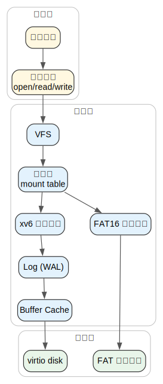

_图 1-1 文件系统总览_

### 1.2 磁盘布局与关键数据结构

- **磁盘布局：** boot/super/log/inode/bitmap/data 依次排列。
- **核心元数据：** superblock 记录全局布局与范围。
- **文件元数据：** inode 保存类型、权限、大小、块地址。

图 1-2 展示了 xv6 文件系统的磁盘布局，各区域依次排列。


_图 1-2 磁盘布局示意_

### 1.3 关键流程图

#### 1.3.1 VFS 路径匹配

步骤列表：
1. `vfs_get_mount()` 对路径执行最长前缀匹配。
2. 使用匹配挂载点的 `ops->namei/nameiparent`。
3. 返回 `vfs_inode`，进入后续打开/读写路径。

图 1-3 展示 VFS 路径匹配的主干流程。

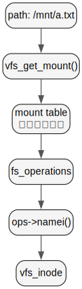

_图 1-3 VFS 路径匹配流程_

#### 1.3.2 文件读写路径

步骤列表：
1. `begin_op()` 开启日志事务。
2. `namei()` 获取 inode 并上锁。
3. `bmap/bread/readi` 或 `writei/log_write` 完成数据访问。
4. `end_op()` 触发提交与落盘。

图 1-4 展示文件读写的事务流程。

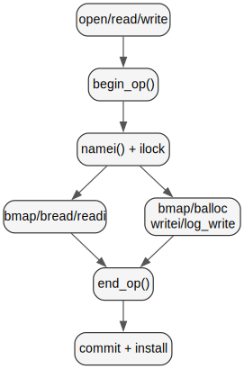

_图 1-4 文件读写主路径_

### 1.4 核心数据结构速览

| 结构体 | 说明 |
|---|---|
| `superblock` | 文件系统布局与容量信息 | 
| `dinode` | 磁盘 inode，保存类型/权限/大小/块地址 |
| `dirent` | 目录项（文件名 + inode 号） |
| `file` | FD 对应的内核文件对象 |
| `buf` | 磁盘块缓存对象 |
| `vfs_inode` | 统一 inode 抽象（含底层 fs_data） |
| `vfs_mount` | 挂载点描述与 ops 指针 |

### 1.5 模块与代码分布

| 文件 | 说明 |
|---|---|
| `kernel/filesystem/fs.c` | 文件系统核心逻辑（inode/目录/块映射） |
| `kernel/filesystem/bio.c` | Buffer cache 实现 |
| `kernel/filesystem/log.c` | WAL 日志实现 |
| `kernel/filesystem/file.c` | file/FD 层操作 |
| `kernel/filesystem/vfs.c` | VFS 核心实现 |
| `kernel/filesystem/fat.c` | FAT16 适配实现 |
| `kernel/filesystem/xattr.c` | 扩展属性实现 |
| `kernel/sysfile.c` | 文件系统系统调用 |
| `kernel/include/fs.h` | 文件系统核心数据结构 |
| `kernel/include/file.h` | file 结构定义 |
| `kernel/include/buf.h` | buf 结构定义 |
| `kernel/include/vfs.h` | VFS 接口定义 |
| `kernel/include/fat.h` | FAT16 数据结构 |

### 1.6 系统调用覆盖

| 分类 | 系统调用 |
|---|---|
| 基础 I/O | read, write, open, close |
| 目录与链接 | mkdir, link, unlink, symlink |
| 权限与锁 | chmod, access, flock |
| 空间管理 | fallocate, truncate, ftruncate, punch |
| 克隆与去重 | fclone, fclonerange, dedup |
| 偏移与批量 I/O | lseek, pread, pwrite, readv, writev |
| 元数据与统计 | fsync, fdatasync, xattr, fsinfo |
| VFS | mount, umount |


## 2. 基本功能（xv6）

### 2.1 磁盘布局与超级块

简要说明：
- superblock 记录布局位置与容量，用于定位日志、inode 与位图。
- mkfs 生成初始磁盘布局，内核通过 `readsb()` 读取。

核心代码：
```c
struct superblock {
  uint magic;      // Must be FSMAGIC
  uint size;       // Size of file system image (blocks)
  uint nblocks;    // Number of data blocks
  uint ninodes;    // Number of inodes
  uint nlog;       // Number of log blocks
  uint logstart;   // First log block
  uint inodestart; // First inode block
  uint bmapstart;  // First bitmap block
};
```

### 2.2 Buffer Cache

简要说明：
- 缓存磁盘块，降低重复 I/O。
- `bread/bwrite/brelse` 形成统一的块访问接口。

核心代码：
```c
struct buf*
bread(uint dev, uint blockno)
{
  struct buf *b = bget(dev, blockno);
  if (!b->valid) {
    virtio_disk_rw(b, 0);
    b->valid = 1;
  }
  return b;
}

void
bwrite(struct buf *b)
{
  if (!holdingsleep(&b->lock))
    panic("bwrite");
  virtio_disk_rw(b, 1);
}
```

### 2.3 日志（WAL）

简要说明：
- 文件系统操作以事务方式提交，保证崩溃一致性。
- `begin_op/end_op` 控制事务边界，日志满时阻塞。

核心代码：
```c
void
begin_op(void)
{
  acquire(&log.lock);
  while (log.committing ||
         log.lh.n + (log.outstanding+1)*MAXOPBLOCKS > LOGSIZE) {
    sleep(&log, &log.lock);
  }
  log.outstanding += 1;
  release(&log.lock);
}

void
end_op(void)
{
  int do_commit = 0;
  acquire(&log.lock);
  log.outstanding -= 1;
  if (log.outstanding == 0) {
    do_commit = 1;
    log.committing = 1;
  } else {
    wakeup(&log);
  }
  release(&log.lock);
  if (do_commit)
    commit();
}
```

### 2.4 inode 与块映射（bmap）

简要说明：
- inode 使用直接块、一级间接块、二级间接块寻址。
- `bmap()` 在写入路径中按需分配新块。

图 2-1 展示 inode 的直接块、一级间接块与二级间接块寻址结构。

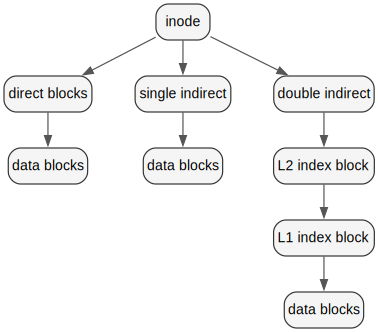

_图 2-1 inode 块映射结构_

核心代码：
```c
if (bn < NDIRECT) {
  if (ip->addrs[bn] == 0)
    ip->addrs[bn] = balloc(ip->dev);
  addr = ip->addrs[bn];
} else if (bn < NDIRECT + NINDIRECT) {
  if (ip->addrs[NDIRECT] == 0)
    ip->addrs[NDIRECT] = balloc(ip->dev);
  // ... 从一级间接块中取地址
} else {
  // ... 二级间接块分配与映射
}
```

### 2.5 目录与路径解析

简要说明：
- 目录是特殊文件，保存 `dirent` 序列。
- `namex()` 逐级解析路径，依赖 `dirlookup()`。

核心代码：
```c
while ((path = skipelem(path, name)) != 0) {
  ilock(ip);
  if (ip->type != T_DIR) {
    iunlockput(ip);
    return 0;
  }
  if (nameiparent && *path == '\0') {
    iunlock(ip);
    return ip;
  }
  if ((next = dirlookup(ip, name, 0)) == 0) {
    iunlockput(ip);
    return 0;
  }
  iunlockput(ip);
  ip = next;
}
```

### 2.6 file 层与文件描述符

简要说明：
- 每个 FD 绑定一个 `struct file`。
- file 层统一处理 inode/设备/管道等不同类型。

核心代码：
```c
if (f->type == FD_INODE) {
  ilock(f->ip);
  if ((r = readi(f->ip, 1, addr, f->off, n)) > 0)
    f->off += r;
  iunlock(f->ip);
}
```


## 3. 改进与创新

### 3.1 二级间接块的混合索引分配方式

#### 3.1.1 原理介绍

- 直接块 + 一级间接块容量有限，限制单文件大小。
- 二级间接块扩展寻址范围，保持 inode 结构稳定。

#### 3.1.2 实现策略

- 新增 `NDINDIRECT`/`NADDR_PER_BLOCK`，扩大 `MAXFILE`。
- `bmap()` 在写入路径中分配二级索引块。

```c
// 二级间接块寻址
bn -= NINDIRECT;
if(bn < NDINDIRECT) {
  int level2_idx = bn / NADDR_PER_BLOCK;
  int level1_idx = bn % NADDR_PER_BLOCK;
  if((addr = ip->addrs[NDIRECT + 1]) == 0)
    ip->addrs[NDIRECT + 1] = addr = balloc(ip->dev);
  // 分配二级索引块...
}
```

#### 3.1.3 测试程序

- `user/test/bigfiletest`：大文件读写一致性校验；独立运行。

**测试结果：**

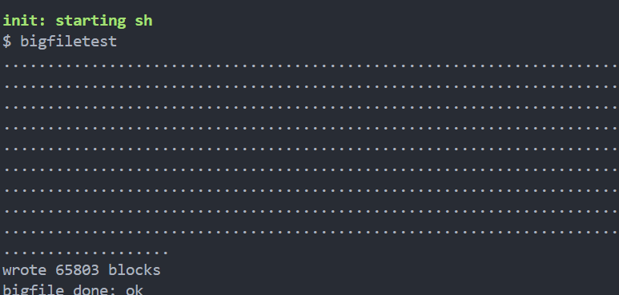

_图 3-1 bigfiletest 测试结果_

#### 3.1.4 优点

- 提升单文件最大容量。
- 兼容 xv6 原有 inode 布局。

### 3.2 细粒度化 buffer cache 互斥锁

#### 3.2.1 原理介绍

- 全局锁会放大并发访问开销。
- 按桶加锁缩小冲突范围。

#### 3.2.2 实现策略

- 哈希桶 + per-bucket 自旋锁，读写路径只锁命中桶。
- `evict_lock` 保护回收路径，避免跨桶死锁。

```c
#define NBUCKET 13
#define HASH(id) ((id) % NBUCKET)
struct {
  struct spinlock evict_lock;
  struct buf buf[NBUF];
  struct hashbuf buckets[NBUCKET];
} bcache;
```

#### 3.2.3 测试程序

- `user/test/bcachetest`：并发读写块缓存一致性校验；独立运行。

**测试结果：**

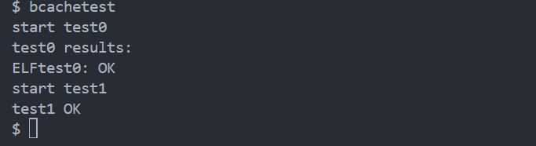

_图 3-2 bcachetest 测试结果_

#### 3.2.4 优点

- 减少锁竞争，提高吞吐。
- 结构清晰，易于扩展置换策略。

### 3.3 符号链接

#### 3.3.1 原理介绍

- 符号链接保存目标路径字符串。
- 打开时可选择跟随或不跟随（`O_NOFOLLOW`）。

#### 3.3.2 实现策略

- 新增 `T_SYMLINK` 类型 inode。
- `sys_symlink()` 写入目标路径，`open()` 递归解析并限制深度。

```c
ip = create(path, T_SYMLINK, 0, 0);
writei(ip, 0, (uint64)target, 0, strlen(target));
```

#### 3.3.3 测试程序

- `user/test/symlinktest`：创建/读取/循环链接检查；独立运行。

**测试结果：**

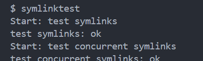

_图 3-3 symlinktest 测试结果_

#### 3.3.4 优点

- 提供轻量级路径重定向能力。
- 与原有目录项机制兼容。

### 3.4 文件访问控制权限（chmod/access）

#### 3.4.1 原理介绍

- inode 记录权限位，读写在内核侧强制校验。
- `access()` 为应用提供显式检测接口。

#### 3.4.2 实现策略

- `dinode.mode` 保存权限，`sys_chmod()` 更新并写回。
- `fileread/filewrite` 与 `sys_access()` 按位检查。

```c
ip->mode = mode & 0x7;  // rwx 权限位
iupdate(ip);
```

#### 3.4.3 测试程序

- `user/test/chmodtest`：权限修改与读写验证；独立运行。
- `user/test/accesstest`：访问权限检查；已纳入 `usertests`（quiet 模式）。

**测试结果：**

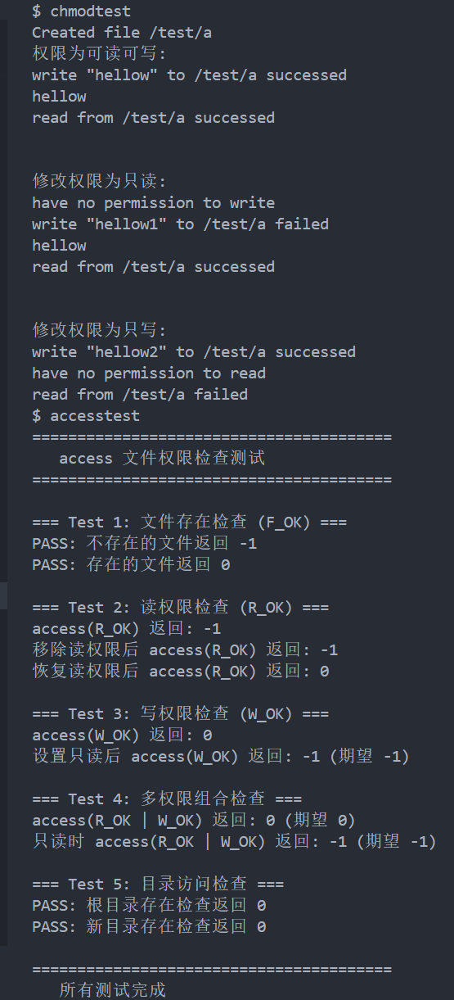

_图 3-4 chmod/access 测试结果_

#### 3.4.4 优点

- 权限逻辑清晰，和读写路径一致。
- 与已有 sysfile 接口兼容。

### 3.5 基于索引信息的文件恢复策略

#### 3.5.1 原理介绍

- 先保存 inode 的块地址，再按地址读取原始数据块。
- 在未被覆盖的前提下恢复删除文件。

#### 3.5.2 实现策略

- `sys_geti()` 导出 inode 索引信息。
- `sys_recoveri()` 读取磁盘块内容，用户态工具重建文件。

```c
// 导出 inode 块地址到用户空间
copyout(p->pagetable, dst, ip->addrs, sizeof(ip->addrs));
```

#### 3.5.3 测试程序

- `user/test/recoveritest`：保存索引 → 删除 → 恢复校验；独立运行。

**测试结果：**

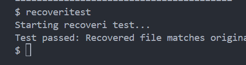

_图 3-5 recoveritest 测试结果_

#### 3.5.4 优点

- 实现简单，可复用现有磁盘块读取逻辑。
- 提供最小可用的恢复路径。

### 3.6 文件预分配（fallocate）

#### 3.6.1 原理介绍

- 提前分配物理块，减少运行时碎片。
- 提升顺序写入稳定性。

#### 3.6.2 实现策略

- `sys_fallocate()` 遍历范围，调用 `bmap_ensure()` 预分配。
- 更新 inode 大小并落盘。

```c
for(bn = start_bn; bn <= end_bn; bn++)
  bmap(ip, bn, 0);  // 预分配块
if(offset + len > ip->size)
  ip->size = offset + len;
```

#### 3.6.3 测试程序

- `user/test/fallocatetest`：预分配后写入校验；已纳入 `usertests`（quiet 模式）。

**测试结果：**

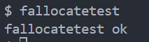

_图 3-6 fallocate 测试结果_

#### 3.6.4 优点

- 降低碎片化风险。
- 减少写入路径上的分配开销。

### 3.7 文件截断（truncate/ftruncate）

#### 3.7.1 原理介绍

- 缩小文件时释放多余块，扩展时更新大小。
- 兼容路径与 FD 两种接口。

#### 3.7.2 实现策略

- `itrunc()` 回收块并更新 inode。
- `sys_truncate/sys_ftruncate` 负责参数解析与事务封装。

```c
itrunc_to(ip, (uint)length);
iupdate(ip);
```

#### 3.7.3 测试程序

- `user/test/truncatetest`：扩展/收缩一致性检查；已纳入 `usertests`（quiet 模式）。

**测试结果：**

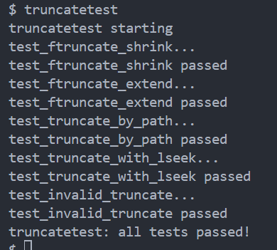

_图 3-7 truncatetest 测试结果_

#### 3.7.4 优点

- 回收空间及时。
- 行为与 POSIX 截断接口一致。

### 3.8 稀疏文件打洞（punch hole）

#### 3.8.1 原理介绍

- 释放区间块但保持文件大小不变。
- 读空洞返回 0。

#### 3.8.2 实现策略

- `ipunch()` 处理 direct/indirect/dindirect 的块释放。
- 只更新映射，不改变 `size`。

```c
for(bn = start_bn; bn <= end_bn; bn++) {
  bfree(ip->dev, ip->addrs[bn]);
  ip->addrs[bn] = 0;
}
```

#### 3.8.3 测试程序

- `user/test/punchtest`：打洞后读写校验；已纳入 `usertests`（quiet 模式）。

**测试结果：**

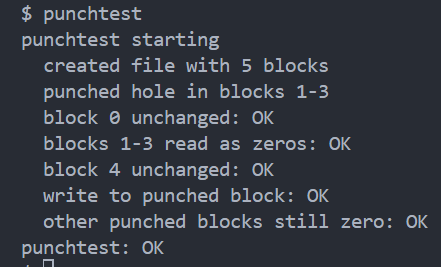

_图 3-8 punchtest 测试结果_

#### 3.8.4 优点

- 支持稀疏文件节省空间。
- 与 truncate 行为互补。

### 3.9 文件克隆与写时复制（fclone）

#### 3.9.1 原理介绍

- 克隆共享数据块，写入时触发块级 COW。
- 大文件复制避免全量拷贝。

#### 3.9.2 实现策略

- `iclone()` 共享块并更新 `bref` 引用计数。
- `bmap()` 在 `for_write` 路径上执行块级复制。

```c
if(for_write && bref_get(addr) > 1) {
  uint newb = balloc(ip->dev);
  memmove(dst->data, src->data, BSIZE);
  bfree(ip->dev, addr);
}
```

#### 3.9.3 测试程序

- `user/test/fclonetest`：共享后写入一致性校验；已纳入 `usertests`（quiet 模式）。

**测试结果：**


_图 3-9 fclonetest 测试结果_

#### 3.9.4 优点

- 克隆成本低，空间利用率高。
- 写入路径保持隔离性。

### 3.10 文件偏移量随机访问（lseek）

#### 3.10.1 原理介绍

- 修改 FD 的文件偏移量。
- 支持 `SEEK_SET/CUR/END`。

#### 3.10.2 实现策略

- `sys_lseek()` 根据 whence 计算新的 `f->off`。
- 统一在内核层做范围检查。

```c
switch(whence) {
  case SEEK_SET: newoff = offset; break;
  case SEEK_CUR: newoff = f->off + offset; break;
  case SEEK_END: newoff = f->ip->size + offset; break;
}
f->off = newoff;
```

#### 3.10.3 测试程序

- `user/test/lseektest`：多场景偏移一致性校验；已纳入 `usertests`（quiet 模式）。

**测试结果：**

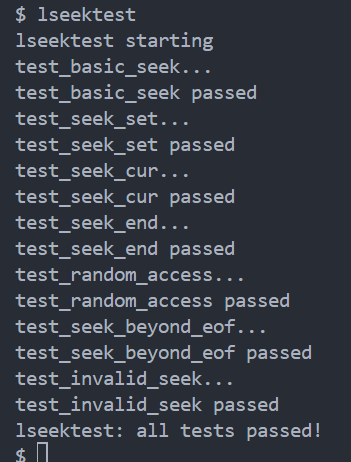

_图 3-10 lseektest 测试结果_

#### 3.10.4 优点

- 支持随机读写接口。
- 与 pread/pwrite 组合灵活。

### 3.11 文件重命名（rename）

#### 3.11.1 原理介绍

- 同目录内原子更新目录项。
- 保证崩溃一致性。

#### 3.11.2 实现策略

- 在事务内完成旧项删除与新项写入。
- 保持 inode 引用计数正确。

```c
begin_op();
dirlink(dp, newname, ip->inum);
dirunlink(dp, oldname);
end_op();
```

#### 3.11.3 测试程序

- `user/test/renametest`：多轮重命名与一致性检查；已纳入 `usertests`（quiet 模式）。

**测试结果：**

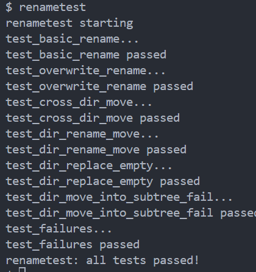

_图 3-11 renametest 测试结果_

#### 3.11.4 优点

- 满足原子重命名语义。
- 与日志系统协同。

### 3.12 块级在线去重（dedup）

#### 3.12.1 原理介绍

- 对相同内容的块进行共享。
- 降低冗余存储占用。

#### 3.12.2 实现策略

- `idedup()` 比较块内容并复用地址。
- 使用 `bref` 记录共享计数。

```c
if(memcmp(b1->data, b2->data, BSIZE) == 0) {
  bref_inc(addr1);
  ip2->addrs[bn] = addr1;
  bfree(ip2->dev, addr2);
}
```

#### 3.12.3 测试程序

- `user/test/deduptest`：重复块识别与共享校验；已纳入 `usertests`（quiet 模式）。

**测试结果：**

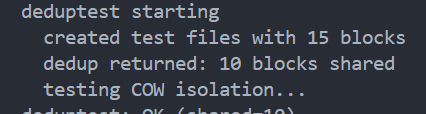

_图 3-12 deduptest 测试结果_

#### 3.12.4 优点

- 减少磁盘占用。
- 与 fclone 的共享策略一致。

### 3.13 文件范围克隆（fclonerange）

#### 3.13.1 原理介绍

- 仅克隆指定范围，支持局部共享。
- 适用于大文件局部复制。

#### 3.13.2 实现策略

- `iclone_range()` 按块建立共享映射。
- 对齐到块边界，必要时补齐范围。

```c
for(bn = start; bn < end; bn++) {
  bref_inc(src->addrs[bn]);
  dst->addrs[bn] = src->addrs[bn];
}
```

#### 3.13.3 测试程序

- `user/test/fclonerangetest`：范围复制一致性校验；已纳入 `usertests`（quiet 模式）。

**测试结果：**


_图 3-13 fclonerangetest 测试结果_

#### 3.13.4 优点

- 局部拷贝更高效。
- 保持与块级 COW 的一致性。

### 3.14 文件锁（flock）

#### 3.14.1 原理介绍

- 共享锁/排他锁保护多进程访问。
- 允许阻塞与非阻塞模式。

#### 3.14.2 实现策略

- inode 维护 `flock_type` 与 `flock_count`。
- `fileflock()` 使用 `sleep/wakeup` 等待锁释放。

```c
while(ip->flock_type == LOCK_EX)
  sleep(&ip->flock_type, &ip->lock);
ip->flock_type = type;
ip->flock_count++;
```

#### 3.14.3 测试程序

- `user/test/flocktest`：并发锁竞争验证；已纳入 `usertests`（quiet 模式）。

**测试结果：**

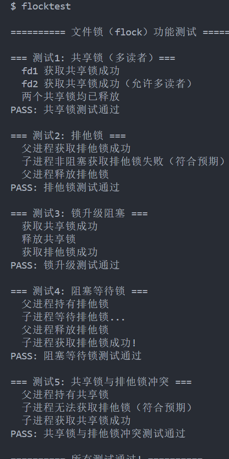

_图 3-14 flocktest 测试结果_

#### 3.14.4 优点

- 提供稳定的文件级互斥机制。
- 与 FD 生命周期一致。

### 3.15 文件同步（fsync/fdatasync）

#### 3.15.1 原理介绍

- 将脏数据与元数据持久化到磁盘。
- fsync 包含元数据，fdatasync 聚焦数据。

#### 3.15.2 实现策略

- 触发日志提交并落盘。
- 在事务边界内完成写回。

```c
begin_op();
iupdate(ip);  // 写回元数据
end_op();     // 触发 commit
```

#### 3.15.3 测试程序

- `user/test/fsynctest`：写回一致性校验；已纳入 `usertests`（quiet 模式）。

**测试结果：**

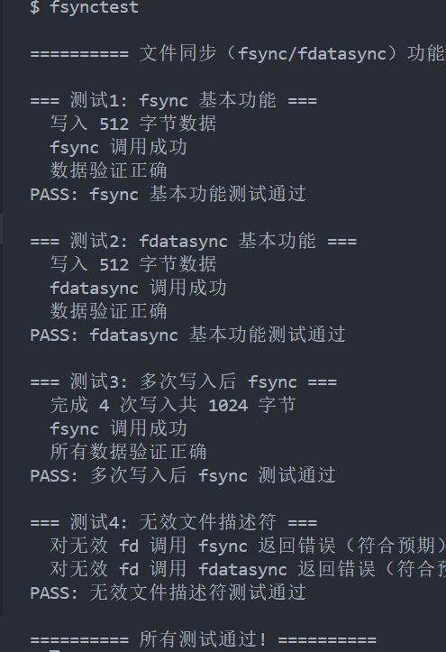

_图 3-15 fsynctest 测试结果_

#### 3.15.4 优点

- 提升数据可靠性。
- 与 WAL 机制自然协同。

### 3.16 文件扩展属性（xattr）

#### 3.16.1 原理介绍

- 为 inode 提供键值对元数据。
- 适配更多应用场景。

#### 3.16.2 实现策略

- `xattr_table` 维护 inode 扩展属性集合。
- 提供 set/get/list/remove 接口。

```c
struct xattr_entry {
  uint inum;
  char name[XATTR_NAME_MAX];
  char value[XATTR_VALUE_MAX];
};
```

#### 3.16.3 测试程序

- `user/test/xattrtest`：增删改查全流程检查；已纳入 `usertests`（quiet 模式）。

**测试结果：**

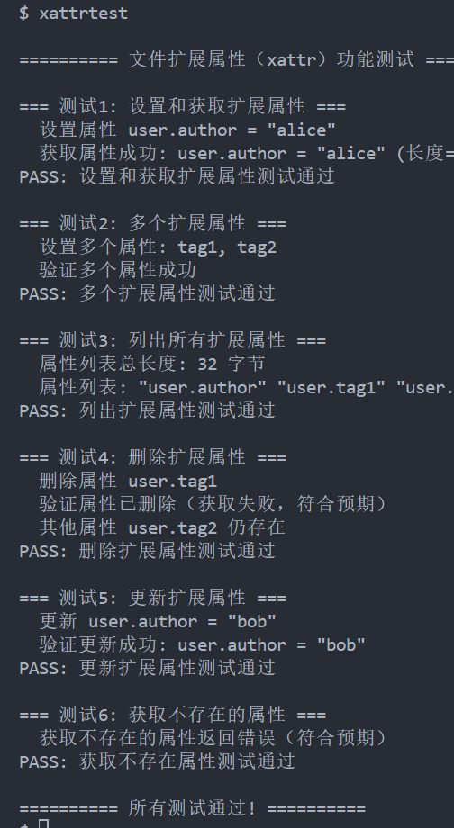

_图 3-16 xattrtest 测试结果_

#### 3.16.4 优点

- 元数据扩展灵活。
- 实现集中、易维护。

### 3.17 文件系统空间统计（fsinfo/statfs）

#### 3.17.1 原理介绍

- 统计总块数、空闲块数与 inode 数量。
- 提供 `statfs` 风格接口。

#### 3.17.2 实现策略

- `fsinfo()` 扫描位图与 inode 区。
- `sys_fsinfo()` 将统计信息返回用户态。

```c
info->total_blocks = sb.nblocks;
info->free_blocks = count_free_blocks(dev);
info->total_inodes = sb.ninodes;
info->free_inodes = count_free_inodes(dev);
```

#### 3.17.3 测试程序

- `user/test/fsinfotest`：统计结果一致性校验；已纳入 `usertests`（quiet 模式）。

**测试结果：**


_图 3-17 fsinfotest 测试结果_

#### 3.17.4 优点

- 便于容量监控与调试。
- 与 superblock 数据一致。

### 3.18 位置读写（pread/pwrite）

#### 3.18.1 原理介绍

- 在指定偏移读写，FD 偏移量不变。
- 便于并发与随机访问。

#### 3.18.2 实现策略

- `sys_pread/sys_pwrite` 使用临时偏移调用 read/write。
- 不更新 `f->off`。

```c
r = readi(ip, 1, addr, offset, n);  // 使用指定 offset
// f->off 保持不变
```

#### 3.18.3 测试程序

- `user/test/preadwritetest`：偏移读写一致性校验；已纳入 `usertests`（quiet 模式）。

**测试结果：**

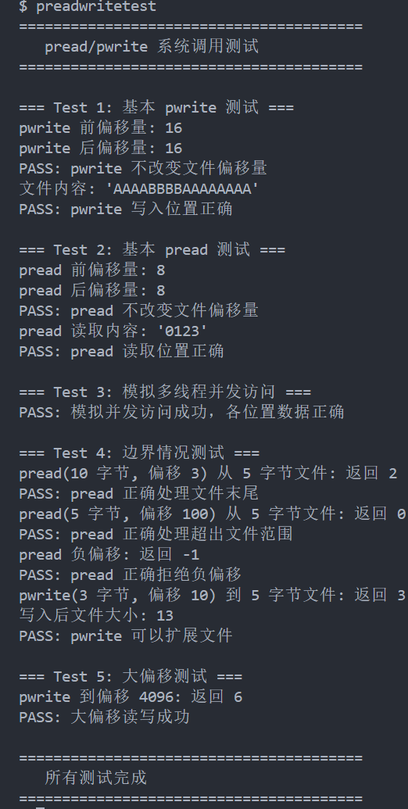

_图 3-18 pread/pwrite 测试结果_

#### 3.18.4 优点

- 与 lseek 解耦，便于多线程访问。
- 保持 FD 状态稳定。

### 3.19 文件描述符复制（dup2）

#### 3.19.1 原理介绍

- 将旧 FD 复制到指定编号。
- 若目标已占用则先关闭。

#### 3.19.2 实现策略

- `sys_dup2()` 维护 `ofile[]` 表并调用 `filedup()`。
- 保持引用计数正确。

```c
if(p->ofile[newfd])
  fileclose(p->ofile[newfd]);
p->ofile[newfd] = f;
filedup(f);
```

#### 3.19.3 测试程序

- `user/test/dup2test`：FD 复制与重定向校验；已纳入 `usertests`（quiet 模式）。

**测试结果：**

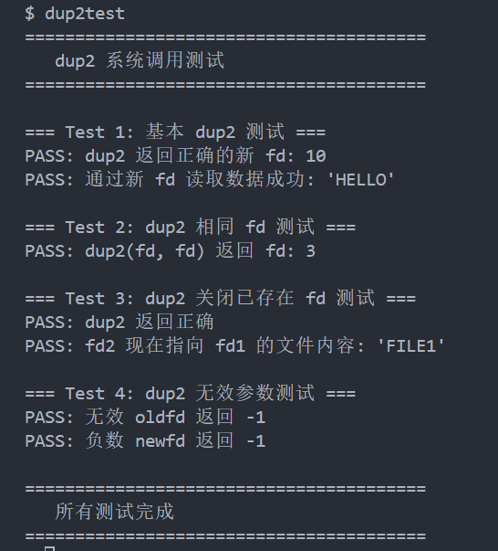

_图 3-19 dup2test 测试结果_

#### 3.19.4 优点

- 兼容标准 I/O 重定向需求。
- 与 shell 管道配合良好。

### 3.20 分散/聚集 I/O（readv/writev）

#### 3.20.1 原理介绍

- 一次系统调用处理多个缓冲区。
- 减少用户态/内核态切换。

#### 3.20.2 实现策略

- `sys_readv/sys_writev` 遍历 `iovec` 数组。
- 逐段调用读写并累计返回值。

```c
for(i = 0; i < iovcnt; i++) {
  r = fileread(f, iov[i].base, iov[i].len);
  total += r;
}
```

#### 3.20.3 测试程序

- `user/test/readvwritevtest`：多缓冲区一致性校验；已纳入 `usertests`（quiet 模式）。

**测试结果：**

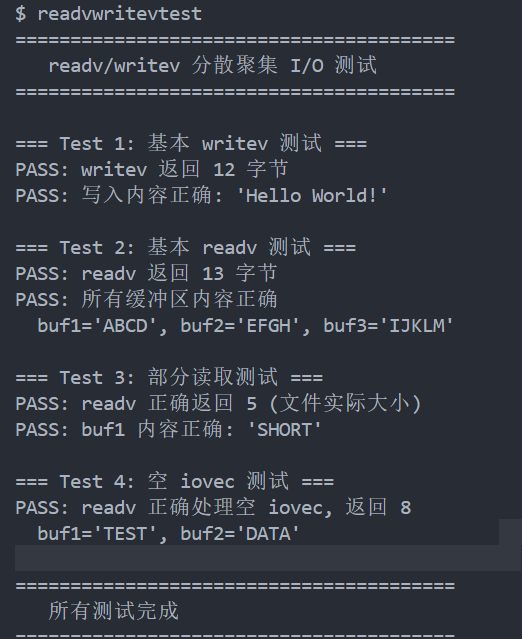

_图 3-20 readv/writev 测试结果_

#### 3.20.4 优点

- 提升批量 I/O 效率。
- 接口兼容 POSIX 语义。

### 3.21 虚拟文件系统（VFS）

#### 3.21.1 原理介绍

- 使用统一接口屏蔽底层文件系统差异。
- 路径解析先匹配挂载点，再调用具体实现。

图 3-21 展示 VFS 的分层架构与多文件系统挂载结构。

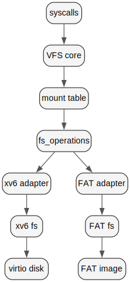

_图 3-21 VFS 架构示意_

#### 3.21.2 实现策略

- `fs_operations` 定义统一的 inode/目录/读写接口。
- `vfs_inode` 持有底层 `fs_data` 指针与挂载点。

```c
struct fs_operations {
  const char *name;
  int (*mount)(struct vfs_mount *mnt, int dev);
  int (*unmount)(struct vfs_mount *mnt);
  struct vfs_inode* (*iget)(struct vfs_mount *mnt, uint inum);
  int (*readi)(struct vfs_inode *ip, int user_dst, uint64 dst, uint off, uint n);
  int (*writei)(struct vfs_inode *ip, int user_src, uint64 src, uint off, uint n);
  struct vfs_inode* (*namei)(struct vfs_mount *mnt, char *path);
};

struct vfs_inode {
  uint dev;
  uint inum;
  int ref;
  short type;
  short mode;
  uint size;
  struct vfs_mount *mnt;
  void *fs_data;
};
```

#### 3.21.3 测试程序

- `user/program/vfstest`：VFS 行为与路径匹配校验；独立运行。

**测试结果：**

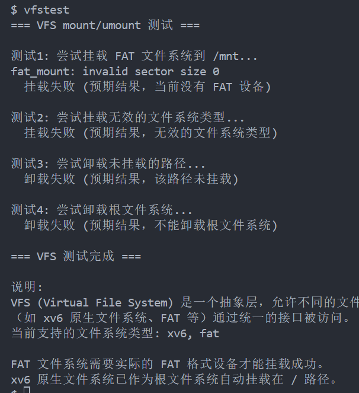

_图 3-22 vfstest 测试结果_

#### 3.21.4 优点

- 支持多文件系统共存。
- 新增文件系统只需实现 ops 并注册。

### 3.22 挂载/卸载（mount/umount）

#### 3.22.1 原理介绍

- mount 将设备挂接到路径前缀。
- umount 释放挂载点并清理资源。

#### 3.22.2 实现策略

- `sys_mount()` 将字符串类型映射为 `fs_type`。
- `vfs_mount()` 分配挂载槽并调用 `ops->mount`。

```c
mnt->ops = &fat_ops;  // 或 &xv6_ops
mnt->ops->mount(mnt, dev);
strncpy(mnt->path, mountpoint, MAXPATH);
```

#### 3.22.3 测试程序

- `user/program/vfstest`：覆盖 mount/umount 边界条件；独立运行。

**测试结果：**

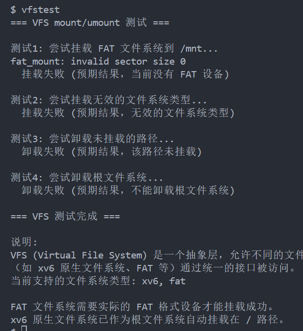

_图 3-23 mount/umount 测试结果_

#### 3.22.4 优点

- 支持运行时扩展文件系统。
- 挂载逻辑集中在 VFS，易于维护。
