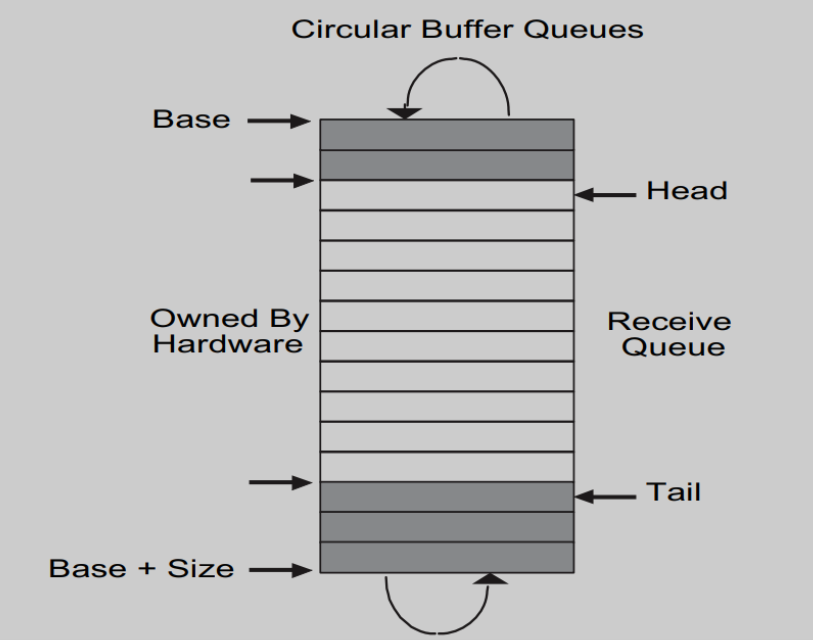
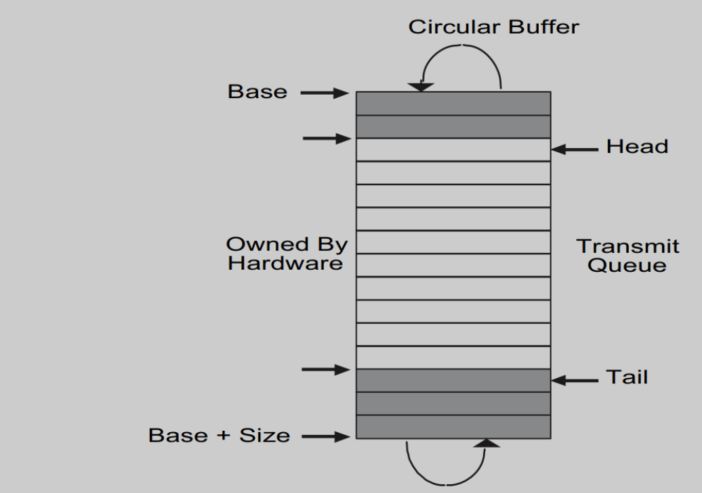
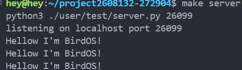
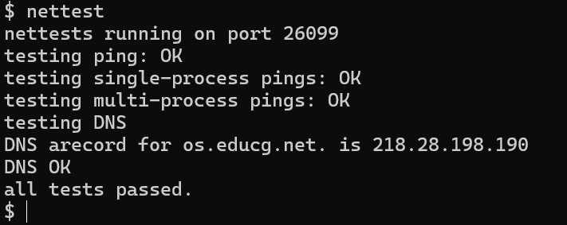

# OopsOS——网络设备

OopsOS是我们在xv6基础上改进的内核。我们在xv6原有的网络基础上，完善了E1000网卡驱动程序，通过该驱动程序可以发送和接受数据包，提供对`UDP/IP` 协议通信的简单支持。

E1000是qemu提供的模拟，修改了Makefile以启用qemu的用户模式网络栈和E1000网卡。

E1000 网卡驱动中的 `transmit()` 和 `recv()` 函数由自己实现，其余部分来自于XV6源码。

## 一、E1000的交互

E1000 使用了 DMA技术，可以直接把接收到的数据包写入计算机的内存，这在数据量大的时候非常有用，可以当作缓存。

对网络数据的描述——`mbuf` 用于网络协议栈中，管理数据包的传输。`mbuf` 可以串联成链表以处理较大的数据包，特别是在网络数据传输中。

```c
struct mbuf {
  struct mbuf *next;  // 指向链表中下一个 mbuf 的指针，形成一个 mbuf 链
  char *head;         // 当前缓冲区的起始位置，指向数据的起始地址
  unsigned int len;   // 缓冲区中数据的有效长度（字节数）
  char buf[MBUF_SIZE]; // 后备存储区，实际的数据存放在此数组中，大小为 MBUF_SIZE
};
```


### 2.1 接收

网卡收到数据后，会产生中断，然后调用对应的中断处理程序去处理这个新到达的数据。

#### 2.1.1 接受描述符

```c
struct rx_desc
{
  uint64 addr;       // 描述符数据缓冲区的地址 
  uint16 length;     // DMA传输到数据缓冲区的长度 
  uint16 csum;       // 数据包的校验和 
  uint8 status;      // 描述符状态 
  uint8 errors;      // 描述符错误 
  uint16 special;    //特殊字段 
};
```

#### 2.1.2 接收描述符环形队列



接收新的数据包后，会检查环形队列 `head` 位置的描述符，然后把数据写入 `head` 描述符的缓冲区，也就是 `addr` 记录的地址。

其中，`head` 到 `tail` 的这段区域是空闲的。如果有新的数据包到达，网卡会把数据写入这个区域的开始，也就是 `head`，把老的数据覆盖掉。网卡把老的数据覆盖掉后会把 `head` 的值加1。

而软件会按照顺序处理深色的区域。读取环形队列时，读取的是 `tail + 1` 位置描述符缓冲区的数据（这个位置是所有未处理数据中等待时间最长的），处理完这个缓冲区后会把 `tail` 加1。

### 2.1.3 e1000_recv()实现

我们需要一次性读出所有的待读取数据包。也就是需要加一个循环，然后一直读取 `tail` 位置的描述符，直到描述符的状态为未完成接收。通过遍历这个环, 把所有新到来的packet交由网络上层的协议/应用去处理。

对于接收到的数据包，E1000 网卡有很多种不同的中断策略。一般最常用的是 RDTR (接收中断延迟计时) 。收到一个包，并且用 DMA 写入宿主的内存后，会开启计时器，在到达设定的事件后发生中断。

这个策略的主要好处是可以减少大量包在短时间内到达时发生的中断次数。

```c
static void e1000_recv(void)
{
  while(1) { // 每次 recv 可能接收多个包
    uint32 ind = (regs[E1000_RDT] + 1) % RX_RING_SIZE;
    struct rx_desc *desc = &rx_ring[ind];
    // 如果需要接收的包都已经接收完毕，则退出
    if(!(desc->status & E1000_RXD_STAT_DD)) {
      return;
    }
    rx_mbufs[ind]->len = desc->length
    net_rx(rx_mbufs[ind]); // 传递给上层网络栈。上层负责释放 mbuf
    // 分配并设置新的 mbuf，供给下一次轮到该下标时使用
    rx_mbufs[ind] = mbufalloc(0); 
    desc->addr = (uint64)rx_mbufs[ind]->head;
    desc->status = 0;
    regs[E1000_RDT] = ind;
  }
}
```

### 2.2 发送

#### 2.2.1 发送描述符

```c
struct tx_desc
{
  uint64 addr;       // 发送缓冲区的数据地址
  uint16 length;     // 数据包的长度（字节）
  uint8 cso;         // 校验和偏移量，表示校验和计算的起始位置
  uint8 cmd;         // 发送描述符的命令字段，指定发送操作的标志
  uint8 status;      // 发送描述符的状态字段，表示当前描述符的处理状态
  uint8 css;         // 校验和控制字段，用于配置是否计算校验和
  uint16 special;    // 特殊字段，用于额外的信息或命令参数
};
```

#### 2.2.2 发送描述符环形队列



和接收描述符的环形队列略有不同，发送描述符的 `head` 到 `tail` 这段区域（途中浅色区域）表示我们希望发送，但是网卡还没发送出去的数据。

其中 `head` 指向等待时间最长的待发送数据，网卡会从这里开始发送。完成后会把 `tail` 加1，而如果我们要新加入1个描述符，是从 `tail` 这个方向加入的，也会把 `tail` 加1。

### 2.2.3 e1000_transmit()实现

实现将一个数据包`mbuf` 发送到网络接口卡e1000，并通过一个环形缓冲区管理发送的描述符。

将数据包从 `mbuf` 发送到网卡，使用环形缓冲区管理发送描述符。它检查描述符状态，释放旧的 `mbuf`，更新描述符并通知网卡发送数据，最后更新描述符的指针以准备下一次发送。

```c
int e1000_transmit(struct mbuf *m)
{
  acquire(&e1000_lock); // 获取 E1000 的锁，防止多进程同时发送数据出现 race
  uint32 ind = regs[E1000_TDT]; // 下一个可用的 buffer 的下标
  struct tx_desc *desc = &tx_ring[ind]; // 获取 buffer 的描述符，其中存储了关于该 buffer 的各种信息
  // 如果该 buffer 中的数据还未传输完，则代表我们已经将环形 buffer 列表全部用完，缓冲区不足，返回错误
  if(!(desc->status & E1000_TXD_STAT_DD)) {
    release(&e1000_lock);
    return -1;
  }
  // 如果该下标仍有之前发送完毕但未释放的 mbuf，则释放
  if(tx_mbufs[ind]) {
    mbuffree(tx_mbufs[ind]);
    tx_mbufs[ind] = 0;
  }
  // 将要发送的 mbuf 的内存地址与长度填写到发送描述符中
  desc->addr = (uint64)m->head;
  desc->length = m->len;
  // 设置参数，EOP 表示该 buffer 含有一个完整的 packet
  // RS 告诉网卡在发送完成后，设置 status 中的 E1000_TXD_STAT_DD 位，表示发送完成。
  desc->cmd = E1000_TXD_CMD_EOP | E1000_TXD_CMD_RS;
  // 保留新 mbuf 的指针，方便后续再次用到同一下标时释放。
  tx_mbufs[ind] = m;
  // 环形缓冲区内下标增加一。
  regs[E1000_TDT] = (regs[E1000_TDT] + 1) % TX_RING_SIZE;
  release(&e1000_lock);
  return 0;
}
```

### 2.3 测试程序

`/user/test/nettest` 用于测试该功能，通过以下方式：

- **测试一：** 主机操作系统中运行`make server` ，另一个窗口运行`nettest` ，会尝试将UDP数据包发送到主机操作系统，主机上的`server` 将看到它并发送响应数据包，`nettest` 将检测是否收到响应数据包。

- **测试二：** 通过（真实的）互联网将DNS请求发送到域名服务器中，返回域名解析地址。

**测试结果：**



主机收到了来自于OopsOS的消息，测试一通过。



发送DNS请求到域名服务器，解析域名`os.educg.net` ，收到了域名解析地址`218.28.198.190` ，测试二通过。
