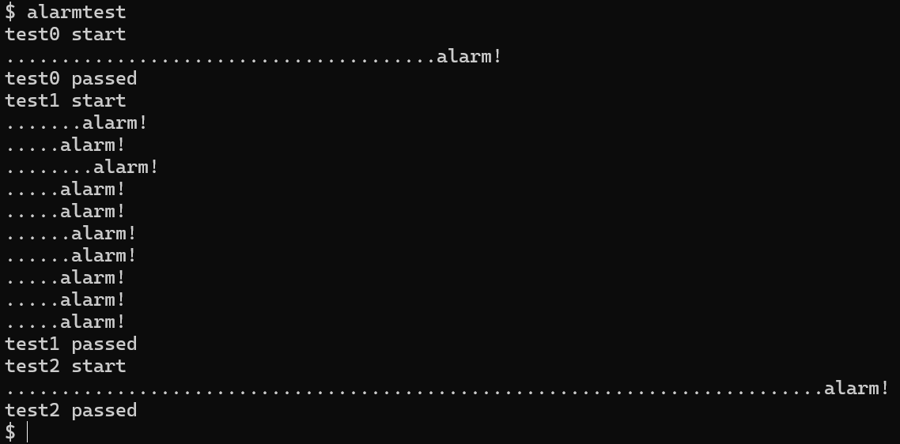
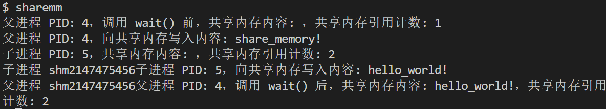
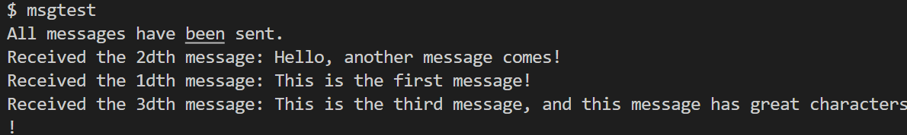

# OopsOS——进程管理

OopsOS是我们在xv6基础上改进的内核。文档分为两部分：xv6的基本功能与我们改进与新增的功能。

**目录：**

一、基本功能

二、改进与创新

- 2.1 调度改进（DYNPRIO + MLFQ）
- 2.2 记录型信号量
- 2.3 基于中断的定时提醒机制
- 2.4 共享内存IPC
- 2.5 消息队列MQ
- 2.6 直接通信IPC
- 2.7 管程机制
- 2.8 内核线程完善


## 一、基本功能

### 1.1 进程控制块

- 进程信息：pid进程号，parent父进程，name进程名
- 进程运行状态：state进程状态，killed是否被杀死
  - state分为{ UNUSED未使用, SLEEPING阻塞, RUNNABLE就绪, RUNNING运行中, ZOMBIE僵尸 };
- 进程调度切换信息：tf陷阱帧、context进程上下文（用于进程切换）、chan阻塞链表
- 内存映射信息：sz内存空间大小、pagetable页表、kstack内核栈底
- 文件系统信息：cwd当前目录、ofile打开的文件列表

```c
struct proc
{
  struct spinlock lock;

  // p->lock must be held when using these:
  enum procstate state; // Process state
  struct proc *parent;  // Parent process
  void *chan;           // If non-zero, sleeping on chan
  int killed;           // If non-zero, have been killed
  int xstate;           // Exit status to be returned to parent's wait
  int pid;              // Process ID
  int tgid;             // Thread group ID (leader PID)
  int tgroup_ref;       // Thread group refcount

  // these are private to the process, so p->lock need not be held.
  uint64 kstack;               // Virtual address of kernel stack
  uint64 sz;                   // Size of process memory (bytes)
  pagetable_t pagetable;       // User page table
  struct trapframe *trapframe; // data page for trampoline.S
  struct context context;      // swtch() here to run process
  struct file *ofile[NOFILE];  // Open files
  struct inode *cwd;           // Current directory
  char name[16];               // Process name (debugging)
  int trace_mask;
  struct vm_area vma[NVMA]; // 虚拟内存区域
  int priority;             //(0-20)进程优先级
  int wait_time;            // 等待CPU的时间
  int cpu_time;             // CPU上运行的时间
  int dyn_priority;         // 动态优先级
  int mlfq_level;           // MLFQ level (0 is highest)
  int mlfq_ticks;           // ticks consumed in current time slice
  int rt_policy;            // 实时调度类型
  int rt_period;            // 周期（ticks）
  int rt_runtime;           // 预算运行时间（ticks）
  int rt_deadline;          // 相对截止期（ticks）
  int rt_release;           // 当前周期起点（ticks）
  int rt_deadline_tick;     // 绝对截止期（ticks）
  int rt_remaining;         // 剩余预算（ticks）
  int rt_misses;            // 截止期违约计数
  struct proc *pthread;     // 父线程
  void *ustack;             // 用户线程栈
  uint shm;        // 本进程共享内存区域的下边界
  uint shmkeymask; // 本进程的8个共享内存区与使用掩码(位图)
  void *shmva[8];  // 本进程共享内存起始地址(虚地址)列表


  uint mqmask; // 本进程使用的消息队列（掩码）

  int alarm_interval;          // Alarm interval (0 for disabled)
  void(*alarm_handler)();      // Alarm handler
  int alarm_ticks;             // How many ticks left before next alarm goes off
  struct trapframe *alarm_trapframe;  // A copy of trapframe right before running alarm_handler
  int alarm_goingoff;          // Is an alarm currently going off and hasn't not yet returned? (prevent re-entrance of alarm_handler)

};
```

说明：`dyn_priority/wait_time/cpu_time` 主要用于 `SCHED=DYNPRIO` 模式，`mlfq_level/mlfq_ticks` 用于 `SCHED=MLFQ` 模式，`rt_*` 字段用于 LLF 实时调度。

------


### 1.2 处理器管理

对于物理内存的管理使用的是空闲链表，以页为单位进行管理，每次分配/释放都是一页。

#### 1.2.1 **结构**

使用两个结构体维护一个单向链表，kmem作为全局变量，freelist为空闲链表的头节点，每个链表节点为struct run，包含指向下一个链表节点的结构体指针，并为全局变量kmem维护一把锁用于race condition（竞态条件）。

```c
// Per-CPU state.
struct cpu {
  struct proc *proc;          // The process running on this cpu, or null.
  struct context context;     // swtch() here to enter scheduler().
  int noff;                   // Depth of push_off() nesting.
  int intena;                 // Were interrupts enabled before push_off()?
};
```

#### 1.2.2 组织形式

用定长数组维护每个cpu

```c
struct cpu cpus[NCPU];
```

------


### 1.3 init进程

#### 1.3.1 init进程意义

init是用户态第一个进程

1. 创建基础用户环境
   - 加载了shell
2. 用户进程管理者
   - 不会被销毁的用户进程，其他用户进程如果变成孤儿，他会成为这些进程的父进程
   - wait系统调用清理僵尸进程
3. 运行initcode.S
   - intcode.S是init进程的前身

#### 1.3.2 init.c

代码如下：

```c
int main(void)
{
  int pid, wpid;

  if(open("console", O_RDWR) < 0){
    mknod("console", CONSOLE, 0);
    open("console", O_RDWR);
  }
  dup(0);  // stdout
  dup(0);  // stderr

  for(;;){
    printf("init: starting sh\n");
    pid = fork();
    if(pid < 0){
      printf("init: fork failed\n");
      exit(1);
    }
     // 子进程调用 exec 加载 shell
    if(pid == 0){
      exec("sh", argv);
      printf("init: exec sh failed\n");
      exit(1);
    }
  
  
    for(;;){
      // this call to wait() returns if the shell exits,
      // or if a parentless process exits.
      wpid = wait((int *) 0);
      if(wpid == pid){
        // the shell exited; restart it.
        break;
      } else if(wpid < 0){
        printf("init: wait returned an error\n");
        exit(1);
      } else {
        // it was a parentless process; do nothing.
      }
    }
  }
}
```

proc.c中存在函数负责初始化init进程（main函数负责调用）

```c
void userinit(void)
{
  struct proc *p;

  // 1. 分配一个进程表项，用于创建第一个用户态进程。
  // allocproc() 初始化进程结构，分配内核栈和页表，并将其状态设置为 EMBRYO。
  p = allocproc();

  // 将全局变量 initproc 指向这个进程，方便系统标识它为第一个用户态进程。
  initproc = p;

  // 2. 分配一页用户内存，并将用户初始代码（initcode）加载到该内存中。
  // uvminit() 会为进程分配一页内存，并将 initcode 的指令和数据复制到这页内存。
  uvminit(p->pagetable, initcode, sizeof(initcode));

  // 设置进程的内存大小为一页（PGSIZE，通常为 4096 字节）。
  p->sz = PGSIZE;

  // 3. 初始化用户态的陷阱帧（trapframe）。
  // trapframe 用于保存用户态到内核态切换时的寄存器状态。
  
  // 设置用户程序计数器（epc）为 0，表示用户态从 initcode 的起始地址开始执行。
  p->trapframe->epc = 0;

  // 设置用户态栈指针（sp）为一页的顶部，表示用户态栈的起始位置。
  p->trapframe->sp = PGSIZE;

  // 4. 为该进程设置一些标识信息。
  // 设置进程名称为 "initcode"，用于调试或标识。
  safestrcpy(p->name, "initcode", sizeof(p->name));

  // 设置进程的当前工作目录为根目录（"/"）。
  p->cwd = namei("/");

  // 5. 将进程状态设置为 RUNNABLE。
  // 表示该进程可以被调度器选中执行。
  p->state = RUNNABLE;

  // 释放进程锁，允许其他内核代码访问该进程。
  release(&p->lock);
}
```

------


### 1.4 proc.c

proc.c是进程管理的核心

全局变量：

- struct cpu cpus[NCPU]：管理所有cpu
- struct proc proc[NPROC]：管理所有proc进程
- struct proc *initproc：指向init进程
- int nextpid = 1：下一个pid是多少

重要函数：

- procinit(void)：初始化所有的进程

  - kalloc：创建内核栈
  - 平均分给所有proc
  - 在里面分配trapframe和context结构

- allocproc(void)：分配进程控制块，并进行一点初始化

- userinit(void)：通过main函数启动第一个进程，也就是init进程

- growproc(int n)：拓展进程映像大小（内存管理功能）

- fork(void)：创建进程（实际上是复制父进程）

- exit(int status)：结束进程，释放资源

- wait(uint64 addr)：等待子进程结束

- scheduler(void)：调度器函数（时间片轮循）

- void sched(void)：调用汇编代码swatch切换到scheduler执行流，在主动睡眠、时间片到、io读写需要阻塞、主动放弃cpu的时候调用

  ```c
  swtch(&p->context, &mycpu()->context);// 保存当前进程的上下文，然后切换到cpu的context
  ```

- yield(void)：当前进程放弃cpu

- forkret(void)：在子进程执行完调度后进入内核态

  - 释放 `scheduler()` 中持有的进程锁，使其他进程可以获取这个进程的资源。
  - 如果是第一次执行 `forkret()`，则初始化文件系统 (`fsinit()`)，这在系统启动时非常重要，但只能在进程上下文中执行。
  - 最后通过 `usertrapret()`，将进程从内核态返回到用户态，继续执行用户程序。

- sleep(void *chan, struct spinlock *lk)：睡眠让出cpu

  ```
    ...
    p->chan = chan;
    p->state = SLEEPING;
    sched();
    p->chan = 0;
    ....
  ```

- wakeup(void *chan)：唤醒睡眠进程

- wakeup1(struct proc *p)：同上

- kill(int pid)：杀死进程

------


### 1.5 自旋锁

内核同步使用互斥的自旋锁

```c
struct spinlock {
  uint locked;       // 是否获得锁，0 表示未锁定，1 表示已锁定
  char *name;        // 锁的名称，便于调试时查看锁的名称
  struct cpu *cpu;   // 持有锁的处理器，如果没有锁持有者，该字段为 NULL
};
```

内核同步：不允许睡眠，没有获得锁就自旋申请

用户进程：无法获得锁就进入睡眠

**spinlock.c**

- 初始化锁

  ```c
  void initlock(struct spinlock *lk, char *name)
  {
    lk->name = name;     // 设置锁的名称
    lk->locked = 0;      // 初始化锁为未锁定状态
    lk->cpu = 0;         // 初始化锁的持有者 CPU 为 NULL，表示没有 CPU 持有锁
  }
  ```

- 获取锁

  ```c
  // 获取锁,该函数会不断循环（自旋）直到成功获取锁。
  void acquire(struct spinlock *lk)
  {
    // 禁用中断，以防止在获取锁的过程中发生死锁。
    // 禁用中断确保当前 CPU 在获取锁期间不会被其他 CPU 中断，避免并发冲突。
    push_off(); 
  
    // 检查当前 CPU 是否已经持有该锁。
    // 如果锁已经被当前 CPU 持有，则认为出现了错误，并触发 panic（程序崩溃）。
    if(holding(lk)) // 检查当前 CPU 是否已经持有锁。
      panic("acquire"); // 如果已经持有锁，触发 panic 错误。
  
    // 在 RISC-V 上，我们使用原子操作来获取锁。
    // `__sync_lock_test_and_set` 是一个原子内建函数，执行以下操作：
    //   1. 将 `lk->locked` 设置为 1，表示锁被获取。
    //   2. 返回 `lk->locked` 原来的值。
    // 该操作是原子的，意味着在执行时不会被其他 CPU 干扰，保证锁的正确获取。
    // `while` 循环确保我们在获取锁之前一直自旋（等待）。
    while(__sync_lock_test_and_set(&lk->locked, 1) != 0); // 自旋直到锁被成功获取（即 `lk->locked` 变为 0）。
  
    // 防止编译器重排内存访问。
    // 这确保锁获取后，所有在临界区（critical section）中的内存操作都会在获取锁后执行，
    // 不会在编译阶段被提前或延迟。
    // 处理器也会执行一个 "fence" 指令，防止内存操作在硬件层面重排。
    __sync_synchronize(); // 防止编译器和处理器优化，确保后续操作发生在锁获取之后。
  
    // 记录当前 CPU 的信息，以供 `holding()` 函数和调试使用。
    // 这会标记哪个 CPU 正在持有锁，并在后续检查时使用。
    lk->cpu = mycpu(); // 将当前 CPU 的指针存储在锁结构体中。
  }
  ```

- 释放锁

  ```c
  // 释放锁
  void release(struct spinlock *lk)
  {
    // 检查当前 CPU 是否持有锁。如果没有持有锁，触发 panic。
    // 这样可以防止出现错误情况：例如，释放一个未被当前 CPU 持有的锁。
    if(!holding(lk))
      panic("release"); // 如果当前 CPU 没有持有该锁，触发 panic 错误。
  
    // 将锁的持有者 CPU 信息清空。
    // 这表示锁已经被释放，其他 CPU 可以获取该锁。
    lk->cpu = 0; // 锁不再由当前 CPU 持有，清空持有者信息。
  
    // 防止编译器和 CPU 重新排序内存操作。
    // 确保临界区的所有操作（例如共享数据的修改）在释放锁之前对其他 CPU 可见。
    // 同时确保临界区内的加载操作发生在锁被释放之前。
    // 对于 RISC-V 架构，这通过发出 "fence" 指令来实现。
    __sync_synchronize(); // 内存屏障，防止编译器和处理器优化内存操作。
  
    // 释放锁。相当于将锁的状态设置为 0，表示锁不再被持有。
    // 此代码使用原子操作来避免潜在的竞争条件。
    // 在 RISC-V 上，`__sync_lock_release` 变成了一个原子交换操作，具体如下：
    //   s1 = &lk->locked
    //   amoswap.w zero, zero, (s1)
    // 这个操作将锁状态从 1 设置为 0，并确保操作的原子性。
    __sync_lock_release(&lk->locked); // 执行原子操作释放锁。
  
    // 恢复中断。在获取锁时，禁用了中断（通过 `push_off()`），释放锁后，恢复中断允许系统继续处理其他中断。
    pop_off(); // 恢复中断。
  }
  ```

- 判断是否持有锁

  ```c
  // 检查该cpu是否持有锁
  // 中断必须关闭
  int holding(struct spinlock *lk)
  {
    int r;
    r = (lk->locked && lk->cpu == mycpu());
    return r;
  }
  ```

------


### 1.6 用户程序

`init` 进程是第一个用户级进程，它本身通过 `exec` 替换成了新的用户程序（如 `/init` 或 `/bin/sh`）

**`init` 进程**：

- 当内核启动时，内核首先创建一个叫做 `init` 的进程。这个进程是系统中的第一个用户级进程，且其代码位于内核的初始化代码中（`initcode.S`）。
- 但是，`init` 进程并不是用户空间应用程序，它只是一个简单的用户进程，通常会做一些系统初始化工作，比如启动 shell 或者其他进程。
- 在 `init` 进程启动后，它会通过exec()加载一个新的程序，这个程序通常是 `/init`，也就是文件系统中的 `init` 程序，它会替代 `init` 进程的映像（内存中表示进程的代码和数据）。这就是通过 `exec` 系统调用完成的。


**用户进程启动**：

- **`init` 进程**是系统启动后第一个运行的进程。它的初始化过程通常是由内核完成的，内核会加载一个基本的进程映像（通常是通过 `initcode.S` 实现的）。

**`fork` 和 `exec` 系统调用**：

- 一旦 `init` 进程启动，它通常会使用 `fork` 系统调用创建子进程。子进程会执行 `exec` 系统调用来加载新的用户程序映像。
- 例如，`init` 会通过 `exec` 系统调用加载 `/bin/sh` 程序，或者加载其他的用户程序（如 `_cat`, `_echo`, `_ls` 等）。

**用户程序的加载**：

- 在 `exec` 系统调用过程中，进程的用户空间（内存中的进程映像）会被替换为指定程序的映像。这个过程通常会从磁盘读取程序文件，并加载到内存中（例如，加载 `_cat` 或 `_ls` 等程序）。
- `exec` 调用之后，进程会继续执行加载到内存中的新程序代码，而不是继续执行 `fork` 之后的代码。

  ------

  

## 二、改进与创新

### 2.1 调度改进（DYNPRIO + MLFQ + LLF）

本项目在 `xv6` 的轮转调度（Round-Robin）基础上引入两类改进策略：**动态优先级（DYNPRIO）**、**多级反馈队列（MLFQ）**，以及**同核共存的实时 LLF**。其中 DYNPRIO/MLFQ 通过编译期开关选择，LLF 作为实时类调度在运行时可与常规调度共存。

#### 2.1.0 **相较 xv6 的改进**

`xv6` 默认使用时间片轮转，不区分优先级，也没有交互/CPU 密集负载的差异化调度。本项目的改进点：

- **DYNPRIO**：基于等待时间与 CPU 时间动态调整优先级，缓解饥饿并提升响应性。
- **MLFQ**：对交互负载更友好，短任务优先，长期 CPU 密集任务自动下沉。
- **LLF 实时类**：以最小松弛度优先（Least Laxity First）选择实时任务，适配周期性实时负载。

#### 2.1.1 **共存与切换（未删除动态优先级）**

调度策略通过编译开关控制：

- 默认 MLFQ：`make qemu`
- 动态优先级：`make qemu SCHED=DYNPRIO`

这样可以在同一代码库内保留两种算法，方便回归对比与实验复现。

#### 2.1.2 **动态优先级（SCHED=DYNPRIO）**

**关键字段：**

```c
  int priority;     // 静态优先级
  int wait_time;    // 等待CPU时间
  int cpu_time;     // 运行CPU时间
  int dyn_priority; // 动态优先级
```

**优先级计算：**

```c
dyn_priority = priority + (wait_time / 5) - (cpu_time / 5);
```

- `wait_time` 在调度器扫描 `RUNNABLE` 进程时累计。
- 被选中运行的进程 `cpu_time++`，防止长期占用 CPU。
- `dyn_priority` 被限制在 `[0, 20]`。

**调度策略：**每轮选择 `dyn_priority` 最高的进程运行。

**适用性与局限：**

- 实现简单、易讲解，适合教学。
- 但对“短交互 burst”的偏好不如 MLFQ 明显，尾延迟可能更大。

#### 2.1.3 **多级反馈队列（SCHED=MLFQ）**

多级反馈队列将可运行进程分配到多个优先级队列，优先级越高的队列时间片越短，响应性更强；进程若耗尽时间片会被降级，若出现长期饥饿则通过周期性提升回到高优先级队列。

**关键字段：**

```c
  int mlfq_level; // MLFQ level (0 is highest)
  int mlfq_ticks; // ticks consumed in current time slice
```

**调度参数：**

```c
#define MLFQ_LEVELS 4
#define MLFQ_BOOST_TICKS 200
#define MLFQ_SLICE_L0 1
#define MLFQ_SLICE_L1 2
#define MLFQ_SLICE_L2 4
#define MLFQ_SLICE_L3 8
```

**调度流程：**

1. 从最高队列开始寻找 `RUNNABLE` 进程。
2. 同一队列内轮转，保证公平性。
3. 运行完成后回到调度器。

**时间片与降级：**

```c
if (p->mlfq_ticks >= mlfq_time_slice[p->mlfq_level]) {
  if (p->mlfq_level < MLFQ_LEVELS - 1)
    p->mlfq_level++;
  p->mlfq_ticks = 0;
  return 1;
}
```

**周期性提升：**

```c
if (now % MLFQ_BOOST_TICKS == 0)
  mlfq_boost(now);
```

#### 2.1.4 **实时调度（LLF，同核共存）**

为满足课本“实时调度”内容，本项目新增 **LLF（Least Laxity First）实时类**，与 DYNPRIO/MLFQ **同核共存**。LLF 通过系统调用配置为“实时类进程”，在调度器中优先于普通任务选择执行。

**设计目标：**

1. **提供经典实时调度策略**，便于与课本内容对齐（LLF/EDF/RMS）。
2. **不破坏原有调度体系**，实时任务作为“运行时类”与普通任务共存。
3. **可展示对比效果**：在有 CPU 负载时，周期性任务的 deadline miss 应减少。

**关键字段：**

```c
int rt_policy;        // SCHED_NORMAL / SCHED_RT_LLF
int rt_period;        // 周期（ticks）
int rt_runtime;       // 预算运行时间（ticks）
int rt_deadline;      // 相对截止期（ticks）
int rt_release;       // 当前周期起点（ticks）
int rt_deadline_tick; // 绝对截止期（ticks）
int rt_remaining;     // 剩余预算（ticks）
int rt_misses;        // 截止期违约计数
```

**核心概念（LLF）**

- **period**：每个任务的周期长度。
- **runtime**：每周期允许占用 CPU 的预算。
- **deadline**：相对截止期，必须满足 `runtime <= deadline <= period`。
- **laxity（松弛度）**：距离截止期“还剩多少可浪费时间”。

```c
laxity = deadline_tick - now - remaining;
```

**调度原则：**选择 **laxity 最小** 的实时任务运行（越小越紧急，可能为负）。

**调度流程（简化伪代码）：**

```c
// scheduler()
if (exist runnable RT task)
  pick task with min laxity;
else
  run normal scheduler (MLFQ or DYNPRIO);

// timer interrupt
if (current is RT)
  rt_remaining--;
  if (rt_remaining == 0) yield;
if (exist RT task with smaller laxity) yield;
```

**运行时共存规则：**

1. 调度器先扫描 LLF 任务；若存在可运行实时任务，则优先运行。
2. 普通调度（DYNPRIO/MLFQ）只选择 `rt_policy == SCHED_NORMAL` 的任务。
3. 时钟中断中更新实时任务预算；预算用尽强制让出 CPU。
4. 若出现 **更小松弛度** 的 RT 任务，则触发抢占。

**关键代码（调度器优先 RT）：**

```c
struct proc *rt = rt_pick(rt_now());
if (rt) {
  rt->state = RUNNING;
  c->proc = rt;
  swtch(&c->context, &rt->context);
  c->proc = 0;
  release(&rt->lock);
  continue;
}
// 之后进入 MLFQ / DYNPRIO 普通调度逻辑
```

**关键代码（松弛度选择）：**

```c
static int rt_laxity_locked(struct proc *p, uint now) {
  return (int)p->rt_deadline_tick - (int)now - p->rt_remaining;
}

static struct proc *rt_pick(uint now) {
  // 选出 laxity 最小的 RUNNABLE 实时任务
}
```

**关键代码（时钟中断中的预算/抢占）：**

```c
if (rt_tick())
  yield();
else if (rt_should_preempt())
  yield();
else if (mlfq_tick())
  yield();
```

**参数与边界处理：**

- `period/runtime/deadline` 必须 > 0。
- 必须满足 `runtime <= deadline <= period`。
- 当进入新周期时，若上一周期预算未用完，则记一次 `rt_misses`。

**接口：**

- `rt_set(pid, period, runtime, deadline)`：设置 LLF 实时参数。
- `rt_clear(pid)`：恢复为普通调度类。

**使用示例：**

```c
// 每 10 ticks 释放一次预算，需在 6 ticks 内完成 2 ticks 工作
rt_set(getpid(), 10, 2, 6);
...
rt_clear(getpid());
```

**测试：**

- `llftest`：在 CPU 负载下对比“普通调度/LLF”周期任务的 deadline miss 次数。
- 设计思想：并发 hog 任务制造压力，周期任务统计 miss 计数，对比 RT 与 normal。

**局限说明：**

- 当前实现为 **软实时**（soft RT），无 admission control。
- 以 ticks 为粒度，精度受时钟中断频率影响。
- 仅保证“更紧急的 RT 任务优先”，不保证严格的硬实时上界。

#### 2.1.5 优点

1. **交互性更好**：短任务优先，响应更快。
2. **避免饥饿**：周期性提升确保低优先级进程也能被调度。
3. **兼顾吞吐与公平**：CPU 密集型任务自动下沉到长时间片队列。
4. **可配置性强**：队列与时间片可调。

#### 2.1.6 **优先级倒置与优先级继承（PI）**

**背景：**

在引入显式优先级调度（DYNPRIO）后，系统会出现典型的“优先级倒置”：
- 低优先级进程持有锁；
- 高优先级进程等待锁被阻塞；
- 中优先级进程持续抢占 CPU，导致低优先级无法运行并释放锁。

**设计：**

- **捐赠规则：**当高优先级进程在 `monitor` 或 `sleeplock` 上阻塞时，将自己的优先级捐赠给锁持有者。
- **回收规则：**锁释放后重新计算持有者的继承优先级，恢复到正常优先级。
- **调度影响：**
  - `SCHED=DYNPRIO`：动态优先级以 `max(priority, pi_boost)` 为基准；
  - `SCHED=MLFQ`：捐赠后将持锁者提升到最高队列（level 0），降低饥饿风险。

**关键代码：**

```c
// DYNPRIO 下使用继承优先级作为基准
int base_prio = pi_effective_base(p);
p->dyn_priority = base_prio + (p->wait_time / 5) - (p->cpu_time / 5);

// 等待锁时捐赠给持锁者
if (donor > lk->pi_waiter_max)
  lk->pi_waiter_max = donor;
pi_donate(lk->pid, donor);
```

**测试：**

- `pitest`：构造“低持锁/高等待/中抢占”三进程场景。
  - 若 PI 生效，高优先级进程会在中优先级进程之前拿到锁（输出 `high before mid`）。
  - 该测试**推荐在 `SCHED=DYNPRIO` 下运行**，结果更稳定。

#### 2.1.7 **实验设置与结果（schedtest）**

**测试目的：**对比 MLFQ 与动态优先级对“交互型短请求”延迟的影响。

**负载模型：**

- **CPU 密集任务（hog）**：持续执行 busywork，模拟后台计算。
- **交互任务（worker）**：管道 ping‑pong，请求到达后进行短计算并立即响应。
- **指标**：交互请求延迟（ticks），统计 avg/p95/max。

**关键参数（`user/test/schedtest.c`）：**

```c
HOG_TICKS = 200
ROUNDS = 60
HANDLER_WORK = 4000
HOG_WORK = 40000
hogs = min(NPROC - 4, max(2, 2 * NCPU))
```

**运行方式：**

- MLFQ：`make qemu` → `schedtest`
- 动态优先级：`make qemu SCHED=DYNPRIO` → `schedtest`

**示例结果（同一环境对比）：**

- MLFQ：avg 0 ticks，p95 0，max 6
- DYNPRIO：avg 3 ticks，p95 8，max 9

结论：MLFQ 对交互型请求的尾延迟（p95/max）更友好，更符合“先响应短任务”的调度目标。
   
     ------
   
     

### 2.2 记录型信号量

记录型信号量是操作系统中用于管理多个资源的同步原语。与传统的二值信号量不同，记录型信号量的计数值可以大于 1，表示系统中可用资源的数量。它用于在多个进程或线程之间共享访问有限资源的情况，允许一定数量的并发进程访问共享资源。

在我的实现中，信号量的设计采用了**记录型信号量**，并结合了自旋锁机制，以确保在高并发情况下对信号量资源的访问不会发生竞争。以下是我实现的记录型信号量的详细说明：

#### 2.2.1 信号量的结构设计

每个信号量由一个 `struct sem` 结构体表示，包含以下成员：

1. **锁 (`struct spinlock lock`)**：用于保护信号量的操作，确保对信号量资源计数的原子性操作。使用自旋锁（spinlock）来实现，避免了死锁的发生。
2. **资源计数 (`int resource_count`)**：记录信号量当前剩余的资源数量。每次进程请求资源时，这个值会减少；每次释放资源时，值会增加。资源计数为负数时，表示所有资源已经被占用，进程需要等待。
3. **已分配标记 (`int allocated`)**：表示信号量是否已经被分配。通过检查该标志位，系统可以判断信号量是否可用。
4. **信号量数组 (`struct sem sems[SEM_MAX_NUM]`)**：信号量是一个数组，最多可以有 128 个信号量（`SEM_MAX_NUM`）。每个信号量由 `struct sem` 表示，独立管理。

#### 2.2.2 信号量的初始化

信号量的初始化过程通过 `initsem()` 函数进行。该函数会为每个信号量设置初始值，并初始化其内部的自旋锁。具体代码如下：

```c
void initsem()
{
  for (int i = 0; i < SEM_MAX_NUM; i++)
  {
    initlock(&sems[i].lock, "semaphore");  // 初始化自旋锁
    sems[i].allocated = 0;  // 初始为未分配
    sems[i].resource_count = 0;  // 初始资源计数为 0
  }
}
```

#### 2.2.3 信号量的创建、销毁、P 操作和 V 操作

1. **创建信号量 (`sys_sem_create`)**： 创建一个信号量并初始化其资源数量（允许为 0）。信号量通过 `sems[id]` 进行管理，最多支持 `SEM_MAX_NUM` 个信号量。如果信号量创建成功，返回信号量的 ID。

   ```c
   int sys_sem_create()
   {
     int n_sem, id;
     if (argint(0, &n_sem) < 0 || n_sem <= 0)
     {
       return -1;
     }
   
     for (id = 0; id < SEM_MAX_NUM; id++)
     {
       acquire(&sems[id].lock);
       if (sems[id].allocated == 0)
       {
         sems[id].allocated = 1;
         sems[id].resource_count = n_sem; // 设置资源计数
         sem_used_count++;  // 更新使用中的信号量数量
         release(&sems[id].lock);
         return id;  // 返回信号量 ID
       }
       release(&sems[id].lock);
     }
   
     return -1;  // 信号量数量已达上限
   }
   ```

2. **销毁信号量 (`sys_sem_free`)**： 释放指定的信号量。为了避免有进程在等待时被直接销毁，若存在等待者则返回失败；销毁成功会将分配标记清零并重置资源计数。

   ```c
   int sys_sem_free()
   {
     int id;
     if (argint(0, &id) < 0 || id < 0 || id >= SEM_MAX_NUM)
     {
       return -1;
     }
   
     acquire(&sems[id].lock);
     if (sems[id].allocated == 1)
     {
       sems[id].allocated = 0;
       sems[id].resource_count = 0;
       sem_used_count--;
     }
     release(&sems[id].lock);
     return 0;
   }
   ```

3. **P 操作（获取资源） (`sys_sem_p`)**： P 操作用于请求资源，进程在资源计数大于 0 时获取资源并减少资源计数。如果资源计数为 0，进程会被阻塞，直到其他进程释放资源。休眠使用信号量自身的锁，避免丢失唤醒。

   ```c
   int sys_sem_p()
   {
     int id;
     struct proc *p = myproc();
   
     if (argint(0, &id) < 0 || id < 0 || id >= SEM_MAX_NUM)
     {
       return -1;
     }
   
     acquire(&p->lock);       // 获取进程锁
    acquire(&sems[id].lock); // 获取信号量锁
   
     sems[id].resource_count--;
     if (sems[id].resource_count < 0)
     {
      sleep(&sems[id], &sems[id].lock); // 进程休眠，等待资源
     }
     else
     {
       release(&sems[id].lock); // 资源足够时，释放信号量锁
     }
   
     release(&p->lock); // 释放进程锁
     return 0;
   }
   ```

4. **V 操作（释放资源） (`sys_sem_v`)**： V 操作用于释放资源，增加信号量的资源计数。当资源计数小于 0 时，表示有进程在等待资源，因此需要唤醒等待的进程（一次唤醒一个，避免羊群效应）。
5. **AND P 操作（原子获取多个信号量） (`sys_sem_p_multi`)**：一次性申请多个信号量，只有当所有资源都可用时才整体获取；否则阻塞等待，避免 “先拿一个再等另一个” 造成死锁。
6. **信号量集（`sys_semset_*`）**：支持将多个信号量作为集合统一创建/释放，并通过 index 执行 P/V 或 AND 获取，便于管理多资源同步。

**设计要点：**

- 允许 `sem_create(0)`，用于同步屏障/生产者消费者中的“先阻塞再唤醒”。
- `sem_p` 休眠使用信号量自身锁进行 `sleep`，避免丢唤醒。
- `sem_free` 在有等待者时返回失败，防止释放后等待进程永久挂起。
- `sem_v` 采用“唤醒一个”等待者的策略，降低羊群效应。
- 记录 `owner`（仅在 `resource_count == 0` 时设置），用于后续死锁检测的等待图追踪。
- 在 `sem_p/semset_p/mon_enter` 阻塞前执行死锁检测，检测到环路时返回 `-1`，由调用方释放已持有资源或退出。

**测试用例：**
- `user/test/semtest.c` 覆盖阻塞语义、非法参数、释放后访问、多等待者与并发计数。
- `user/test/semandtest.c` 展示 “无 AND 易死锁 / 有 AND 可完成” 的对比。
- `user/test/semsettest.c` 覆盖信号量集创建/释放、等待者约束与 AND 对比。
- `user/test/deadlocktest.c` 覆盖信号量/信号量集/管程的死锁检测与恢复路径。
 - `user/program/pcand.c` 生产者-消费者演示，包含“错误顺序导致死锁”与“AND 原子获取成功”对比。

   ```c
   int sys_sem_v()
   {
     int id;
     if (argint(0, &id) < 0 || id < 0 || id >= SEM_MAX_NUM)
     {
       return -1;
     }
   
     acquire(&sems[id].lock); // 获取信号量锁
   
     sems[id].resource_count++;
     if (sems[id].resource_count <= 0)
     {
       wakeup(&sems[id]); // 唤醒等待的进程
     }
   
     release(&sems[id].lock); // 释放信号量锁
     return 0;
   }
   ```

#### 2.2.4 **记录型信号量设计优点**

- **支持多进程共享**：信号量管理通过自旋锁实现，确保了信号量分配与资源计数更新的线程安全。
- **系统调用接口清晰**：提供 `sem_create`/`sem_free`/`sem_p`/`sem_v` 等基础接口，并扩展 `sem_p_multi` 与 `semset_*` 便于多资源同步。
- **基于内核实现**：通过内核的自旋锁和进程调度机制，保证了信号量操作的原子性和可靠性。

**性能与扩展性**：

- **轻量级实现**：信号量资源计数直接记录在内核数据结构中，操作开销小。
- **支持资源分配**：信号量支持任意资源数的初始化，适用于多种场景（如互斥锁、资源计数器）。
- **可扩展性强**：实现了系统调用接口，未来可以通过拓展 `sys_sem_*` 系列函数支持更复杂的功能。

**系统安全性**：

- **死锁检测与避免**：在阻塞前执行 `deadlock_detect(chan)`，通过 `owner` 与 `proc->chan` 构建等待图，发现环路则返回 `-1`，避免全系统永久卡死。
- **资源管理机制完善**：信号量释放后会重置状态，避免了重复分配或资源泄露。

#### 2.2.5 **测试**

测试代码为sh_rw_lock.c

```c
int main(int argc, char *argv[])
{
    sh_var_write(0);
    int id = sem_create(1); // 创建信号量
    int pid = fork();
    int i, n;
    for (i = 0; i < 10000; i++)
    {
        sem_p(id);
        n = sh_var_read();
        sh_var_write(n + 1);
        sem_v(id);
    }
    if (pid > 0)
    {
        wait(0);
        sem_free(id);
    }
    printf("pid = %d ,sum = %d\n", pid, sh_var_read());
    exit(0);

    return 0;
}
```

测试结果如下：


------

#### 2.2.6 **死锁检测与处理（等待图）**

**背景：**  
信号量、信号量集与管程都可能产生“环形等待”，例如 A 持有资源 1 等资源 2，B 持有资源 2 等资源 1。若内核只阻塞而不检测，系统会永久卡死，且 `usertests` 无法结束。

**设计：**
1. **等待图抽象**：以 `proc->chan` 作为“等待边”，以资源 `owner` 作为“占有边”，形成 wait-for graph。  
2. **所有者记录**：仅当 `resource_count == 0` 时记录 `owner`，避免等待者覆盖持有者。  
3. **检测时机**：在 `sem_p/semset_p/mon_enter` 即将阻塞前调用 `deadlock_detect(chan)`。  
4. **处理策略**：检测到环路直接返回 `-1`，由用户态释放已持有资源或退出，保证系统可恢复。

**关键代码：**

- **等待链追踪**（`kernel/proc/proc.c::deadlock_detect`）：  

```c
int deadlock_detect(void *chan)
{
  struct proc *start = myproc();
  int pid = owner_of_chan(chan);
  for (int depth = 0; pid > 0 && depth < NPROC; depth++) {
    if (pid == start->pid) return 1;
    struct proc *p = find_proc(pid);
    if (p == 0 || p->state != SLEEPING || p->chan == 0) return 0;
    pid = owner_of_chan(p->chan);
  }
  return 0;
}
```

- **阻塞前检测**（`kernel/sysproc.c::sys_sem_p`）：  

```c
sems[id].resource_count--;
if (sems[id].resource_count < 0) {
  if (deadlock_detect(&sems[id])) {
    sems[id].resource_count++;
    release(&sems[id].lock);
    return -1;
  }
  sems[id].waiters++;
  sleep(&sems[id], &sems[id].lock);
  sems[id].waiters--;
}
if (sems[id].resource_count == 0)
  sems[id].owner = myproc()->pid;
```

**测试：**
- `deadlocktest`：覆盖**信号量 / 信号量集 / 管程**的死锁检测与恢复路径。  
  - 运行：`deadlocktest`  
  - 预期：打印 `deadlock detected` 与 `recovered` 关键字。  
- `semandtest / semsettest`：对比“无 AND 易死锁 / AND 正常完成”。

**结果/结论：**
- 在阻塞前检测到环路即可返回，避免系统永久卡死。
- 用户态可通过释放已持有资源恢复执行，具备可恢复性。
- 该设计为教学目的提供“可观察、可验证”的死锁处理流程。

#### 2.2.7 **银行家算法（死锁避免）**

**背景：**  
死锁检测属于“事后处理”，而银行家算法属于“事前避免”。在资源请求阶段做安全性检查，可避免系统进入不安全状态，从根源上避免死锁。

**设计：**
1. **全局资源模型**：维护 `total[]/available[]/nres`，用于描述系统资源上限与当前可用量。  
2. **进程最大需求**：每进程记录 `max[]` 与 `alloc[]`，用于计算 `need = max - alloc`。  
3. **安全性检查**：请求后进行 “work/finish” 迭代，若所有进程都能完成则安全，否则回滚。  
4. **退出清理**：进程退出时释放其持有资源，避免资源泄露导致误判。

**关键代码：**

- **安全性检查**（`kernel/proc/proc.c::banker_is_safe_locked`）  

```c
for (int r = 0; r < banker.nres; r++)
  work[r] = banker.avail[r];
for each proc:
  if (!active) finish=1;
while (progress) {
  if (need <= work) { work += alloc; finish=1; }
}
```

- **请求路径**（`kernel/proc/proc.c::banker_request`）  

```c
if (req > need || req > available) return -1;
available -= req; alloc += req;
if (!safe) rollback and return -1;
```

**测试：**
- `bankertest`：构造安全/不安全请求，验证  
  - 不安全请求被拒绝（返回 -1）  
  - 安全请求被允许  
  - 释放后可恢复可用资源  

**结果/结论：**
- 通过“安全序列”判定避免系统进入不安全状态。  
- 与死锁检测互补：检测用于事后恢复，银行家用于事前避免。  
- 适合作为教学演示：能直接展示“安全/不安全”差异。

### 2.3 基于中断的定时提醒机制

#### 2.3.1 原理介绍

实现了`sigalarm` 和`sigreturn` 两个系统调用，为用户进程添加定期通知功能，使得进程在一段时间内使用CPU后，会被定期提醒，类似于用户态的中断处理，用来模拟用户级的异常处理。

如果一个程序调用了`sigalarm(n, fn)`，那么每当程序消耗了CPU时间达到n个“滴答”，内核应当使应用程序函数`fn`被调用。当`fn`返回时，应用应当在它离开的地方恢复执行。一个滴答是一段相当任意的时间单元，取决于硬件计时器生成中断的频率。如果一个程序调用了`sigalarm(0, 0)`，系统应当停止生成周期性的报警调用。

而当添加了定时机制后，变成了以下过程

- 进入内核空间，保存用户寄存器到进程陷阱帧
- 陷阱处理过程
- 恢复用户寄存器，返回用户空间，但此时返回的并不是进入陷阱时的程序地址，而是处理函数`handler`的地址，而`handler`可能会改变用户寄存器

#### 2.3.2 实现策略

要实现定期的警报，何调用处理程序是主要的问题。程序计数器的过程是这样的：

1. `ecall`指令中将PC保存到`SEPC`
2. 在`usertrap`中将`SEPC` 保存到`p->trapframe->epc`
3. `p->trapframe->epc`加4指向下一条指令
4. 执行系统调用
5. 在`usertrapret`中将`SEPC `改写为`p->trapframe->epc`中的值
6. 在`sret`中将PC设置为`SEPC` 的值

可见执行系统调用后返回到用户空间继续执行的指令地址是由`p->trapframe->epc`决定的，因此在`usertrap`中主要就是完成它的设置工作。

- 在`struct proc`中增加字段，在`allocproc`中将它们初始化为0，并在`freeproc`中也设为0

```c
int alarm_interval;          // 报警间隔
void (*alarm_handler)();     // 报警处理函数
int ticks_count;             // 两次报警间的滴答计数
int is_alarming;                    // 是否正在执行告警处理函数
struct trapframe* alarm_trapframe;  // 告警陷阱帧
```

- 在`sys_sigalarm`中读取参数

```c
uint64 sys_sigalarm(void) {
  if(argint(0, &myproc()->alarm_interval) < 0 ||
    argaddr(1, (uint64*)&myproc()->alarm_handler) < 0)
    return -1;
  return 0;
}
```

- 修改`usertrap()` 如果是定时器中断则进程放弃CPU，保存进程陷阱帧`p->trapframe` 到`p->alarm_trapframe`

```c
if(which_dev == 2) {
  if(p->alarm_interval != 0 && ++p->ticks_count == p->alarm_interval && p->is_alarming == 0) {
    // 保存寄存器内容
    memmove(p->alarm_trapframe, p->trapframe, sizeof(struct trapframe));
    // 更改陷阱帧中保留的程序计数器，保存寄存器内容后再设置epc
    p->trapframe->epc = (uint64)p->alarm_handler;
    p->ticks_count = 0;
    p->is_alarming = 1;
  }
  yield();
}
```

- 更改`sys_sigreturn`，恢复陷阱帧

```c
uint64
sys_sigreturn(void) {
  memmove(myproc()->trapframe, myproc()->alarm_trapframe, sizeof(struct trapframe));
  myproc()->is_alarming = 0;
  return 0;
}
```


#### 2.3.3 测试

`/user/test/alarmtest` 用于测试该功能，考虑如下情况：

- **定时提醒是否被正确触发**。

如果能跳转到用户空间中的报警处理程序，`test0` 会打印“alarm!”

- **报警处理函数是否能够多次被调用**。
- **报警处理函数返回时，程序能够恢复到正确的执行点**。
- **是否避免了定时提醒的重入**。

每次被调用时，在标准错误输出上打印一个 `.`，通常用于显示程序正在运行的进度或状态。

**测试结果：**



#### 2.3.4 优点

在进程使用CPU的时间内，系统定期向进程发出警报。这对于那些希望限制CPU时间消耗的受计算限制的进程，或者对于那些计算的同时执行某些周期性操作的进程会有用。

### 2.4 进程通信：共享内存

共享内存是一种高效的进程间通信（IPC）机制，允许多个进程直接访问同一块内存区域。通过共享内存，进程间可以实现快速的数据交换，而不需要通过操作系统的内核进行数据复制。因此，共享内存是一种零拷贝的通信方式，具有较高的性能。

#### 2.4.1 共享内存原理

共享内存的基本原理是：多个进程可以映射同一块物理内存区域到各自的虚拟地址空间中。当一个进程修改共享内存的内容时，其他映射该内存区域的进程可以立即看到这些变化。这使得进程间可以高效、直接地交换信息。

在实现共享内存时，有几个关键点：

1. **内存映射**：进程通过虚拟内存机制将物理内存映射到自己的虚拟地址空间中。不同进程可以将同一块物理内存区域映射到不同的虚拟地址上。
2. **引用计数**：为了管理共享内存的生命周期，操作系统会为每个共享内存区域维护一个引用计数（refcount）。每当一个进程映射该内存区域时，引用计数加 1；当一个进程解除映射时，引用计数减 1。当引用计数为 0 时，操作系统会回收该共享内存区域。
3. **同步控制**：共享内存操作需要同步处理，避免多个进程同时修改同一数据导致的数据一致性问题。在 Oops-OS 中，我们使用全局锁 `shmlock` 来确保多进程对共享内存的并发访问是安全的。
4. **内存保护**：每个进程只能访问它已映射的共享内存区域。操作系统需要提供合适的机制来保证进程之间的内存访问权限，防止非法访问。

#### 2.4.2 系统设计

在 Oops-OS 中，我们设计了共享内存管理模块，通过 `shmtab` 表来管理所有共享内存区域。系统最多支持 8 个共享内存区域，每个区域有一个引用计数、页数和物理地址列表。

**关键数据结构**：

- **sharemem 结构体**：表示一个共享内存区域。
  - `refcount`：引用计数，表示有多少进程映射了该共享内存区域。
  - `pagenum`：共享内存区域占用的页面数。
  - `physaddr[MAX_SHM_PGNUM]`：保存共享内存区域每页的物理地址。
- **shmtab**：共享内存表，最大支持 8 个共享内存区域。每个区域对应一个 `sharemem` 结构体，记录其状态。
- **shmlock**：全局锁，用于保护 `shmtab` 表，避免并发访问时出现数据竞争。

**共享内存区域分配策略**：

- 系统使用 `shmgetat` 函数来为进程分配共享内存区域。如果共享内存区域尚未分配，则为其分配物理内存并映射到进程的虚拟地址空间。如果该区域已经分配，则直接返回映射地址。
- 为了避免内存泄漏，系统采用了引用计数机制。当一个进程不再使用共享内存时，引用计数减 1；当引用计数为 0 时，操作系统会释放该共享内存。

#### 2.4.3 核心函数实现

##### 1. `sharememinit` — 共享内存初始化

在操作系统启动时，`sharememinit` 函数负责初始化共享内存表 `shmtab`，并为每个共享内存区域设置初始的引用计数。

```c
void sharememinit()
{
    initlock(&shmlock, "shmlock"); // 初始化共享内存锁
    for (int i = 0; i < 8; i++)
    {
        shmtab[i].refcount = 0; // 引用计数初始化为 0
    }
    printf("Shared memory area initialization completed\n");
}
```

##### 2. `shmkeyused` — 判断共享内存是否已启用

此函数判断某个共享内存区域是否已经启用。如果已经启用，返回 1，否则返回 0。

```c
int shmkeyused(uint64 key, uint64 mask)
{
    if (key < 0 || key > 8)
    {
        return 0;
    }
    return (mask >> key) & 0x1; // 根据 key 判断共享内存区域是否已启用
}
```

##### 3. `shmgetat` — 获取共享内存并映射到进程空间

`shmgetat` 函数是共享内存的核心接口。它首先检查进程是否已经映射该共享内存区域，如果已经映射，则直接返回映射地址。如果未映射，则根据共享内存的 `key` 分配新的物理内存，并将其映射到进程的地址空间。

```c
void *shmgetat(uint64 key, uint64 num)
{
    pagetable_t pagetable;
    void *phyaddr[MAX_SHM_PGNUM];
    uint64 shm = 0;

    if (key < 0 || key >= 8 || num < 0 || MAX_SHM_PGNUM < num)
        return (void *)-1;

    acquire(&shmlock);
    pagetable = proc->pagetable; // 获取当前进程的页表
    shm = proc->shm;

    // 检查进程是否已经映射共享内存
    if (proc->shmkeymask >> key & 1)
    {
        release(&shmlock);
        return proc->shmva[key];
    }

    // 如果系统未创建共享内存
    if (shmtab[key].refcount == 0)
    {
        shm = allocshm(pagetable, shm, shm - num * PGSIZE, proc->sz, phyaddr);
        if (shm == 0)
        {
            release(&shmlock);
            return (void *)-1;
        }
        proc->shmva[key] = (void *)shm;
        shmadd(key, num, phyaddr); // 将物理内存区域添加到共享内存表
    }
    else
    {
        for (int i = 0; i < num; i++)
        {
            phyaddr[i] = shmtab[key].physaddr[i]; // 获取已分配的物理地址
        }
        num = shmtab[key].pagenum; // 获取共享内存的页数
        if ((shm = mapshm(pagetable, shm, shm, proc->sz, phyaddr)) == 0)
        {
            release(&shmlock);
            return (void *)-1;
        }

        proc->shmva[key] = (void *)shm;
        shmtab[key].refcount++; // 引用计数加 1
    }

    proc->shm = shm;
    proc->shmkeymask |= 1 << key; // 更新共享内存的使用标志
    release(&shmlock);
    return (void *)shm;
}
```

##### 4. `allocshm` — 分配共享内存

`allocshm` 函数为共享内存区域分配物理内存，并将其映射到进程的虚拟地址空间。若分配失败，返回 0。

```c
int allocshm(pagetable_t pagetable, uint64 oldshm, uint64 newshm, uint64 sz, void *phyaddr[MAX_SHM_PGNUM])
{
    char *mem;
    uint64 a;

    if (oldshm & 0xFFF || newshm & 0xFFF || oldshm > KERNBASE || newshm < sz)
        return 0;

    a = newshm;

    for (int i = 0; a < oldshm; a += PGSIZE, i++)
    {
        mem = kalloc(); // 分配物理内存
        if (mem == 0)
        {
            deallocshm(pagetable, newshm, oldshm); // 如果分配失败，释放已分配的内存
            return 0;
        }

        memset(mem, 0, PGSIZE); // 清零内存

        if (mappages(pagetable, a, PGSIZE, (uint64)mem, PTE_W | PTE_U) != 0)
        {
            kfree(mem);
            deallocshm(pagetable, newshm, oldshm); // 如果映射失败，释放内存
            return 0;
        }

        phyaddr[i] = (void *)mem; // 保存物理地址
    }
    return 1;
}
```

#### 2.4.4 优点

Oops-os中实现的共享内存，具有以下几个显著优点：

1. **高效的通信性能**
   共享内存的最大优势在于其极高的性能。与基于消息传递或管道的进程间通信方式不同，进程间共享内存区域是直接映射在各个进程的地址空间中的，避免了数据的复制和内存的冗余分配。因此，进程间的数据交换速度非常快，适用于对实时性要求较高的应用场景。
2. **零拷贝（Zero-Copy）**
   共享内存允许多个进程直接访问同一块物理内存区域，避免了传统通信机制中数据从一个进程传递到另一个进程时的内存拷贝操作。这种“零拷贝”机制大大降低了CPU的负载，提高了系统的整体吞吐量。
3. **减少上下文切换**
   由于共享内存的使用不依赖于系统内核进行数据交换，避免了传统进程间通信方式中的上下文切换操作。上下文切换是指操作系统从一个进程切换到另一个进程所需的时间开销，减少这一开销有助于提升系统的响应速度和并发处理能力。
4. **灵活的内存管理**
   共享内存使得进程可以灵活地管理内存区域，通过引用计数机制来控制共享内存的生命周期。只有当所有使用该内存区域的进程都结束时，系统才会回收该内存，避免了内存泄漏的情况发生。
5. **适用于大规模数据交换**
   对于需要频繁交换大量数据的应用，尤其是实时系统、数据库系统等，共享内存提供了一个非常有效的解决方案。与传统的基于消息的通信方式相比，共享内存能够显著提高数据传输效率，特别是在处理大数据量时具有明显的优势。
6. **降低内存使用开销**
   由于共享内存的特性，多个进程可以同时访问同一块内存区域，避免了重复分配内存的开销，节省了内存资源。这对于内存资源紧张的系统尤其重要。

#### 2.4.5 **测试**

测试代码为sharemm.c

```c
int main(void)
{
    char *shm;
    int pid = fork(); // 创建子进程

    if (pid == 0)
    {                                 // 子进程
        sleep(3);                     // 子进程等待父进程映射共享内存
        shm = (char *)shmgetat(1, 2); // key为1，大小为3页的共享内存
        printf("子进程 PID: %d，共享内存内容: %s，共享内存引用计数: %d\n", getpid(), shm, shmrefcount(1));
        strcpy(shm, "hello_world!"); // 向共享内存写入数据
        printf("子进程 shm%d", shm);
        printf("子进程 PID: %d，向共享内存写入内容: %s\n", getpid(), shm);
    }
    else if (pid > 0)
    {                                 // 父进程
        shm = (char *)shmgetat(1, 2); // key为1，大小为3页的共享内存
        printf("父进程 PID: %d，调用 wait() 前，共享内存内容: %s，共享内存引用计数: %d\n", getpid(), shm, shmrefcount(1));
        strcpy(shm, "share_memory!"); // 向共享内存写入数据
        printf("父进程 PID: %d，向共享内存写入内容: %s\n", getpid(), shm);

        wait(0); // 等待子进程结束
        printf("父进程 shm%d", shm);
        // 检查共享内存中的内容
        printf("父进程 PID: %d，调用 wait() 后，共享内存内容: %s，共享内存引用计数: %d\n", getpid(), shmrefcount(1),shm);
    }

    exit(0);
}
```

测试结果如下：



------


### 2.5 进程通信：消息队列

#### 2.5.1 概要

在Oops-OS操作系统中，消息队列（Message Queue）作为进程间通信（IPC）的一种机制，用于实现不同进程之间的消息传递。它允许进程将数据发送到队列中，并使得其他进程可以从队列中接收消息。这种机制能够有效地实现异步通信和进程同步，适用于多个进程之间需要协作的场景。

在Oops-OS中，消息队列的设计是基于内存共享的，每个消息队列有独立的内存区域来存储消息。操作系统提供了对消息队列的管理，包括创建、发送、接收、删除队列等操作，同时还处理进程的阻塞与唤醒，确保消息队列在进程间的高效、安全访问。

#### 2.5.2 实现

Oops-OS中的消息队列通过以下几个关键数据结构和机制实现：

1. **消息结构体 (`struct msg`)**
   每条消息由一个`struct msg`结构体表示，结构体中包含消息的类型、数据地址、消息长度和指向下一条消息的指针。消息结构体通过链表形式链接，形成一个消息队列。
2. **消息队列结构体 (`struct mq`)**
   每个消息队列由`struct mq`结构体表示，其中包括：
   - `key`：消息队列的唯一标识符。
   - `status`：消息队列的状态（已使用或未使用）。
   - `msgs`：指向消息链表的指针。
   - `maxbytes`：队列的最大字节数。
   - `curbytes`：队列当前已使用的字节数。
   - `refcount`：引用计数，表示当前有多少个进程正在使用该队列。
3. **消息队列管理**
   操作系统维护一个全局的消息队列数组`mqs`，每个进程通过`mqmask`来记录当前进程正在使用的消息队列。队列的访问是通过`mqget`、`msgsnd`、`msgrcv`等系统调用来实现的。
4. **阻塞队列**
   为了处理消息队列满或空的情况，Oops-OS引入了阻塞队列。当消息队列已满时，写入进程会被加入到写阻塞队列；当消息队列为空时，读取进程会被加入到读阻塞队列。系统会在消息队列有空间或消息可读时唤醒相应的进程。
5. **内存管理**
   每个消息队列使用一页内存来存储消息。通过`kalloc`函数动态分配内存，同时实现内存的回收和碎片整理。内存碎片的管理通过`reloc`函数完成，确保消息队列的内存连续性和高效利用。

#### 2.5.3 关键代码

**发送（队列满则阻塞）：**

```c
while (mq->curbytes + len > mq->maxbytes) {
  sleep(mq, &mq->lock);
}
// 申请 msg 节点并挂到队尾
```

**接收（队列空则阻塞）：**

```c
while (mq->msgs == 0) {
  sleep(mq, &mq->lock);
}
// 从队头取出消息并拷贝到用户缓冲
```

**引用计数与回收：**

```c
mq->refcount++;
// 进程退出时降低 refcount，为 0 则回收队列资源
```

#### 2.5.4 优点

Oops-OS中实现的消息队列具有以下优点：

1. **高效的通信**
   消息队列提供了高效的进程间通信机制，进程之间通过内存共享来传递消息，避免了频繁的内存复制操作，从而提升了通信效率。
2. **异步通信支持**
   消息队列允许发送进程和接收进程解耦，支持异步通信。发送进程无需等待接收进程处理完消息即可继续执行，这对于需要大量并发操作的应用非常有用。
3. **阻塞与唤醒机制**
   当消息队列满或空时，Oops-OS会自动将进程加入到阻塞队列，避免了忙等待的无效占用CPU资源。当队列状态发生变化时，操作系统会自动唤醒阻塞的进程，确保资源的高效利用和进程的同步。
4. **灵活的内存管理**
   每个消息队列独立分配内存空间，采用分页管理，最大限度减少了内存碎片的发生。`reloc`函数还能够有效地整理消息队列中的内存，避免内存泄漏和碎片化问题。
5. **支持多进程并发**
   消息队列支持多个进程同时访问，能够高效处理多进程间的消息传递。在进程数目较多的情况下，消息队列能够通过引用计数机制和进程阻塞队列保证资源的合理分配和同步。
6. **简单易用的接口**
   系统通过一组简单的系统调用（`sys_mqget`、`sys_msgsnd`、`sys_msgrcv`）提供消息队列的创建、发送、接收功能，进程通过这些接口即可轻松进行进程间通信，降低了开发的复杂度。

#### 2.5.5 **测试**

测试代码为msgtest.c

```c
struct msg
{
    long type; // 使用 long 类型来符合消息队列要求
    char *dataaddr;
} s1, s2, g;

void msg_test()
{
    // 创建消息队列
    int mqid = mqget(123);

    int pid = fork();
    if (pid == 0)
    { // 子进程
        s1.type = 1;
        s1.dataaddr = "This is the first message!";
        msgsnd(mqid, &s1, 27); // 发送消息1

        s1.type = 2;
        s1.dataaddr = "Hello, another message comes!";
        msgsnd(mqid, &s1, 30); // 发送消息2

        s1.type = 3;
        s1.dataaddr = "This is the third message, and this message has great characters!";
        msgsnd(mqid, &s1, 70); // 发送消息3

        printf("All messages have been sent.\n");
        exit(0); // 子进程结束
    }
    else if (pid > 0)
    {              // 父进程
        sleep(10); // sleep 保证子进程消息写入之后才读入

        g.dataaddr = malloc(70);

        g.type = 2;
        msgrcv(mqid, &g, 30); // 读入消息2
        printf("Received the %ldth message: %s\n", g.type, g.dataaddr);

        g.type = 1;
        msgrcv(mqid, &g, 27); // 读入消息1
        printf("Received the %ldth message: %s\n", g.type, g.dataaddr);

        g.type = 3;
        msgrcv(mqid, &g, 70); // 读入消息3
        printf("Received the %ldth message: %s\n", g.type, g.dataaddr);

        wait(0); // 等待子进程结束
    }
}

int main(int argc, char *argv[])
{
    msg_test();
    return 0;
}
```

测试结果如下：



### 2.6 进程通信：直接通信

#### 2.6.1 背景

直接通信是课本中“进程之间显式按进程号通信”的模型：发送方指定目标 PID，接收方无需创建显式信箱/队列。相比消息队列（信箱通信），直接通信更贴近“点对点”的接口，语义清晰，便于教学演示同步与阻塞机制。

#### 2.6.2 设计

1. **按进程维护消息缓冲队列**
   - 每个进程保存 `dmsg_head/dmsg_tail` 链表以及 `dmsg_count/dmsg_bytes` 统计。
   - 发送与接收都在该进程自己的队列上进行。
2. **阻塞语义**
   - 队列为空：接收方 `dmsgrcv` 阻塞。
   - 队列已满：发送方 `dmsgsend` 阻塞。
3. **并发控制**
   - 每进程独立锁 `dmsg_lock`，避免并发读写链表。
4. **容量限制**
   - 单条消息大小 `DMSG_MAX`。
   - 队列长度 `DMSG_QUEUE_MAX`。
5. **退出回收**
   - 进程退出时调用 `dmsg_close`，清空队列并唤醒等待者，避免发送方永久阻塞。

#### 2.6.3 关键代码

**发送路径（阻塞于队列满）：**

```c
while (p->dmsg_count >= DMSG_QUEUE_MAX) {
  sleep(&p->dmsg_count, &p->dmsg_lock);
  if (p->dmsg_closed) {
    release(&p->dmsg_lock);
    return -1;
  }
}
```

**接收路径（阻塞于队列空）：**

```c
while (p->dmsg_count == 0) {
  if (p->killed || p->dmsg_closed) {
    release(&p->dmsg_lock);
    return -1;
  }
  sleep(&p->dmsg_count, &p->dmsg_lock);
}
```

**退出回收（避免永久阻塞）：**

```c
acquire(&p->dmsg_lock);
p->dmsg_closed = 1;
wakeup(&p->dmsg_count);
release(&p->dmsg_lock);
```

#### 2.6.4 测试

- `user/test/dmsgtest.c` 覆盖非法参数、基本收发、小缓冲失败、发送阻塞与多发送者场景。
- 补充“接收端退出导致发送阻塞”用例，验证退出回收与唤醒逻辑。
- `user/test/cstest.c` 为客户端-服务器请求/响应演示：服务端 `dmsgrcv` 收包后按发送者 PID 回包，客户端校验响应内容。

### 2.7 管程机制（Monitor）
#### 2.7.1 背景

管程（Monitor）是课本中对“互斥 + 条件同步”的高级抽象。相比信号量，管程将互斥进入与条件变量绑定在一起，减少错误使用的可能，更适合教学展示同步逻辑的结构化写法。

#### 2.7.2 设计

1. **全局监视器表**
   - `monitors[]` 固定大小数组，条目包含 `lock/owner/waiters/conds[]`。
2. **互斥进入/退出**
   - `mon_enter` 若已被占用则 `sleep`；`mon_exit` 释放并 `wakeupOneProc`。
3. **条件变量（Mesa 语义）**
   - `cond_wait` 释放监视器并阻塞在条件变量上；
   - 被唤醒后需重新竞争进入监视器。
4. **退出回收**
   - 进程异常退出时释放持有的监视器锁，防止永久锁死。

#### 2.7.3 关键代码

**互斥进入：**

```c
while (m->locked) {
  m->waiters++;
  sleep(m, &m->lock);
  m->waiters--;
}
m->locked = 1;
m->owner = pid;
```

**条件等待（Mesa 语义）：**

```c
m->conds[cid].waiters++;
m->locked = 0;
m->owner = 0;
wakeupOneProc(m);
sleep(&m->conds[cid], &m->lock);
m->conds[cid].waiters--;
// 被唤醒后重新竞争进入监视器
```

#### 2.7.4 测试

- `user/test/monitortest.c`：非法参数、互斥递增、条件等待与广播唤醒场景。
- 额外覆盖“进程异常退出时释放监视器”路径，避免死锁。

### 2.8 内核线程完善

在原有 `clone/join` 基础上完善线程语义，目标是让线程更接近“共享地址空间 + 独立执行流”的模型，同时补足异常路径与资源回收。

#### 2.8.1 背景

`xv6` 原生为进程模型，缺少“线程组/共享地址空间”的语义。本项目扩展 `clone/join`，使线程既能共享地址空间，又能有独立的执行上下文，并补齐退出回收、参数传递等细节。

#### 2.8.2 设计

- **线程组与标识**：新增 `tgid` 与 `tgroup_ref`，`gettid/gettgid` 用于区分线程与线程组。
- **线程退出语义**：新增 `thread_exit`，线程函数结束后显式退出。
- **栈校验与 guard page**：`clone` 强制栈对齐，并将 `stack - PGSIZE` 设为 guard page。
- **地址空间共享**：子线程页表通过 `uvmshare` 映射到同一物理页，避免 TRAPFRAME 冲突。

#### 2.8.3 关键代码

**clone 参数校验与 guard page：**

```c
if (stack % PGSIZE != 0 || stack < PGSIZE || stack >= MAXVA - PGSIZE)
  return -1;
uvmclear(leader->pagetable, stack - PGSIZE);
```

**共享地址空间：**

```c
if (uvmshare(leader->pagetable, np->pagetable, leader->sz) < 0)
  return -1;
```

**线程退出：**

```c
uint64 sys_thread_exit(void) {
  int status = 0;
  argint(0, &status);
  exit(status);
  return 0;
}
```

#### 2.8.4 用户态线程库

`user/program/uthread.c` 内封装 `thread_create/thread_join`：

- 线程栈采用 2 页 + 对齐的方式分配，第一页作为 guard page。
- `thread_entry` 作为统一入口，调用用户函数后执行 `thread_exit`。
- `thread_join` 回收线程并释放对应栈内存。

#### 2.8.5 测试

`user/test/threadtest.c` 覆盖以下场景：

- 多线程共享内存写入与回收（`thread_create` + `thread_join`）
- `gettid/gettgid` 线程标识验证
- 非对齐栈参数的非法 `clone` 检查
